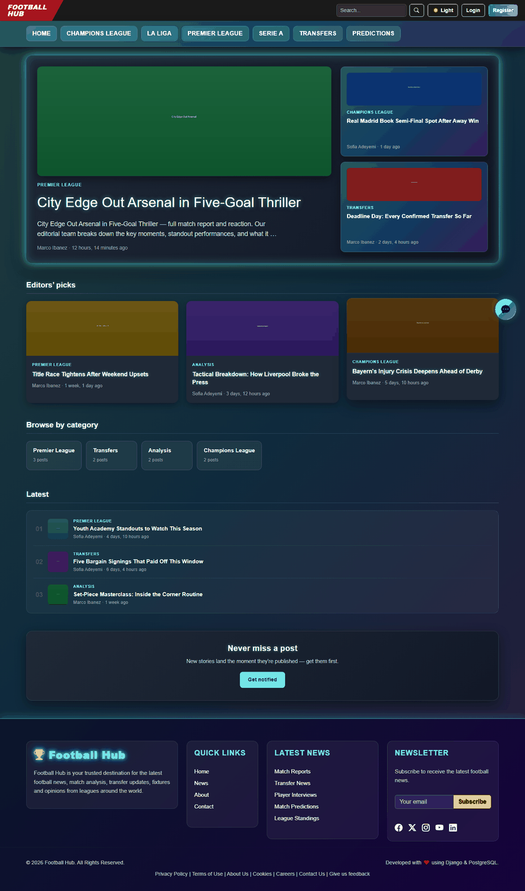
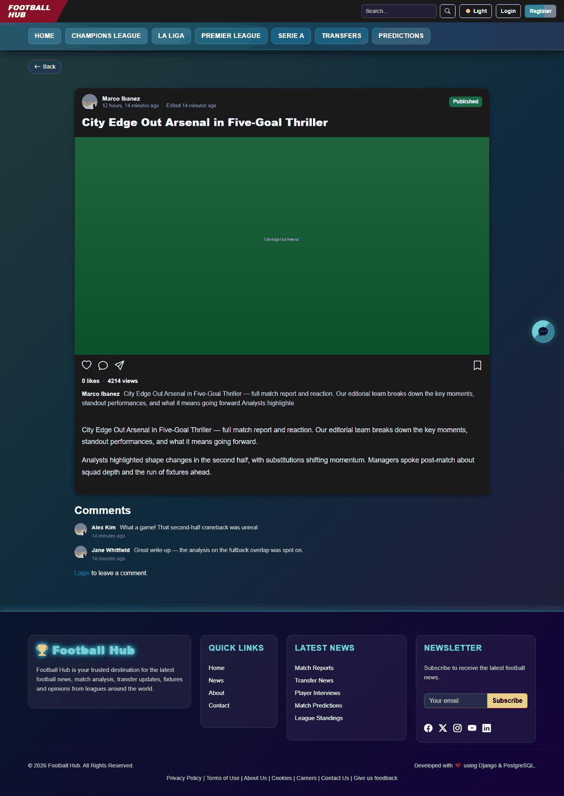
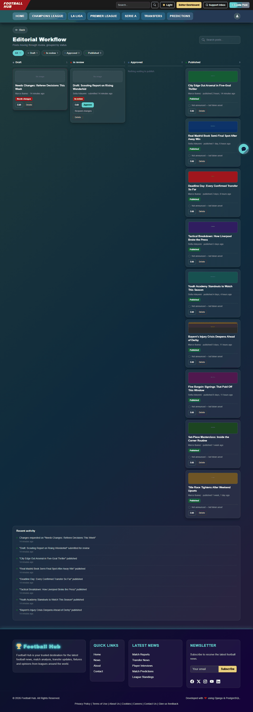
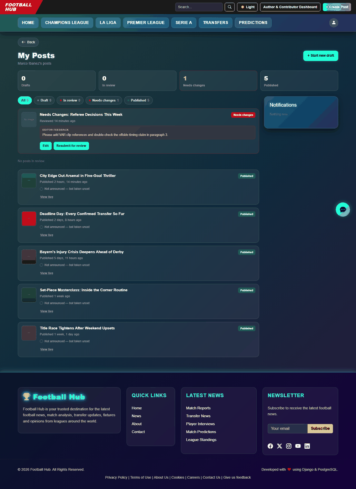
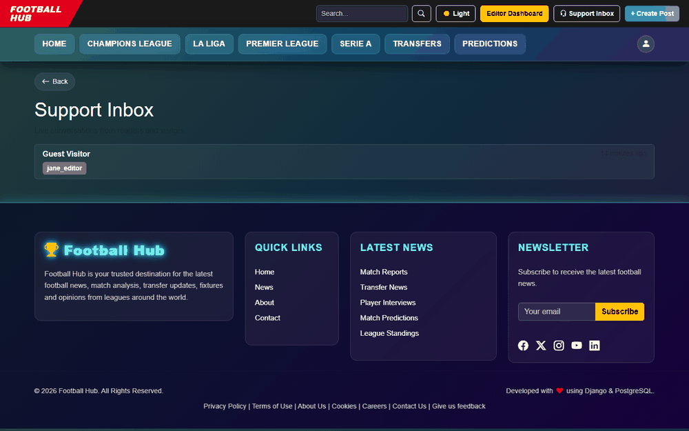
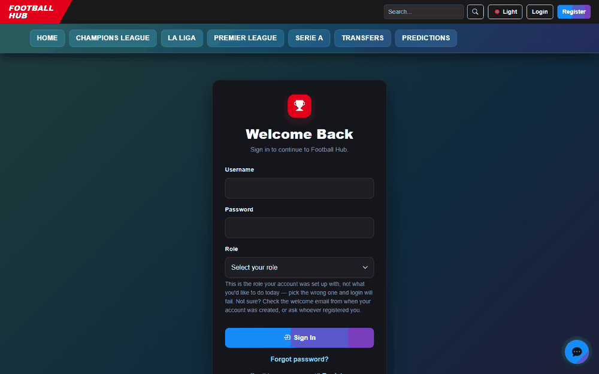

# Football Hub

[](https://github.com/Babilalewis20004/football-hub-django/actions/workflows/security.yml)

Football Hub is a Django 5.2 editorial platform for publishing and
discussing football content: articles with an editorial workflow (draft →
review → approval → publish), categories and tagging, comments, user
roles, and a live chat/support-inbox feature built on Django Channels. It
is a server-rendered monolith (Django templates + Bootstrap 5 + a little
HTMX) backed by PostgreSQL, with Redis powering real-time messaging.

## Screenshots

| Homepage | Post detail |
|---|---|
|  |  |

| Editorial workflow (Editor dashboard) | Author dashboard |
|---|---|
|  |  |

| Support inbox (live chat) | Login (role-based + 2FA) |
|---|---|
|  |  |

## Features

- **Editorial workflow** — role-based publishing pipeline (Admin / Editor
  / Author / Contributor / Reader) with draft, review, approval, and
  publish states. Every new account starts as a Reader; an Admin promotes
  users to Contributor/Editor from Django admin (see
  [docs/architecture/security-architecture.md](docs/architecture/security-architecture.md#authorization)).
- **Live chat & support inbox** — real-time messaging over WebSockets
  (Django Channels + Daphne), backed by Redis in multi-worker deployments.
- **Account security** — TOTP two-factor authentication (`django-otp`),
  progressive CAPTCHA and lockout after repeated failed logins, session
  inactivity timeouts.
- **Hardened by default** — a documented Content-Security-Policy, CSRF/
  session cookie hardening, and an automated CI security pipeline (SAST,
  dependency/secret/container scanning) on every push — see
  [docs/security.md](docs/security.md).
- **Optional Telegram announcements** — automatically posts to a Telegram
  channel when a post is published — see [TELEGRAM.md](TELEGRAM.md).

## Tech stack

Django 5.2 · PostgreSQL · Django Channels / Daphne (WebSockets) · Redis ·
Bootstrap 5 + HTMX · Docker Compose · pytest


**Security pipeline** ([docs/security.md](docs/security.md)):


See [docs/architecture/technology-stack.md](docs/architecture/technology-stack.md)
for the full, verified dependency list.

## Security & CI/CD

Every push runs through an automated security pipeline
([docs/security.md](docs/security.md)):

| Tool | Purpose |
|---|---|
| Bandit | Static analysis for common Python security issues |
| Semgrep | Custom rule-based static analysis across the codebase |
| Trivy | Container and dependency vulnerability scanning |
| Gitleaks | Secrets detection to catch committed credentials before merge |
| pip-audit | Known-CVE scanning of pinned Python dependencies |
| OWASP ZAP | Dynamic application security testing (DAST) against the running app |

The app is deployed via Docker Compose (nginx reverse proxy, Django/Gunicorn,
Redis, PostgreSQL) on Ubuntu 24.04.

I've also run manual penetration testing against a live deployment from a
separate Kali Linux attack box — reconnaissance, enumeration, and
vulnerability scanning (Nmap, Gobuster, Nikto, Nessus), followed by
exploitation/verification and remediation with Metasploit, beyond what the
automated scanners catch. The target instance (`football-hub-test`) has
since been decommissioned. See the full
[penetration test report](<Football Hub - Django Web Penetration testing Report.docx>)
and [manual security audit](SECURITY_AUDIT_2026-08-10.md).

## Architecture & database

Design docs are written from the actual implementation (models, views, URLs,
middleware, signals) rather than from intent, with diagrams for the
non-obvious flows:

- [docs/architecture/system-architecture.md](docs/architecture/system-architecture.md) —
  high-level component diagram and layer-by-layer explanation
- [docs/architecture/application-architecture.md](docs/architecture/application-architecture.md) —
  internal Django structure: routing, views, forms, services, middleware,
  per-app breakdown
- [docs/architecture/security-architecture.md](docs/architecture/security-architecture.md) —
  authentication, authorization, session security, application security
  controls
- [docs/architecture/deployment-architecture.md](docs/architecture/deployment-architecture.md) —
  production topology, environment variables, dev-vs-prod differences
- [docs/architecture/data-flow.md](docs/architecture/data-flow.md) — data flow
  diagrams for auth, publishing, search, chat, Telegram, and feedback/subscription
- [docs/architecture/authentication-flow.md](docs/architecture/authentication-flow.md) —
  login → lockout/CAPTCHA → 2FA → session flowchart
- [docs/architecture/realtime-chat-flow.md](docs/architecture/realtime-chat-flow.md) —
  Django Channels architecture with sequence diagrams
- [docs/database/erd.md](docs/database/erd.md) — Entity-Relationship Diagram
- [docs/database/schema.md](docs/database/schema.md) — full field-by-field
  table definitions and migration history
- [docs/database/relationships.md](docs/database/relationships.md) — FK
  delete behavior, M2M relationships, unique constraints, cascade risks

## Getting started

Docker Compose is the recommended way to run this project locally — it
starts the app, PostgreSQL, and Redis with no manual setup required.

```bash
git clone https://github.com/Babilalewis20004/football-hub-django.git
cd football-hub-django
cp .env.example .env   # Windows PowerShell: Copy-Item .env.example .env
docker compose up --build -d
docker compose exec web python manage.py createsuperuser
```

Then open <http://localhost:8000>.

See the [Deployment Guide](docs/deployment.md) for complete local setup
and deployment instructions, including environment configuration,
troubleshooting, and the production Docker Compose configuration. For a
production deployment to a cloud provider, see
[docs/deployment/aws.md](docs/deployment/aws.md) or
[docs/deployment/gcp.md](docs/deployment/gcp.md).

## Environment variables

Copied from [.env.example](.env.example), which has the full inline
explanations. The Docker Compose defaults work out of the box; only
`SECRET_KEY` needs to be set for local dev.

| Variable | Purpose |
|---|---|
| `SECRET_KEY` | Django secret key |
| `DEBUG` | Django debug mode (`True` for local dev only) |
| `DB_NAME` / `DB_USER` / `DB_PASSWORD` / `DB_HOST` / `DB_PORT` | Database connection Django actually uses |
| `POSTGRES_DB` / `POSTGRES_USER` / `POSTGRES_PASSWORD` | Used only to initialize the Postgres container itself — must match the `DB_*` values above |
| `ALLOWED_HOSTS` | Django's allowed-hosts list |
| `REDIS_URL` | Channel layer for live chat across multiple workers; unset falls back to an in-memory layer (fine for a single dev process) |
| `SECURE_SSL_REDIRECT` / `SESSION_COOKIE_SECURE` / `CSRF_COOKIE_SECURE` / `SECURE_HSTS_SECONDS` | Production-only HTTPS hardening — leave unset for local HTTP dev |
| `TELEGRAM_BOT_TOKEN` / `TELEGRAM_CHANNEL_ID` | Optional — enables the Telegram publish announcements (see [TELEGRAM.md](TELEGRAM.md)) |

See [docs/architecture/deployment-architecture.md](docs/architecture/deployment-architecture.md)
for how these map to dev vs. production behavior.

## Project structure

The project is a standard Django multi-app layout: `config/` holds
settings/URLs/ASGI-WSGI entrypoints; `users/` owns authentication, 2FA,
lockout/CAPTCHA, and roles; `blog/` owns posts, categories, comments, and
the editorial workflow; `chat/` owns the live chat and support inbox
(WebSocket consumers + HTTP views); and `pages/` owns static/informational
pages and the feedback/subscribe forms. See
[docs/architecture/application-architecture.md](docs/architecture/application-architecture.md#app-by-app-breakdown)
for the full per-app breakdown of models, views, services, and URLs.

## Documentation

- [docs/deployment.md](docs/deployment.md) — full local setup and
  deployment guide
- [docs/docker.md](docs/docker.md) — day-to-day Docker Compose commands
- [docs/deployment/aws.md](docs/deployment/aws.md) — production deployment
  to AWS (ECS Fargate, RDS, ElastiCache)
- [docs/deployment/gcp.md](docs/deployment/gcp.md) — production deployment
  to GCP (Cloud Run, Cloud SQL, Memorystore)
- [docs/README.md](docs/README.md) — architecture, database schema, and
  UI documentation index
- [docs/security.md](docs/security.md) — CI/CD security pipeline
  (SAST, dependency/secret/container scanning)
- [SECURITY_AUDIT_2026-08-10.md](SECURITY_AUDIT_2026-08-10.md) —
  point-in-time manual security audit
- [Football Hub - Django Web Penetration testing Report.docx](<Football Hub - Django Web Penetration testing Report.docx>) —
  external black-box penetration test (August 2026)
- [TESTING.md](TESTING.md) — running the test suite

## Useful links

Official repositories/docs for the security-scanning tools used in the
CI pipeline (see [docs/security.md](docs/security.md)):

- **Bandit** (SAST) — [PyCQA/bandit](https://github.com/PyCQA/bandit) ·
  [docs](https://bandit.readthedocs.io)
- **Semgrep** (SAST) — [semgrep/semgrep](https://github.com/semgrep/semgrep) ·
  [docs](https://semgrep.dev/docs)
- **Trivy** (container/filesystem scanning) —
  [aquasecurity/trivy](https://github.com/aquasecurity/trivy) ·
  [docs](https://aquasecurity.github.io/trivy)
- **Gitleaks** (secret scanning) —
  [gitleaks/gitleaks](https://github.com/gitleaks/gitleaks)

## Testing

```bash
python -m pytest -v
```

**256 tests, 99% coverage** (whole project — see [TESTING.md](TESTING.md) for
the per-file breakdown).

See [TESTING.md](TESTING.md) for coverage details, or
[docs/deployment.md#16-running-tests](docs/deployment.md#16-running-tests)
for running tests inside Docker.

## License

[MIT](LICENSE)
