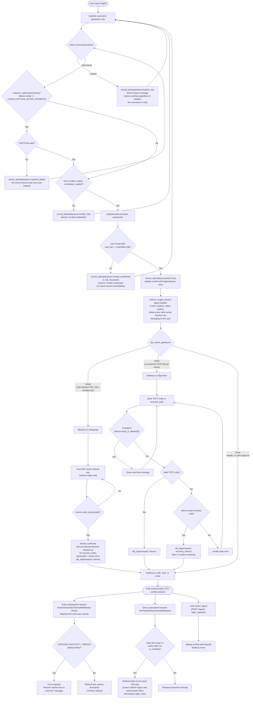

# Authentication Flow

Full detail behind the summary in [security-architecture.md](security-architecture.md). Traced from `users/views.py`, `users/security.py`, `users/twofactor.py`, `users/middleware.py`, `users/signals.py`, and `users/forms.py`.

## Complete flowchart

## Key behaviors worth calling out explicitly

- **The lockout/CAPTCHA/error responses are indistinguishable for real vs. nonexistent usernames.** This is a deliberate anti-enumeration measure (see code comments in `users/security.py`), not an oversight — a penetration tester should expect this and not flag it as a bug.
- **Role selection is a genuine authorization input, not decoration.** Because `login_view` compares the submitted `role` against `user.role`, a correct password with the wrong role selected fails exactly like a wrong password. `admin` is deliberately not one of the selectable options here - admin accounts authenticate through the separate `/admin/` login form instead (see below).
- **The `/admin/` login path is a separate code path** (`users/forms.py: LockoutAwareAdminAuthenticationForm`, installed via `users.admin: admin.site.login_form = ...`) that duplicates the lockout/CAPTCHA logic against the same `LoginAttempt` table, but does **not** duplicate the role-matching check (Django admin login only checks `is_staff`). It is covered by `enforce_single_session` (via the shared `user_logged_in` signal) and by `TwoFactorEnforcementMiddleware` (which runs on every request regardless of login path), but not by `login_view`'s own post-login redirect logic.
- **2FA verification state lives on the session** (`django_otp`'s `is_verified()`), separate from Django's own `is_authenticated`. A user can be `is_authenticated=True` but not yet `is_verified()` — that gap is exactly what `TwoFactorEnforcementMiddleware` closes on every request, not just immediately after login.
- **Recovery codes are single-use and finite.** `two_factor_verify` decrements availability implicitly (each `StaticToken` is deleted/consumed by django-otp on successful use — standard django-otp behavior); the UI warns the user with a remaining-count message when they're used.

## Where this is enforced (file map)

| Step | File |
|---|---|
| Lockout / CAPTCHA policy | `users/security.py` |
| Login view logic | `users/views.py: login_view` |
| Admin login form override | `users/forms.py: LockoutAwareAdminAuthenticationForm`, `users/admin.py` |
| Single-session eviction | `users/signals.py: enforce_single_session` |
| 2FA policy (who/when) | `users/twofactor.py` |
| 2FA views (setup/verify/disable/regenerate) | `users/views.py` |
| Session inactivity timeout | `users/middleware.py: SessionInactivityTimeoutMiddleware` |
| 2FA enforcement backstop | `users/middleware.py: TwoFactorEnforcementMiddleware` |
| Middleware ordering | `config/settings.py: MIDDLEWARE` (both custom middlewares run after `django_otp.middleware.OTPMiddleware`, which populates `request.user.is_verified()`) |
