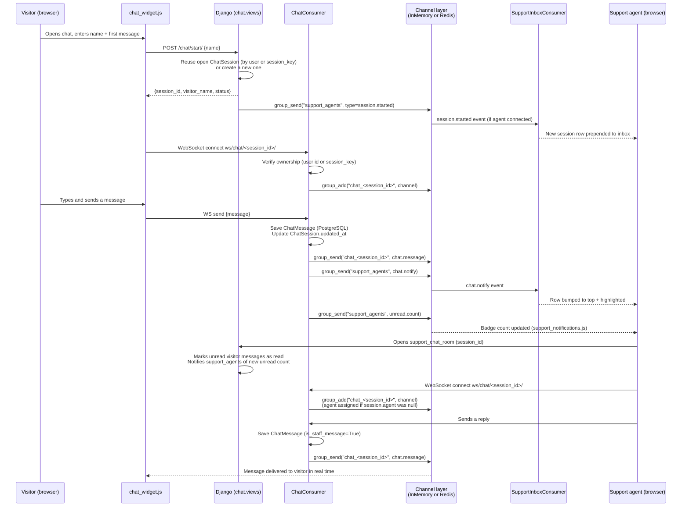
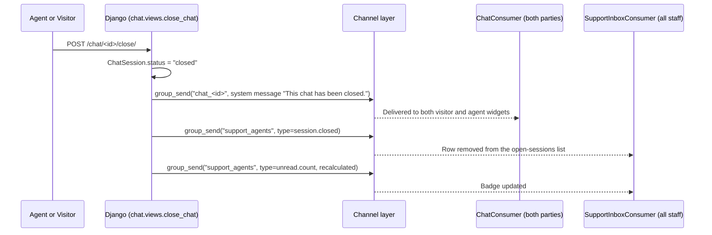

# Real-Time Chat Architecture

Built entirely on **Django Channels** over ASGI. There is no polling fallback — the widget, support inbox, and support room all depend on a live WebSocket connection. Traced from `config/asgi.py`, `chat/routing.py`, `chat/consumers.py`, `chat/views.py`, `chat/services.py`, `chat/permissions.py`, and the three chat-related JS files.

## Components

| Component | File | Role |
|---|---|---|
| ASGI entrypoint | `config/asgi.py` | Routes `websocket` scope to `AllowedHostsOriginValidator(AuthMiddlewareStack(URLRouter(chat.routing.websocket_urlpatterns)))` — origin-checked, session/auth-aware |
| WebSocket routes | `chat/routing.py` | `ws/chat/support/` → `SupportInboxConsumer`; `ws/chat/<session_id>/` → `ChatConsumer` |
| Visitor-facing HTTP endpoints | `chat/views.py` | `start_chat` (creates/reuses a `ChatSession`), `chat_messages` (history, GET), `close_chat` (POST) |
| Staff-facing HTTP endpoints | `chat/views.py` | `support_inbox` (list of open sessions), `support_chat_room` (one session's transcript + reply form) |
| `ChatConsumer` | `chat/consumers.py` | One instance per connection to a specific `ChatSession`'s room group (`chat_<id>`); shared code path for visitor and staff |
| `SupportInboxConsumer` | `chat/consumers.py` | One instance per connected staff member, joined to the shared `support_agents` group; pushes new-session/new-message/unread-count events |
| Channel layer | `config/settings.py: CHANNEL_LAYERS` | `InMemoryChannelLayer` (dev default) or `channels_redis.core.RedisChannelLayer` (if `REDIS_URL` set) |
| Persistence | `chat/models.py` | `ChatSession`, `ChatMessage` — every message is written to PostgreSQL before being broadcast |
| `ChatSession` model | | Ties an anonymous visitor to their browser session via `session_key` so a page reload doesn't lose the chat |
| Client — widget | `static/js/chat_widget.js` | Visitor-facing chat bubble, used on every page except the two staff chat pages |
| Client — support inbox | `static/js/support_inbox.js` | Live-updating list on `chat/support_inbox.html` |
| Client — support room | `static/js/support_room.js` | Live message stream on `chat/support_room.html` |
| Client — badge | `static/js/support_notifications.js` | Unread-count badge in the navbar (`masthead.html`), shown only to `admin`/`editor` roles |

## Sequence diagram — visitor message reaching a support agent

## Sequence diagram — closing a chat

## Access control on WebSocket connections

- `ChatConsumer.connect()`: closes the socket immediately if the `ChatSession` doesn't exist. For non-staff connections, it further requires that either the authenticated user's ID matches `session.visitor_id`, or the browser's session key matches `session.session_key` — this is how an anonymous visitor's own chat stays private from other anonymous visitors.
- `SupportInboxConsumer.connect()`: closes immediately unless `chat.permissions.is_support_agent(user)` is true (`user.role in ('admin', 'editor')`).
- Both consumers rely on `AuthMiddlewareStack` (in `config/asgi.py`) to populate `self.scope['user']` and `self.scope['session']` from the same session cookie used by regular HTTP requests — no separate WebSocket authentication scheme exists.
- `AllowedHostsOriginValidator` (also in `config/asgi.py`) rejects WebSocket connections whose `Origin` header doesn't match `ALLOWED_HOSTS`.

## A structural note (not a bug, but worth documenting for architecture accuracy)

On `chat/support_inbox.html`, a signed-in `admin`/`editor` viewer has **two independent WebSocket connections open to the same `ws/chat/support/` endpoint simultaneously**: one from `support_notifications.js` (loaded in `masthead.html`, included on every page including the inbox) and one from `support_inbox.js` (loaded specifically by the inbox template). Both are legitimate, independently-authorized connections to the same consumer/group — this doubles the `SupportInboxConsumer` instances (and thus channel-layer group membership) for that one browser tab, though it doesn't cause incorrect behavior since both simply render the same broadcast events.

## Why Redis matters here specifically

`InMemoryChannelLayer` only delivers `group_send()` calls to consumers connected to the **same process**. A `ChatConsumer` and a `SupportInboxConsumer` both need to receive the same `group_send()` call for the flows above to work — if a production deployment runs multiple ASGI worker processes without Redis, a visitor's message could land in a `ChatConsumer` on worker A while the assigned agent's `SupportInboxConsumer`/`ChatConsumer` is connected to worker B, and the broadcast would never cross that boundary. See [deployment-architecture.md](deployment-architecture.md).
