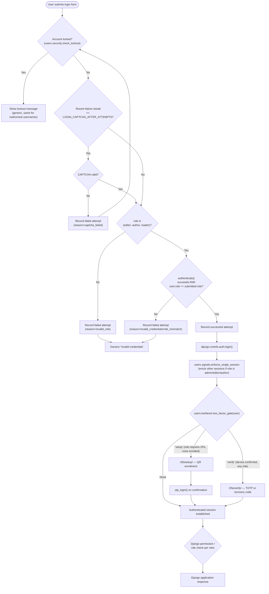

# Security Architecture

This is the most heavily engineered part of the codebase. Every control documented here is traced to a specific file.

## Security flow diagram

## Authentication

### Username/password authentication
Standard Django `authenticate()`/`login()` (`django.contrib.auth`), backed by `CustomUser` (`AUTH_USER_MODEL = 'users.CustomUser'`). Passwords are stored using Django's default hasher chain (PBKDF2-SHA256 first).

**Unusual, load-bearing detail:** the public login form (`templates/users/login.html`) requires the user to additionally select a **role** (`Editor`/`Author`/`Reader`) from a dropdown. `users/views.py: login_view` rejects the attempt — with the same generic error as a wrong password — if `user.role != role`. This means a valid password alone is not sufficient; the submitted role must also match the account's actual role. `admin` accounts are excluded from `PUBLIC_LOGIN_ROLES` entirely and must authenticate through `/admin/` instead.

### Login attempt tracking & account lockout
`users/security.py` + `users/models.py: LoginAttempt`. Every attempt (success or failure, real or nonexistent username) is recorded. Lockout state is *derived* from the most recent `LOGIN_MAX_FAILED_ATTEMPTS` (default 5) rows for a username, not stored as a counter — if all of them are failures and the latest is within `LOGIN_LOCKOUT_MINUTES` (default 15), the account is locked. A successful attempt anywhere in that window breaks the streak.

**Deliberate design choice:** lockout is keyed on the *submitted username string*, not on whether it maps to a real account, and the lockout/CAPTCHA/error responses are identical either way — this prevents the login form from being usable to enumerate valid usernames.

### CAPTCHA
`django-simple-captcha`. Progressive: once a username's recent failure streak reaches `LOGIN_CAPTCHA_AFTER_ATTEMPTS` (default 2, must stay below the lockout threshold), the next attempt must include a solved CAPTCHA, checked *before* credentials. Applied identically to:
- The public login form (`LoginCaptchaForm` in `users/forms.py`).
- Registration (`RegisterForm` includes a `CaptchaField` unconditionally).
- The Django admin login (`LockoutAwareAdminAuthenticationForm`, installed via `admin.site.login_form = ...` in `users/admin.py`) — so `/admin/` cannot be used to bypass lockout/CAPTCHA.

### TOTP two-factor authentication (django-otp)
`users/twofactor.py`, `users/views.py`. Built entirely on `django_otp.plugins.otp_totp` (TOTP devices) and `otp_static` (recovery codes) — no custom cryptography.

- **Mandatory** for `admin`, `editor`, `author` roles (`TWO_FACTOR_REQUIRED_ROLES`). These roles are redirected to `/2fa/setup/` before they can do anything else, enforced both immediately after login (`login_view`) and on every subsequent request (`TwoFactorEnforcementMiddleware`, covering the `/admin/` login path too, which bypasses `login_view` entirely).
- **Optional** for `reader` accounts, self-service via the profile page.
- Enrollment: a QR code (`otpauth://` URL rendered via `qrcode`, embedded as a `data:image/png;base64,...` URI — this is why `img-src` in the CSP allows `data:`) plus a manual base32 key fallback. A device is created unconfirmed and flips to confirmed only once the user proves a valid code.
- **10 recovery codes** are generated at enrollment (and on-demand regeneration), shown exactly once in plaintext, backed by `otp_static.StaticDevice`/`StaticToken`. Regenerating invalidates all previous codes.
- Login-time verification (`/2fa/verify/`) accepts either a live TOTP code or an unused recovery code, both throttled with django-otp's built-in exponential backoff (`device.verify_is_allowed()`).
- Privileged roles cannot self-service-disable 2FA (`two_factor_disable` explicitly blocks it); only an admin can reset a user's enrollment (Django admin action `reset_two_factor_enrollment`, calls `reset_2fa_for_user`).
- `OTP_ADMIN_HIDE_SENSITIVE_DATA = True` hides raw TOTP secrets/recovery codes in Django admin, even from superusers browsing the device list.

### Session management
- Sessions are DB-backed (Django's default `django.contrib.sessions.backends.db`).
- `SessionInactivityTimeoutMiddleware` (`users/middleware.py`) stamps a `last_activity` timestamp into the session on every authenticated request; if more than `SESSION_INACTIVITY_TIMEOUT` seconds (default 300 = 5 minutes) have passed, it force-logs-out the user and shows an explanatory message — rather than letting the session silently expire at the storage layer.
- `SESSION_COOKIE_AGE = SESSION_INACTIVITY_TIMEOUT` and `SESSION_SAVE_EVERY_REQUEST = True` provide a *backstop* at the storage layer with the same window, in case the middleware is ever bypassed.
- `SESSION_EXPIRE_AT_BROWSER_CLOSE = True`.
- **Single-session enforcement for privileged roles**: `users/signals.py: enforce_single_session`, hooked to Django's `user_logged_in` signal (so it applies no matter which login path is used, including `/admin/`). For `admin`/`editor`/`author` accounts, a fresh login deletes every other active `django_session` row belonging to that user (found by decoding each session's `_auth_user_id`, since the `Session` model has no user FK). `reader` accounts may stay logged in on multiple devices simultaneously.
- `SESSION_COOKIE_HTTPONLY = True`.

### Logout
`POST`-only (`@require_POST`), `@login_required`, at `/logout/` (`users.views.logout_view`) — calls `django.contrib.auth.logout()` and logs the event. Also reachable from within the 2FA setup/verify pages ("Log out instead") for a user stuck mid-flow.

## Authorization

Two independent, coexisting authorization mechanisms:

### 1. `CustomUser.role` (application-level role field)
A plain string field (`admin`/`editor`/`author`/`reader`) checked directly in code for: which login roles are selectable, which roles require 2FA, which roles get single-session enforcement, which roles can act as chat support agents, and object-level post-editing rules.

### 2. Django Groups & Permissions (`blog/management/commands/setup_roles.py`)
A separate, `manage.py setup_roles`-driven system that creates five Django `Group`s — **Admin, Editor, Author, Contributor, Reader** — and assigns `Permission` rows to each:

| Group | Permissions granted |
|---|---|
| Admin | All permissions on the `Post` content type (add/change/delete/view + `can_publish_post`/`can_feature_post`/`can_approve_post`) |
| Editor | `add_post`, `change_post`, `delete_post`, `view_post`, `can_publish_post`, `can_feature_post`, `can_approve_post` |
| Author | `add_post`, `view_post` only — **deliberately excludes `change_post`** (a code comment explains: that permission is checked globally, not per-object, so granting it would let any author edit every other author's posts; authors edit their own posts via an object-level ownership check in `post_update` instead, which needs no permission) |
| Contributor | `add_post`, `view_post` (same as Author) — note: "Contributor" exists as a Django Group but is **not** one of `CustomUser.ROLE_CHOICES** (`admin`/`editor`/`author`/`reader` only) — see Issues below |
| Reader | `view_post` only |

**Note on the relationship between the two systems:** nothing in the codebase automatically assigns a `CustomUser` to its matching `Group` when `role` is set (no signal, no `save()` override does this). `@permission_required` checks in `blog/views/posts.py` rely on Django's permission system (`request.user.has_perm(...)`), which for a non-superuser normally resolves through Group membership. **This means a `CustomUser` with `role="author"` has no actual `add_post`/`view_post` permission unless something (not found in this codebase — likely manual admin action) has also added that user to the matching Group.** This is flagged as a discrepancy in the final report; it is not determinable from the code alone whether group assignment happens through an out-of-band process (e.g. manually in Django admin at account creation).

### Role summary table

| Role | 2FA | Single-session | Public login option | Can create posts | Can approve/publish | Chat support agent |
|---|---|---|---|---|---|---|
| Admin | Mandatory | Yes | No (uses `/admin/`) | Yes (via Group) | Yes (via Group) | Yes |
| Editor | Mandatory | Yes | Yes | Yes (via Group) | Yes (via Group) | Yes |
| Author | Mandatory | Yes | Yes | Yes (via Group) | No | No |
| Contributor | n/a (not a `role` choice) | n/a | n/a | Group exists but no `role` value maps to it | No | No |
| Reader | Optional (self-service) | No | Yes | No | No | No |

## Application security

| Control | Setting/mechanism | Notes |
|---|---|---|
| CSRF protection | `django.middleware.csrf.CsrfViewMiddleware`, `CSRF_COOKIE_HTTPONLY = True` | Standard Django CSRF tokens in every form; HTMX requests get the token injected via a global `htmx:configRequest` listener reading the `<meta name="csrf-token">` tag. The `/csp-report/` endpoint is explicitly `@csrf_exempt` because browsers POST CSP reports without a token. |
| XSS protection | Django template auto-escaping (default) + `nh3.clean()` sanitization of `Post.content` server-side (`blog/forms.py`) | CKEditor sanitizes client-side only; server-side sanitization guards against a request that bypasses the browser entirely. Comment content is not explicitly sanitized but is rendered without `\|safe`, relying on Django's default auto-escaping. |
| SQL injection protection | Django ORM exclusively — no raw SQL found anywhere in the codebase | Search/homepage/taxonomy views build querysets with `Q()` objects, never string-interpolated SQL |
| Clickjacking | `X_FRAME_OPTIONS = 'DENY'`, `django.middleware.clickjacking.XFrameOptionsMiddleware`, plus CSP `frame-ancestors 'none'` (belt-and-suspenders) | |
| MIME sniffing | `SECURE_CONTENT_TYPE_NOSNIFF = True` | |
| Referrer leakage | `SECURE_REFERRER_POLICY = 'same-origin'` | |
| HTTPS enforcement | `SECURE_SSL_REDIRECT`, `SESSION_COOKIE_SECURE`, `CSRF_COOKIE_SECURE`, `SECURE_HSTS_SECONDS` — **all environment-driven, all default to off/0** | Intended to be turned on via env vars once HTTPS is confirmed in front of the app in production; currently disabled by default (correct for local HTTP dev, but must be explicitly enabled per environment — nothing in the codebase forces this) |
| Content Security Policy | `django-csp` 4.0, **Report-Only mode** (`CONTENT_SECURITY_POLICY_REPORT_ONLY`, not the enforcing `CONTENT_SECURITY_POLICY` setting) | Violations logged to `logs/csp_violations.log` via `/csp-report/`, not yet blocking anything. See `Content Security policy Docs/CSP_NOTES.md` for the full directive-by-directive rationale and the documented pre-enforcement checklist. Nonce-based (`request.csp_nonce`) for the project's own inline `<script>` blocks; `'unsafe-inline'` is required for `style-src` specifically because of CKEditor 4's runtime inline styling, per that document. |
| Password hashing | Django's default hasher chain (PBKDF2-SHA256) | Reused for admin, chat, and account-deletion password-confirmation checks (`user.check_password(...)`) throughout `users/views.py` |
| Password strength validation | `AUTH_PASSWORD_VALIDATORS`: `UserAttributeSimilarityValidator`, `MinimumLengthValidator`, `CommonPasswordValidator` | Server-side; a separate client-side JS meter (`password-strength.js`) on the registration page is advisory only, not enforced |
| Open-redirect protection | `users.security.safe_next_url()` / `django.utils.http.url_has_allowed_host_and_scheme()` | Applied to every `?next=` parameter across login, 2FA, and newsletter-subscribe redirect flows |
| Security event logging | `security` logger → `logs/security.log` | Records lockouts, failed logins (public and admin), CAPTCHA failures, unauthorized edit attempts, 2FA failures/successes, account-deletion failures |

## Known gaps (from the codebase and existing project docs — not invented)

- CSP is Report-Only, not enforced (see `CSP_NOTES.md`).
- CKEditor 4 is end-of-life with unfixed security issues (`ckeditor.W001`, confirmed by re-running `python manage.py check` for this documentation task).
- HTTPS-related settings default to off and must be explicitly enabled per environment at deploy time.
- The `Group`/`Permission` system's connection to `CustomUser.role` (i.e. how/whether users actually get added to their matching Group) is not implemented in this codebase — see Authorization section above.
- The "Contributor" Django Group has no corresponding `CustomUser.role` value, so it's unclear from the code how (or whether) any account is ever actually a Contributor.
