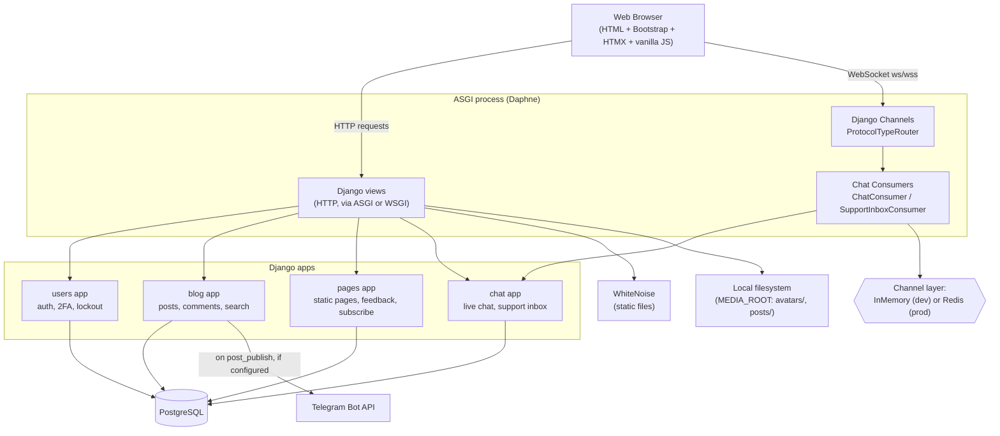

# System Architecture

Football Hub is a server-rendered **Django monolith** with one asynchronous subsystem (Django Channels, for live chat) layered on top via ASGI. There is no separate frontend application, no microservices, and no REST/GraphQL API — every page is rendered server-side from Django templates, with a small number of HTMX-driven partial updates and a hand-written WebSocket client for chat.

## High-level diagram

## Component explanations

### Presentation layer
- **Django templates** (`templates/`) — server-side rendered HTML, organized as `base.html` + per-app template directories + a `components/` directory of reusable includes (navbar, footer, hero, chat widget, etc.).
- **Bootstrap 5.3.3** and **Bootstrap Icons** — loaded from `cdn.jsdelivr.net`, used throughout for layout/styling.
- **HTMX 1.9.12** — loaded from `unpkg.com`, used for exactly four interactions in the live app: the like button, the bookmark button (both `hx-post` + `outerHTML` swap of the post-engagement partial), and the author/editor dashboards' auto-refreshing post lists (`hx-get` with `hx-trigger="load, every 10s"`).
- **Vanilla JavaScript** (`static/js/`) — no framework, no bundler. Handles the chat widget's WebSocket client, password-strength meter, image-dropzone preview, cookie-consent banner, back-button history logic, and the three chat-related WebSocket clients (widget, support inbox, support room).
- **django-ckeditor** — rich-text editing widget for post content, rendered client-side inside `post_form.html`.

### Application layer
Four Django apps, each with a clear responsibility (see [application-architecture.md](application-architecture.md) for the internal structure of each):
- **`users`** — authentication, registration, profile, TOTP 2FA enrollment/verification, login lockout/CAPTCHA, account deletion.
- **`blog`** — posts, categories, tags, comments, likes, bookmarks, notifications, search, the editorial workflow (draft → review → approved → published), and the homepage.
- **`chat`** — live visitor chat and the staff support inbox, built on Django Channels.
- **`pages`** — static informational pages (About, Careers, Privacy, Terms, Cookies, Contact), the feedback form, and newsletter subscription.

Cross-cutting middleware (`config/settings.py: MIDDLEWARE`) enforces session inactivity timeout and 2FA gating on every request (see [security-architecture.md](security-architecture.md)).

### Real-time layer
- **Django Channels** (`channels==4.3.2`) — provides the ASGI routing and WebSocket consumer framework used exclusively by the `chat` app.
- **ASGI entrypoint** (`config/asgi.py`) — a `ProtocolTypeRouter` that routes `http` to the standard Django ASGI application and `websocket` to `chat.routing.websocket_urlpatterns`, wrapped in `AllowedHostsOriginValidator` (origin checking) and `AuthMiddlewareStack` (session/auth available inside consumers).
- **Daphne** — the ASGI server that serves both HTTP and WebSocket traffic in this configuration (it is listed first in `INSTALLED_APPS`, which is required for Channels to hook into `manage.py runserver` in development).
- **Channel layer** — configurable: if `REDIS_URL` is set, uses `channels_redis.core.RedisChannelLayer`; otherwise falls back to `channels.layers.InMemoryChannelLayer`. See [deployment-architecture.md](deployment-architecture.md) for why this matters in multi-process production deployments.

### Data layer
- **PostgreSQL** — the only configured database engine (`django.db.backends.postgresql`), connected via `psycopg2-binary`. No other datastore holds application data.
- **Django ORM** — all data access goes through Django models; no raw SQL was found in the codebase.
- **Migrations** — schema is fully migration-managed (`blog` 0001–0015, `users` 0001–0004, `chat` 0001, `pages` 0001–0002). See [database/schema.md](../database/schema.md).

### External services
- **Telegram Bot API** — `blog/services/telegram.py` posts a one-way announcement message when an editor publishes a post, via `python-telegram-bot`. Disabled by default (no-op) unless `TELEGRAM_BOT_TOKEN` and `TELEGRAM_CHANNEL_ID` are set. Failures are caught and logged, never block publishing. See [TELEGRAM.md](../../TELEGRAM.md) and [data-flow.md](data-flow.md).
- **CAPTCHA** — `django-simple-captcha` generates challenge images server-side (stored in `captcha_captchastore`, a local DB table — no external CAPTCHA service like reCAPTCHA is used).
- **Email** — `EMAIL_BACKEND` defaults to Django's console backend (prints to stdout, does not send real email) unless overridden via the `EMAIL_BACKEND` env var. Used for Django's built-in password-reset flow. Not determinable from the codebase which SMTP provider (if any) is configured in the real production environment, since that's environment-driven and not committed.
- No other external APIs (no payment gateway, no SMS, no third-party OAuth/SSO, no analytics SDK) exist in the codebase.

### Static/media layer
- **WhiteNoise** (`whitenoise.middleware.WhiteNoiseMiddleware`) — serves collected static files (`STATIC_ROOT = staticfiles/`) directly from the Django/ASGI process, without a separate static file server like Nginx being required for correctness (though one may still sit in front for TLS termination — see [deployment-architecture.md](deployment-architecture.md)).
- **Media files** — `MEDIA_ROOT = media/`, served by Django's dev server only when `DEBUG=True` (`config/urls.py`'s conditional `static()` pattern); in production, media must be served by the reverse proxy or another mechanism, since Django/WhiteNoise does not serve `MEDIA_URL` outside `DEBUG`. Not determinable from the codebase whether a CDN or object storage (e.g. S3) is used in production — no such storage backend is configured in `settings.py`; files are read/written to the local filesystem (`avatars/`, `posts/`) via Django's default `FileSystemStorage`.

## Logging (cross-cutting, worth noting at the system level)

`config/settings.py`'s `LOGGING` config routes to four separate log files under `logs/` (`errors.log`, `security.log`, `activity.log`, `csp_violations.log`), each also mirrored to console. Named loggers (`django`, `security`, `blog`, `users`, `chat`, `csp`) are used consistently across the `users`, `blog`, and `chat` apps' views and security modules to record login attempts, publishing actions, permission denials, and CSP violations.
