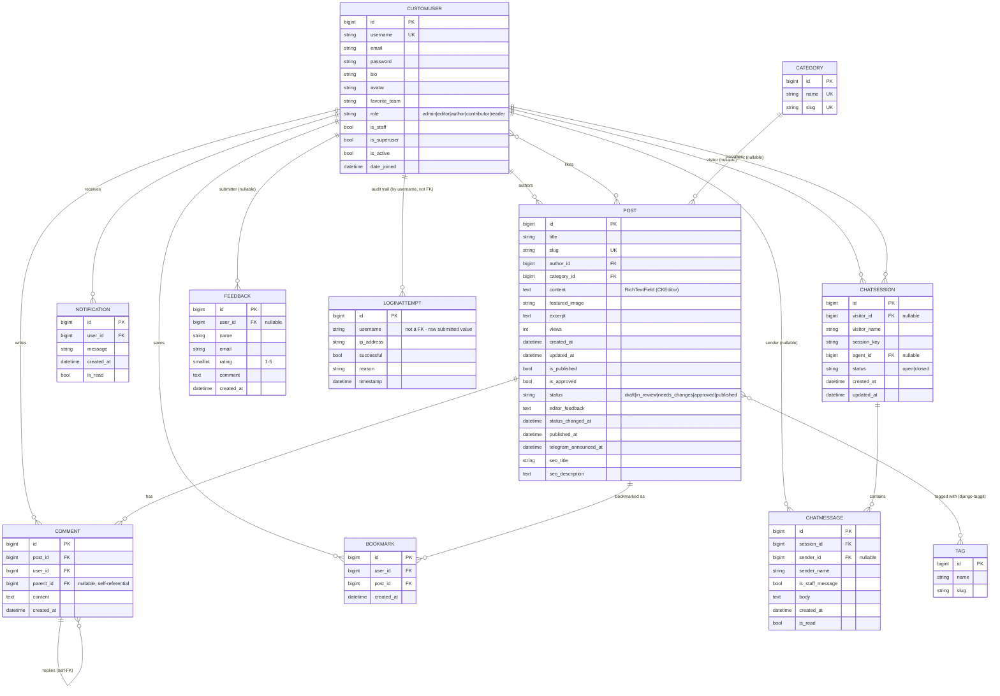

# Entity-Relationship Diagram

Source of truth: the model classes in `blog/models/*.py`, `users/models.py`, `chat/models.py`, `pages/models.py`, plus the Django/third-party tables installed via `INSTALLED_APPS` (`django.contrib.auth`, `django.contrib.sessions`, `django.contrib.contenttypes`, `taggit`, `django_otp`, `captcha`).

All application models use `DEFAULT_AUTO_FIELD = 'django.db.models.BigAutoField'` (`config/settings.py`), so every `id` primary key is a `BigAutoField` unless noted otherwise.

## Application models

## Supporting third-party tables (not application-defined, but part of the live schema)

These are created by installed apps and are used by the application, but their models live outside this codebase:

| Table (approx.) | Provided by | Used for |
|---|---|---|
| `auth_group`, `auth_permission`, `*_groups`, `*_user_permissions` | `django.contrib.auth` | Django Groups/Permissions — see [Roles created by `setup_roles`](#) in `security-architecture.md`. |
| `django_session` | `django.contrib.sessions` | Server-side session store (DB-backed). Decoded manually by `users/signals.py` to enforce single-session-per-privileged-user. |
| `django_content_type` | `django.contrib.contenttypes` | Backs the permission system and `setup_roles`'s `ContentType.objects.get(app_label="blog", model="post")` lookup. |
| `taggit_tag`, `taggit_taggeditem` | `django-taggit` | `Post.tags` (`TaggableManager`) — a generic, reusable many-to-many tagging system. |
| `otp_totp_totpdevice` | `django-otp` (`otp_totp`) | TOTP 2FA devices (`users/twofactor.py`). |
| `otp_static_staticdevice`, `otp_static_statictoken` | `django-otp` (`otp_static`) | One-time recovery codes for 2FA. |
| `captcha_captchastore` | `django-simple-captcha` | Generated CAPTCHA challenge/answer pairs (login form, registration form). |

Not determinable from the current codebase: exact column-level DDL for these third-party tables (they are defined in their respective packages, not in this project's migrations).

See [schema.md](schema.md) for field-level detail, [relationships.md](relationships.md) for FK/M2M behavior, and [data-dictionary.md](data-dictionary.md) for a flat field reference.
