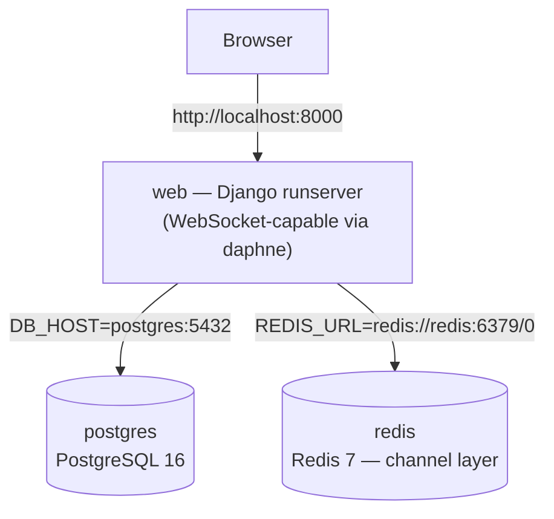
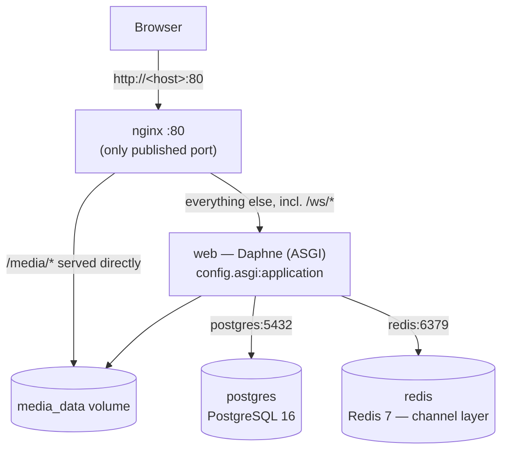

# Deployment Guide

A complete walkthrough for getting **Football Hub** running on your own
machine, from a fresh `git clone` to a working local site — using Docker
Compose, which is the recommended and tested way to run this project
locally. No prior familiarity with this codebase is assumed.

> Looking for terse day-to-day commands instead of a full walkthrough? See
> [docker.md](docker.md). For *why* the Docker setup is shaped the way it
> is, see [architecture/deployment-architecture.md](architecture/deployment-architecture.md).
> Deploying to a cloud provider instead of a single host you manage
> yourself? See [deployment/aws.md](deployment/aws.md) or
> [deployment/gcp.md](deployment/gcp.md).

## Contents

1. [Overview](#1-overview)
2. [Prerequisites](#2-prerequisites)
3. [Clone the Repository](#3-clone-the-repository)
4. [Environment Configuration](#4-environment-configuration)
5. [Create the Environment File](#5-create-the-environment-file)
6. [Build and Start the Application](#6-build-and-start-the-application)
7. [Verify Containers](#7-verify-containers)
8. [Database Initialisation](#8-database-initialisation)
9. [Create a Django Superuser](#9-create-a-django-superuser)
10. [Static Files](#10-static-files)
11. [Media Files](#11-media-files)
12. [Accessing the Application](#12-accessing-the-application)
13. [Django Admin](#13-django-admin)
14. [Real-Time Features](#14-real-time-features)
15. [Useful Docker Commands](#15-useful-docker-commands)
16. [Running Tests](#16-running-tests)
17. [Troubleshooting](#17-troubleshooting)
18. [Clean Reset](#18-clean-reset)
19. [Development Workflow](#19-development-workflow)
20. [Production Deployment](#20-production-deployment)
21. [Security Notes](#21-security-notes)
22. [Architecture Overview](#22-architecture-overview)
23. [Quick Start](#23-quick-start)

---

## 1. Overview

Football Hub is a Django 5.2 monolith: server-rendered templates
(Bootstrap 5 + a little HTMX), PostgreSQL as the only supported database,
and one real-time subsystem — a live chat/support-inbox feature built on
Django Channels (WebSockets), backed by Daphne as the ASGI server. It is
an editorial/blog platform (posts, categories, comments, user roles,
2FA), not a live sports-data product.

**Docker Compose is the recommended way to run this project locally.** It
starts every service the app needs — the app itself, its database, and
its WebSocket message broker — with no manual installation of Python,
PostgreSQL, or Redis on your machine, and no machine-specific setup.

Docker Compose starts these services locally (`docker-compose.yml` +
`docker-compose.override.yml`, merged automatically):

| Service | Image / build | Purpose |
|---|---|---|
| `web` | built from this repo's `Dockerfile` | Django app, served by `manage.py runserver` in dev (WebSocket-capable — see [§14](#14-real-time-features)) |
| `postgres` | `postgres:16-alpine` | Primary database |
| `redis` | `redis:7-alpine` | Channel layer backend for live chat |

A fourth service, `nginx`, is added only in the production Compose
combination — see [§20](#20-production-deployment).

## 2. Prerequisites

You need:

- **Git** — to clone the repository.
- **Docker Desktop** (Windows/macOS) or **Docker Engine + the Compose
  plugin** (Linux) — runs every service; you do **not** need Python,
  PostgreSQL, or Redis installed on your host.

Nothing else is required to run the app via Docker. (A local Python 3.12
install is only useful if you want to run `pytest` or Django management
commands *outside* the container — see [§16](#16-running-tests) — but is
not needed for the Docker workflow itself.)

Verify your tools before continuing:

```bash
git --version
docker --version
docker compose version
```

`docker compose version` must succeed (this project uses Compose v2, the
`docker compose` subcommand — not the older standalone `docker-compose`
binary). If it fails, update Docker Desktop, or install the
[Compose plugin](https://docs.docker.com/compose/install/) on Linux.

## 3. Clone the Repository

```bash
git clone https://github.com/Babilalewis20004/football-hub-django.git
cd football-hub-django
```

## 4. Environment Configuration

The app reads all configuration from environment variables via
`python-decouple` (`config/settings.py`), loaded from a `.env` file in the
project root. `.env.example` is the template documenting every variable —
it is **not** used by the app directly.

`.env` is read two ways: Django reads it directly, and Docker Compose
reads it both to fill in `${POSTGRES_DB}`-style placeholders in
`docker-compose.yml` and to inject variables into the `web` container
(`env_file:`). `.env` is gitignored (see `.gitignore` / `.dockerignore`)
and is never baked into the Docker image — **never commit it**.

### Required (no default — the app refuses to start without these)

| Variable | Purpose | Safe local placeholder |
|---|---|---|
| `SECRET_KEY` | Django's cryptographic signing key | Any long random string for local dev — **must** be a strong, unique value in production |
| `DB_NAME` | PostgreSQL database name | `football_blog` |
| `DB_USER` | PostgreSQL user | `postgres` |
| `DB_PASSWORD` | PostgreSQL password | Any local-only value — must be a strong secret in production |
| `DB_HOST` | Database hostname | `localhost` (Docker Compose overrides this to `postgres` automatically — see the note below) |
| `DB_PORT` | Database port | `5432` |

### Also required when running via Docker Compose specifically

`docker-compose.yml` uses `POSTGRES_DB`/`POSTGRES_USER`/`POSTGRES_PASSWORD`
to initialize the `postgres` container itself. These **must exactly
match** `DB_NAME`/`DB_USER`/`DB_PASSWORD` above, or Django and the
database container will disagree on credentials and every request will
fail with an authentication error.

| Variable | Purpose |
|---|---|
| `POSTGRES_DB` | Must match `DB_NAME` |
| `POSTGRES_USER` | Must match `DB_USER` |
| `POSTGRES_PASSWORD` | Must match `DB_PASSWORD` |

### Optional (have safe defaults)

| Variable | Default | Purpose |
|---|---|---|
| `DEBUG` | `False` | Debug mode — set `True` for local development (shows tracebacks, serves media directly, skips `collectstatic`) |
| `ALLOWED_HOSTS` | `127.0.0.1,localhost` | Comma-separated allowed hostnames |
| `REDIS_URL` | `""` (empty → in-memory channel layer) | Live chat channel layer backend. Leave blank for Docker — Compose overrides it automatically to `redis://redis:6379/0` (see the networking note below) |
| `SECURE_SSL_REDIRECT` | `False` | Force HTTPS redirect — **production only**, leave `False` for local HTTP |
| `SESSION_COOKIE_SECURE` | `False` | HTTPS-only session cookie — **production only** |
| `CSRF_COOKIE_SECURE` | `False` | HTTPS-only CSRF cookie — **production only** |
| `SECURE_HSTS_SECONDS` | `0` | HSTS header duration — **production only** |
| `TELEGRAM_BOT_TOKEN`, `TELEGRAM_CHANNEL_ID` | `""` (unset → disabled) | Optional: announces published posts to a Telegram channel. See [../TELEGRAM.md](../TELEGRAM.md) |
| `EMAIL_BACKEND` | Console backend (prints emails to stdout) | Password-reset email delivery |
| `DEFAULT_FROM_EMAIL` | `noreply@footballhub.local` | From-address for outgoing email |
| `LOGIN_MAX_FAILED_ATTEMPTS` | `5` | Login lockout threshold |
| `LOGIN_LOCKOUT_MINUTES` | `2` | Login lockout duration |
| `LOGIN_CAPTCHA_AFTER_ATTEMPTS` | `2` | Progressive CAPTCHA threshold |
| `SESSION_INACTIVITY_TIMEOUT` | `300` (5 min) | Session auto-logout window, seconds |
| `CSP_VIOLATION_REPORT_PATH` | `/csp-report/` | CSP report-collection endpoint |

### Container networking note

Inside Docker, `DB_HOST`/`DB_PORT`/`REDIS_URL` from `.env` are
**overridden automatically** by `docker-compose.yml` to `postgres`/`5432`
and `redis://redis:6379/0` — the internal Compose service hostnames. This
is why `.env` can keep `DB_HOST=localhost` and a blank `REDIS_URL`: those
values are only used if you run the app natively (outside Docker), and
Compose substitutes the correct container-network values for you. You do
not need to edit these for Docker use.

### Security warning

**Never commit real secrets to Git.** `.env` is already gitignored — keep
it that way. The placeholder values above (`your-secret-key`, a simple
local database password) are fine for local development on your own
machine only. Before any production deployment, replace `SECRET_KEY` and
`DB_PASSWORD`/`POSTGRES_PASSWORD` with strong, unique, randomly generated
values — see [§21](#21-security-notes).

## 5. Create the Environment File

Copy the template to `.env`:

**Windows (PowerShell):**

```powershell
Copy-Item .env.example .env
```

**Linux / macOS:**

```bash
cp .env.example .env
```

Then open `.env` in an editor and fill in at least `SECRET_KEY`,
`DB_PASSWORD`, and `POSTGRES_PASSWORD` (see [§4](#4-environment-configuration)
for what's required vs. optional). Any non-empty local values work for
development — they only need to be strong, unique secrets in production.

## 6. Build and Start the Application

From the project root (with `.env` in place):

```bash
docker compose up --build
```

Run detached (in the background) instead:

```bash
docker compose up --build -d
```

`--build` is only strictly necessary the first time, or after changing
`requirements.txt`/`Dockerfile` — see [§15](#15-useful-docker-commands)
for rebuild-only commands.

**What happens on startup**, in order:

1. Compose merges `docker-compose.yml` (base service definitions) with
   `docker-compose.override.yml` (dev-only settings) automatically — no
   `-f` flags needed for local development.
2. The `web` image is built from the repo's `Dockerfile` (multi-stage:
   dependencies installed in a builder stage, copied into a slim
   non-root runtime image).
3. `postgres` and `redis` start and must pass their health checks
   (`pg_isready`, `redis-cli ping`) before `web` starts, per `depends_on:
   condition: service_healthy` in `docker-compose.yml`.
4. The container's entrypoint (`docker/entrypoint.sh`) runs: it polls the
   database connection directly via `psycopg2` (up to 30 attempts, 2
   seconds apart) as a second line of defense beyond the health check,
   then runs `python manage.py migrate --noinput`.
5. In dev, `collectstatic` is **skipped** (`DJANGO_COLLECTSTATIC=0` is
   set by `docker-compose.override.yml`) because `DEBUG=True` serves
   static files directly from `static/`.
6. Finally, `python manage.py runserver 0.0.0.0:8000` starts (this
   command is set by `docker-compose.override.yml`, replacing the
   image's default Daphne command — see [§14](#14-real-time-features)
   for why this is still WebSocket-capable).

The whole project directory is bind-mounted read/write into the
container in dev, so code edits on your host are picked up immediately
by Django's autoreloader — no rebuild needed for ordinary code changes.

## 7. Verify Containers

```bash
docker compose ps
```

A healthy local deployment shows three services, all `Up` (`postgres` and
`redis` should also show `(healthy)` once their health checks pass):

```text
NAME                     STATUS
<project>-postgres-1     Up (healthy)
<project>-redis-1        Up (healthy)
<project>-web-1          Up (healthy)
```

If `web` is missing or restarting, check its logs (`docker compose logs
web`) — see [§17](#17-troubleshooting).

## 8. Database Initialisation

**Migrations are applied automatically on every container start.**
`docker/entrypoint.sh` runs `python manage.py migrate --noinput` before
starting the server — you do not need to run this manually after the
initial `docker compose up`.

If you pull new migration files while the containers are already
running (without restarting them), apply them manually:

```bash
docker compose exec web python manage.py migrate
```

## 9. Create a Django Superuser

To access the Django admin, create an administrator account inside the
running `web` container:

```bash
docker compose exec web python manage.py createsuperuser
```

Follow the interactive prompts for username, email, and password.

## 10. Static Files

- **Development** (`DEBUG=True`, the default in `.env.example`):
  `django.contrib.staticfiles` serves files directly from `static/` (via
  `STATICFILES_DIRS`) — no `collectstatic` step is run
  (`docker-compose.override.yml` sets `DJANGO_COLLECTSTATIC=0`).
- **Production**: `docker/entrypoint.sh` runs `python manage.py
  collectstatic --noinput` automatically on every container start,
  populating `STATIC_ROOT` (`staticfiles/`). `whitenoise.middleware.WhiteNoiseMiddleware`
  (already wired into `MIDDLEWARE` in `config/settings.py`) then serves
  those files directly from the Django/Daphne process.

You do not need to run `collectstatic` by hand in either environment —
it only becomes relevant if you're debugging a static-file issue and
want to force a fresh collection:

```bash
docker compose exec web python manage.py collectstatic --noinput
```

## 11. Media Files

User-uploaded content (`Post.featured_image`, `CustomUser.avatar`) is
stored under `MEDIA_ROOT` (`media/`), served at `MEDIA_URL` (`/media/`).

- **Development**: the whole project directory — including `media/` — is
  bind-mounted into the container (`docker-compose.override.yml`), so
  uploads land directly in `./media` on your host and persist across
  `docker compose down` / `up` just like any other file on disk. Django
  itself serves `/media/...` in this mode, via the conditional route in
  `config/urls.py` that's only active when `DEBUG=True`.
- **Production**: media is *not* bind-mounted; it's stored in the named
  Docker volume `media_data` (`docker-compose.prod.yml`), mounted
  read-write into `web` and read-only into `nginx`. Nginx serves
  `/media/...` directly from that volume, because nothing in the Django
  codebase serves media once `DEBUG=False`. See
  [§20](#20-production-deployment) and
  [architecture/deployment-architecture.md](architecture/deployment-architecture.md)
  for why.

## 12. Accessing the Application

Local development publishes the app on **port 8000** only
(`docker-compose.override.yml`: `ports: ["8000:8000"]`). `postgres` and
`redis` do not publish any host port — they're reachable only from other
containers on the internal `backend` network.

Open in your browser:

```text
http://localhost:8000
```

(In production, the port is different — see [§20](#20-production-deployment).)

## 13. Django Admin

```text
http://localhost:8000/admin/
```

(`config/urls.py`: `path('admin/', admin.site.urls)`.) Log in with the
superuser credentials you created in [§9](#9-create-a-django-superuser).

## 14. Real-Time Features

Football Hub's live chat (and the staff support inbox) uses **Django
Channels** over WebSockets, not plain HTTP polling.

- **ASGI application**: `config/asgi.py` defines a `ProtocolTypeRouter`
  that routes `http` traffic to the normal Django app and `websocket`
  traffic to `chat.routing.websocket_urlpatterns`, wrapped in
  `AllowedHostsOriginValidator(AuthMiddlewareStack(...))`.
- **WebSocket routes** (`chat/routing.py`):
  - `ws/chat/support/` — `SupportInboxConsumer`
  - `ws/chat/<session_id>/` — `ChatConsumer`
- **Who serves it**: in dev, `manage.py runserver` is WebSocket-capable
  because `daphne` is registered first in `INSTALLED_APPS`
  (`config/settings.py`) — Channels patches the dev server to handle ASGI
  automatically. In production, `docker/entrypoint.sh`'s default command
  runs Daphne directly: `daphne -b 0.0.0.0 -p 8000 config.asgi:application`.
- **Is Redis required?** Not strictly, for a single dev process. Django
  falls back to `channels.layers.InMemoryChannelLayer` when `REDIS_URL`
  is unset (the default in `.env.example`), which is correct for a
  single process. Docker Compose, however, always provides a `redis`
  service and overrides `REDIS_URL` to `redis://redis:6379/0` for the
  `web` container regardless of what `.env` has — so under Docker Compose
  you're always exercising the Redis-backed `channels_redis.core.RedisChannelLayer`
  path, not the in-memory fallback. Redis becomes a **hard requirement**
  the moment more than one app process/worker runs, since the in-memory
  layer can't fan messages out across processes.
- **Verifying it works**: open the app in two browser windows (or two
  different browsers), log in as two different users, and start a chat —
  a message sent in one window should appear in the other without a page
  reload. You can also confirm the WebSocket connection itself in your
  browser's DevTools → Network → WS tab: you should see a connection to
  `ws://localhost:8000/ws/chat/...` with status `101 Switching Protocols`.

## 15. Useful Docker Commands

```bash
# Start services (foreground)
docker compose up

# Start services (background)
docker compose up -d

# Stop services (containers removed, volumes kept)
docker compose down

# Rebuild the web image (after requirements.txt / Dockerfile changes)
docker compose build web

# Rebuild ignoring the layer cache entirely
docker compose build --no-cache web

# View logs for all services (follow)
docker compose logs -f

# View logs for one service only
docker compose logs -f web

# Open a shell inside the Django container
docker compose exec web bash

# Run a Django management command
docker compose exec web python manage.py <command>

# Restart a single service
docker compose restart web

# Check container status
docker compose ps
```

**Removing containers** (`down`) does not delete the `postgres_data`
volume by default — your database is preserved across restarts. See
[§18](#18-clean-reset) for the destructive variant that does remove it.

## 16. Running Tests

The project's test suite runs via `pytest` (with `pytest-django`),
alongside — not instead of — `python manage.py test`. This is also the
exact command the CI security pipeline runs (`.github/workflows/security.yml`).

`pytest`/`pytest-django`/`pytest-cov` are **dev-only dependencies**
(`requirements-dev.txt`), deliberately not installed in the production
image. To run the suite inside the running `web` container, install them
first:

```bash
docker compose exec web pip install -r requirements-dev.txt
docker compose exec web python -m pytest -v
```

With coverage (for the `blog` app, matching [../TESTING.md](../TESTING.md)):

```bash
docker compose exec web python -m pytest --cov=blog --cov-report=term-missing
```

This installs test tooling into the container's writable layer only — it
does not persist across `docker compose build` / container recreation,
and never affects the production image.

## 17. Troubleshooting

**`.env` missing / `decouple.UndefinedValueError`**
`web` will crash on startup with an error naming the missing variable
(e.g. `SECRET_KEY`). Confirm `.env` exists in the project root (see
[§5](#5-create-the-environment-file)) and defines every required variable
from [§4](#4-environment-configuration).

**Environment variables not taking effect**
Compose only re-reads `.env` when a container is (re)created, not on a
plain restart. After editing `.env`:
```bash
docker compose up -d --force-recreate web
```

**PostgreSQL connection failure**
`docker/entrypoint.sh` retries the database connection for up to ~60
seconds before giving up, so brief startup delays resolve themselves.
If `web` still fails after that:
```bash
docker compose logs postgres
docker compose ps
```
Confirm `postgres` shows `(healthy)`. If it's crash-looping, check that
`POSTGRES_DB`/`POSTGRES_USER`/`POSTGRES_PASSWORD` in `.env` are all set
(they have no defaults).

**Database authentication failure**
This almost always means `POSTGRES_DB`/`POSTGRES_USER`/`POSTGRES_PASSWORD`
don't exactly match `DB_NAME`/`DB_USER`/`DB_PASSWORD` in `.env` — see
[§4](#4-environment-configuration). Fix `.env`, then recreate (changing
Postgres credentials after the volume already exists requires a reset —
see below):
```bash
docker compose down
docker compose up -d
```
If the *volume* was already initialized with the old credentials, a
plain restart won't fix it — Postgres only applies `POSTGRES_PASSWORD`
etc. the first time it initializes an empty data directory. You'll need
to remove the `postgres_data` volume (destructive — see
[§18](#18-clean-reset)) and let it reinitialize.

**Port already in use** (`8000` in dev, `80` in production)
Another process on your host is already bound to that port. Either stop
it, or change the published port in `docker-compose.override.yml` (dev)
/ `docker-compose.prod.yml` (prod) — e.g. `"8001:8000"` — then restart.

**Container repeatedly restarting**
```bash
docker compose logs web
```
Read the traceback at the bottom — it's almost always a missing/invalid
environment variable, or a database connection problem (see above).

**Migration errors**
```bash
docker compose exec web python manage.py migrate
```
Run manually to see the full traceback. If migrations conflict after a
`git pull`, confirm you're on the correct branch and that no local,
uncommitted migration files exist that clash with new ones.

**Static files not appearing**
In dev this should just work (`DEBUG=True` serves `static/` directly). If
you set `DEBUG=False` locally, static files won't appear unless
`collectstatic` has run — see [§10](#10-static-files).

**Media files not appearing**
In dev, confirm the file actually landed in `./media` on your host (the
bind mount should make this immediate). In a production-style run,
confirm the `nginx` container is up and serving `/media/` from the
`media_data` volume — plain `docker compose up` (dev) has no `nginx`
service at all, so a raw `web`-only setup with `DEBUG=False` will 404 on
media by design (see [§20](#20-production-deployment)).

**WebSocket / Channels connection problems**
Check the browser DevTools Network tab for the `/ws/...` connection's
status. A failure here usually means either `ALLOWED_HOSTS` doesn't
include the host you're browsing from (Channels' `AllowedHostsOriginValidator`
rejects it), or (in a production-style setup) the reverse proxy isn't
passing the WebSocket `Upgrade`/`Connection` headers through — the
bundled `docker/nginx/default.conf` already handles this correctly for
the bundled Nginx config.

**Redis connection problems**
```bash
docker compose logs redis
docker compose exec redis redis-cli ping
```
Should return `PONG`. If `web` can't reach it, confirm you haven't
overridden `REDIS_URL` in `.env` to point somewhere unreachable —
Compose normally overrides it to `redis://redis:6379/0` automatically
regardless of `.env` (see [§4](#4-environment-configuration)).

**Permission / file-sharing problems on Windows**
If Docker Desktop can't bind-mount the project directory, confirm the
project folder is under a drive shared with Docker Desktop (Settings →
Resources → File sharing) and that Docker Desktop is using the WSL2
backend (Settings → General). Restarting Docker Desktop resolves most
transient mount errors.

**Stale Docker volumes / weird persistent state**
If the database seems to be in an inconsistent state that a normal
restart doesn't fix, see the destructive reset in
[§18](#18-clean-reset) — only use it if you don't need the current
local data.

**Rebuilding after dependency changes**
Any change to `requirements.txt` or the `Dockerfile` requires a rebuild —
a plain restart re-uses the existing image and won't pick up the change:
```bash
docker compose build web
docker compose up -d
```

## 18. Clean Reset

To completely reset your local Docker environment — removing containers,
networks, **and named volumes**:

```bash
docker compose down -v
```

> **Warning:** `-v` deletes the `postgres_data` volume, which
> **permanently destroys your local PostgreSQL database** (every post,
> user, comment — everything). In a production-style run
> (`docker-compose.prod.yml`), it also deletes the `media_data` volume —
> every uploaded avatar/post image. There is no confirmation prompt.
> Only run this if you don't need the current local data, or have backed
> it up first. (In plain dev, uploaded media itself is safe from `-v` —
> it lives in the bind-mounted `./media` on your host, not a volume — but
> the database is not.)

After a full reset, start again from [§6](#6-build-and-start-the-application):

```bash
docker compose up --build -d
```

## 19. Development Workflow

Once initial setup ([§1](#1-overview)–[§9](#9-create-a-django-superuser))
is done, the normal day-to-day loop is:

```bash
# Pull the latest changes
git pull

# Rebuild only if requirements.txt or the Dockerfile changed
docker compose build web

# Start the application
docker compose up -d

# Apply any new migrations (normally automatic on container start,
# but explicit if you didn't restart the container — see §8)
docker compose exec web python manage.py migrate

# Run tests before committing (see §16)
docker compose exec web python -m pytest -v

# Inspect logs while developing
docker compose logs -f web

# Stop the environment when done
docker compose down
```

## 20. Production Deployment

**The local Docker Compose setup described above is a development
configuration, not a production-ready deployment as-is.** Production
requires the explicit `docker-compose.prod.yml` overlay plus manual
security configuration — it is not automatic.

### Local Development vs. Production

| Aspect | Local Development (`docker-compose.yml` + `.override.yml`) | Production (`docker-compose.yml` + `.prod.yml`) |
|---|---|---|
| Command | `docker compose up` (auto-merges override file) | `docker compose -f docker-compose.yml -f docker-compose.prod.yml up -d` (override file is **not** picked up) |
| Source code | Bind-mounted read/write, live-reload | Baked into an immutable image — a code change requires a rebuild |
| Server | `manage.py runserver` | Daphne (`docker/entrypoint.sh`'s default command) |
| Static files | Served directly by `django.contrib.staticfiles`, no `collectstatic` | `collectstatic` runs on every container start; served by WhiteNoise |
| Media | `./media` bind mount | `media_data` named volume, served by Nginx |
| Reverse proxy | None — `web` publishes `:8000` directly | **Nginx**, the only container with a published port (`:80`) |
| `DEBUG` | `True` | **Must be `False`** |

### Running the production combination

```bash
docker compose -f docker-compose.yml -f docker-compose.prod.yml build
docker compose -f docker-compose.yml -f docker-compose.prod.yml up -d
```

### Required production environment variables

Beyond the variables in [§4](#4-environment-configuration), production
specifically needs (all set via `.env`, per `docker-compose.prod.yml` and
`config/settings.py`):

- `DEBUG=False`
- A strong, unique `SECRET_KEY` (not the local placeholder)
- Strong `DB_PASSWORD` / `POSTGRES_PASSWORD`
- `ALLOWED_HOSTS` set to your real domain(s)
- `REDIS_URL` — required in any multi-worker production deployment (see
  [§14](#14-real-time-features)); Docker Compose provides this
  automatically via the `redis` service
- Once HTTPS is terminated in front of the stack: `SECURE_SSL_REDIRECT=True`,
  `SESSION_COOKIE_SECURE=True`, `CSRF_COOKIE_SECURE=True`, and a nonzero
  `SECURE_HSTS_SECONDS`

### Known, documented limitations (not addressed by this Compose setup)

Per [docker.md](docker.md#limitations-read-before-calling-this-production-ready):

- **No TLS is configured.** `docker/nginx/default.conf` serves plain HTTP
  on `:80` only. A real deployment needs a TLS-terminating load balancer
  in front, or an extended Nginx config with real certificates — and, if
  you add TLS termination in front, `SECURE_PROXY_SSL_HEADER` must be set
  in `config/settings.py` (see the comment there and in `docker.md`)
  before turning on `SECURE_SSL_REDIRECT`, or every request will
  redirect-loop.
- **Media storage is a single-host Docker volume, not object storage.**
  It does not survive migrating to a different host and has no
  built-in backup/replication.
- **No CI/CD deployment automation exists.** `.github/workflows/security.yml`
  runs security scanning and tests on every push/PR (see
  [security.md](security.md)) but there is no build/push/deploy job —
  deployment is a manual `docker compose ... up -d` on the target host.

## 21. Security Notes

- **Never commit `.env`** — it's gitignored; keep it that way.
- **Never commit real passwords, API tokens, or secret keys** anywhere in
  the repository, including in commit messages or comments.
- **Never reuse development secrets in production.** The placeholder
  `SECRET_KEY`/`DB_PASSWORD` values suitable for your local machine must
  never appear in a deployed environment.
- **Use a strong, unique Django `SECRET_KEY`** in production — generate
  one rather than hand-typing a "memorable" string.
- **Set `DEBUG=False`** in any environment reachable by anyone other than
  you — `DEBUG=True` exposes stack traces, settings, and other internals.
- **Set `ALLOWED_HOSTS`** to your actual production domain(s) — do not
  leave it as the local default.
- **Use secure, unique database credentials** in production —
  `DB_PASSWORD`/`POSTGRES_PASSWORD` must match each other (see
  [§4](#4-environment-configuration)) and must not be the local dev value.
- **Use HTTPS in production** — set `SECURE_SSL_REDIRECT`,
  `SESSION_COOKIE_SECURE`, `CSRF_COOKIE_SECURE`, and `SECURE_HSTS_SECONDS`
  only once TLS is actually terminated in front of the app (see
  [§20](#20-production-deployment)); turning these on without TLS in
  front will break the site.
- **Review CSRF/CORS/security settings** in `config/settings.py` before
  going live — this project already ships a Content-Security-Policy
  (currently Report-Only — see [security/csp/CSP_NOTES.md](security/csp/CSP_NOTES.md)),
  CSRF cookie hardening, session inactivity timeouts, and login
  lockout/CAPTCHA controls; understand what's already enabled before
  changing it.
- **Keep dependencies updated** — this repo has an automated pip-audit /
  Trivy / Gitleaks / Bandit / Semgrep pipeline (see
  [security.md](security.md)) that flags known vulnerabilities on every
  push; don't ignore its findings.

## 22. Architecture Overview

Local development (`docker compose up` — three containers, no Nginx):



Production (`docker-compose.yml` + `docker-compose.prod.yml` — four
containers, per [architecture/deployment-architecture.md](architecture/deployment-architecture.md)):



## 23. Quick Start

For an experienced developer who just wants the commands:

```bash
git clone https://github.com/Babilalewis20004/football-hub-django.git
cd football-hub-django
cp .env.example .env            # Windows: Copy-Item .env.example .env
# edit .env — set SECRET_KEY, DB_PASSWORD, POSTGRES_PASSWORD (must match DB_*)
docker compose up --build -d
docker compose exec web python manage.py createsuperuser
```

Then open <http://localhost:8000> (app) and
<http://localhost:8000/admin/> (admin).
