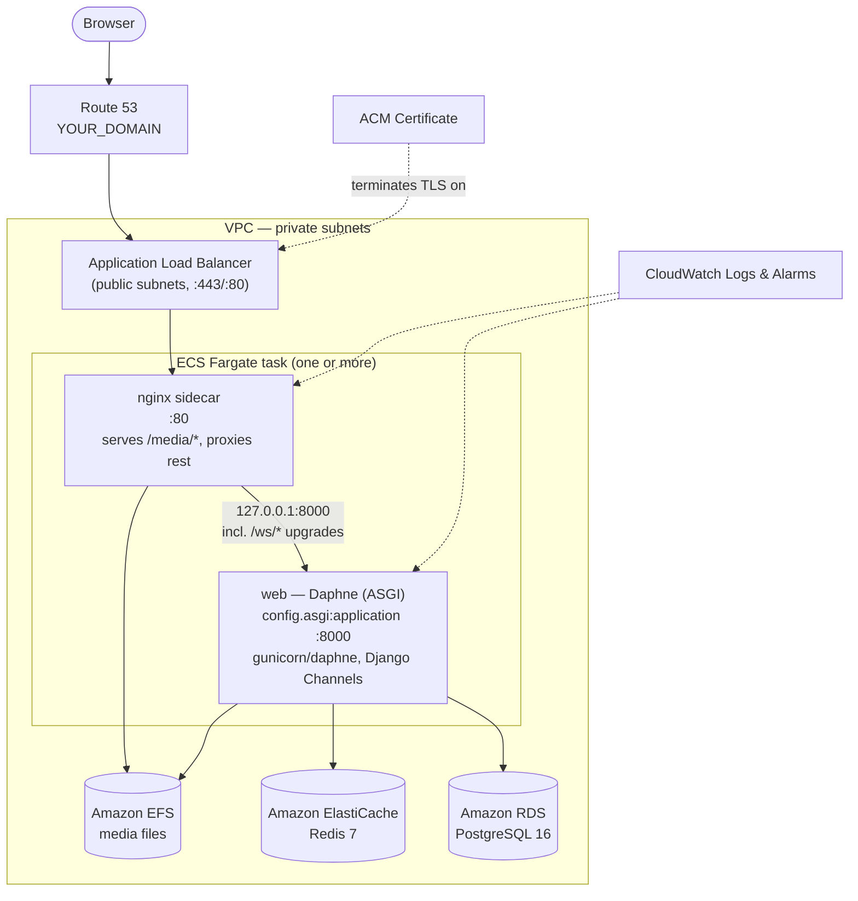

# Deploying Football Hub to AWS

A production-oriented deployment of Football Hub to Amazon Web Services,
using managed services in place of the sibling containers Docker Compose
runs locally. Read [README.md](README.md) first for how this guide relates
to the existing local/Docker documentation, and
[../architecture/deployment-architecture.md](../architecture/deployment-architecture.md)
for *why* the app's Docker/Nginx/Daphne shape looks the way it does — this
guide reuses that shape rather than inventing a new one.

**Assumed starting point:** you can already run `docker compose -f
docker-compose.yml -f docker-compose.prod.yml build` successfully from a
clone of this repository (see [../deployment.md](../deployment.md)). This
guide deploys that same image.

## Contents

1. [Architecture](#1-architecture)
2. [AWS Account Preparation](#2-aws-account-preparation)
3. [Networking (VPC)](#3-networking-vpc)
4. [Database — Amazon RDS PostgreSQL](#4-database--amazon-rds-postgresql)
5. [Redis — Amazon ElastiCache](#5-redis--amazon-elasticache)
6. [Container Registry — Amazon ECR](#6-container-registry--amazon-ecr)
7. [Application Server](#7-application-server)
8. [Static and Media Files](#8-static-and-media-files)
9. [Container Deployment — ECS + Fargate](#9-container-deployment--ecs--fargate)
10. [Domain and HTTPS](#10-domain-and-https)
11. [Environment Variables and Secrets](#11-environment-variables-and-secrets)
12. [Database Migration Strategy](#12-database-migration-strategy)
13. [Monitoring](#13-monitoring)
14. [Deployment Process (Complete Sequence)](#14-deployment-process-complete-sequence)
15. [Rollback](#15-rollback)
16. [WebSocket Verification](#16-websocket-verification)
17. [Production Security Checklist](#17-production-security-checklist)
18. [Troubleshooting](#18-troubleshooting)
19. [Cost Awareness](#19-cost-awareness)

---

## 1. Architecture



This mirrors `docker-compose.prod.yml` almost exactly: the same two
containers (`web` = Daphne, `nginx` = reverse proxy + media server), the
same division of responsibility, just with managed AWS services standing
in for the sibling `postgres`/`redis` containers and a shared filesystem
(EFS) standing in for the `media_data` named Docker volume. See
[§7](#7-application-server) for why both containers are still needed, and
[§8](#8-static-and-media-files) for the one deliberate deviation this
requires from the bundled `docker/nginx/default.conf`.

**Services used and why:**

| Service | Replaces (local) | Why |
|---|---|---|
| ECS on Fargate | `web` + `nginx` containers | Runs the existing Docker image with no server/VM management; Fargate removes the need to patch/scale EC2 hosts yourself |
| Amazon RDS (PostgreSQL) | `postgres` container | Managed backups, patching, and failover for the app's only database engine (`django.db.backends.postgresql` — no SQLite path exists) |
| Amazon ElastiCache (Redis) | `redis` container | Managed Redis for the Channels layer — required the moment more than one task runs (see [§7](#7-application-server)) |
| Amazon ECR | — (local image only) | Private registry to push the built image to, so ECS can pull it |
| Application Load Balancer | `nginx`'s published `:80` | TLS termination, health checks, WebSocket-upgrade-capable HTTP(S) routing to the task |
| Amazon EFS | `media_data` named volume | Shared, persistent filesystem for `/app/media`, reachable from every task and every AZ — a named Docker volume only lives on one host |
| Route 53 + ACM | — (not present locally) | DNS and free managed TLS certificates for a custom domain |
| CloudWatch | `docker compose logs` | Centralized logs/metrics/alarms across tasks, since Fargate tasks have no persistent host to `docker logs` into |
| Secrets Manager / SSM Parameter Store | `.env` file | Secret delivery without baking values into the image or committing them |

Placeholders used throughout: `YOUR_AWS_REGION`, `YOUR_AWS_ACCOUNT_ID`,
`YOUR_DOMAIN`, `YOUR_BUCKET_NAME` (only if you later add S3, see
[§8](#8-static-and-media-files)). Replace every one of these — none of
them are usable as-is.

## 2. AWS Account Preparation

**Do this in:** the AWS Console (root login, one time only) and your local
terminal.

1. **Create/sign in to an AWS account.** If you don't have one, create it
   at <https://aws.amazon.com>. Enable MFA on the root user immediately —
   the root account should not be used for day-to-day work after this
   step.
2. **Never use the root account for deployment work.** Create a dedicated
   IAM user or, preferably, use **IAM Identity Center** (AWS SSO) to
   federate your own login into a role. For a small team/solo project, an
   IAM user with MFA and a scoped policy is a reasonable minimum.
3. **Create a dedicated deployment IAM identity** (user or role) with a
   policy scoped to what this deployment actually touches — not
   `AdministratorAccess`. At minimum: `AmazonECS_FullAccess`,
   `AmazonEC2ContainerRegistryFullAccess`, `AmazonRDSFullAccess`,
   `AmazonElastiCacheFullAccess`, `AmazonVPCFullAccess`,
   `ElasticLoadBalancingFullAccess`, `AmazonEFSFullAccess`,
   `CloudWatchLogsFullAccess`, plus `secretsmanager:*` or
   `ssm:*Parameter*` scoped to a naming prefix (e.g. `football-hub/*`).
   Tighten these to resource-level ARNs once the initial setup is stable —
   the broad managed policies above are a reasonable starting point, not
   the end state.
4. **Install and configure the AWS CLI** (v2):
   ```bash
   aws --version
   aws configure
   ```
   Supply the deployment IAM user's access key, secret key, default
   region (`YOUR_AWS_REGION`, e.g. `eu-west-1`), and output format
   (`json`). Confirm it works:
   ```bash
   aws sts get-caller-identity
   ```
5. **Pick a region** close to your users and confirm all the services
   this guide uses (ECS/Fargate, RDS, ElastiCache, ECR, ACM, EFS) are
   available there — all are available in every standard commercial
   region as of this writing.
6. **Secrets strategy, decided up front:** this guide uses **AWS Systems
   Manager (SSM) Parameter Store** for configuration and secrets, since it
   has no extra per-parameter cost (unlike Secrets Manager's per-secret
   monthly fee) and is sufficient for this app's needs (no automatic
   credential rotation required). If you want automatic RDS credential
   rotation, use **Secrets Manager** for `DB_PASSWORD` specifically and
   SSM for everything else — both are referenced the same way from an ECS
   task definition. See [§11](#11-environment-variables-and-secrets).

## 3. Networking (VPC)

**Do this in:** the AWS Console (VPC service) or via CLI/Infrastructure-as-Code.
For a first deployment, using the **VPC Console's "VPC and more" wizard**
is the fastest correct path (it wires up subnets, route tables, and
gateways consistently) — the manual CLI steps below are shown for clarity
of what it creates.

```text
VPC (e.g. 10.0.0.0/16)
├── Public subnets (2, across 2 AZs) — 10.0.0.0/24, 10.0.1.0/24
│     └── ALB, NAT Gateway
├── Private subnets (2, across 2 AZs) — 10.0.10.0/24, 10.0.11.0/24
│     └── ECS Fargate tasks, RDS, ElastiCache, EFS mount targets
├── Internet Gateway — attached to the VPC, routed from public subnets
└── NAT Gateway (in a public subnet) — outbound internet for private
      subnets (ECR image pulls, OS package updates), no inbound path
```

**What's publicly reachable and what isn't:**

| Component | Reachability |
|---|---|
| ALB | Public — this is the only internet-facing component |
| ECS tasks (web + nginx) | **Private only** — reachable from the ALB's security group, nothing else |
| RDS PostgreSQL | **Private only** — reachable from the ECS task security group, nothing else. Never assign it a public IP / place it in a public subnet. |
| ElastiCache Redis | **Private only** — same as RDS |
| EFS | **Private only** — mount targets in the private subnets, reachable from the ECS task security group only |

**Security groups** (least-privilege, one per component):

| Security group | Inbound | Outbound |
|---|---|---|
| `alb-sg` | `443` (and `80`, redirected — see [§10](#10-domain-and-https)) from `0.0.0.0/0` | to `ecs-task-sg` on `80` |
| `ecs-task-sg` | `80` from `alb-sg` only | to `rds-sg` (`5432`), `redis-sg` (`6379`), `efs-sg` (`2049`), and `0.0.0.0/0` on `443` (ECR/CloudWatch/SSM API calls via NAT) |
| `rds-sg` | `5432` from `ecs-task-sg` only | — |
| `redis-sg` | `6379` from `ecs-task-sg` only | — |
| `efs-sg` | `2049` (NFS) from `ecs-task-sg` only | — |

Create the VPC:

```bash
aws ec2 create-vpc --cidr-block 10.0.0.0/16 --region YOUR_AWS_REGION \
  --tag-specifications 'ResourceType=vpc,Tags=[{Key=Name,Value=football-hub-vpc}]'
```

(Continue with subnets/route tables/gateways per the CIDR plan above, or
use the Console wizard — **VPC → Create VPC → VPC and more**, 2 AZs, 2
public + 2 private subnets, 1 NAT gateway for a dev/staging budget, or 1
per AZ for production high availability.)

## 4. Database — Amazon RDS PostgreSQL

The app has exactly one supported database engine
(`django.db.backends.postgresql` — no SQLite fallback exists anywhere in
`config/settings.py`), so this is not a choice among engines, only among
Postgres hosting options. RDS is used here as the managed option.

**Do this in:** AWS Console (RDS) or CLI, from your terminal (needs
network access to the AWS API, not to the VPC itself).

1. **Create a DB subnet group** spanning the two private subnets:
   ```bash
   aws rds create-db-subnet-group \
     --db-subnet-group-name football-hub-db-subnets \
     --db-subnet-group-description "Private subnets for Football Hub RDS" \
     --subnet-ids subnet-PRIVATE_A subnet-PRIVATE_B
   ```
2. **Create the instance.** Match the version Postgres runs locally
   (`postgres:16-alpine` in `docker-compose.yml`) — use a PostgreSQL 16.x
   engine version for parity:
   ```bash
   aws rds create-db-instance \
     --db-instance-identifier football-hub-db \
     --db-instance-class db.t4g.micro \
     --engine postgres \
     --engine-version 16 \
     --master-username footballhub \
     --master-user-password 'REPLACE_WITH_A_STRONG_GENERATED_PASSWORD' \
     --allocated-storage 20 \
     --storage-type gp3 \
     --storage-encrypted \
     --db-subnet-group-name football-hub-db-subnets \
     --vpc-security-group-ids sg-RDS_SG_ID \
     --db-name football_blog \
     --backup-retention-period 7 \
     --no-publicly-accessible \
     --no-multi-az
   ```
   - `--db-name football_blog` matches `DB_NAME` in `.env.example` — this
     is a naming convention, not a requirement; any name works as long as
     `DB_NAME` matches what you pass here.
   - `--storage-encrypted` — encryption at rest, cannot be added after
     creation, set it now.
   - `--no-publicly-accessible` — **never** expose RDS to the internet;
     the app reaches it only over the private `backend`-equivalent network.
   - `--backup-retention-period 7` — automated daily backups, 7-day
     retention (raise for production; RDS automated backups + this
     retention window is the AWS equivalent of backing up the
     `postgres_data` Docker volume, which this Compose setup has no
     built-in backup story for at all).
   - `--no-multi-az` for a dev/cost-conscious setup; pass `--multi-az`
     instead for production (synchronous standby in a second AZ,
     automatic failover — see [§19](#19-cost-awareness) for the cost
     trade-off).
3. **Wait for it to become available**, then note its endpoint:
   ```bash
   aws rds describe-db-instances --db-instance-identifier football-hub-db \
     --query 'DBInstances[0].Endpoint.Address' --output text
   ```
4. **Map to Django's environment variables** exactly as
   `config/settings.py` reads them (`config("DB_NAME")` etc., all
   required with no defaults):

   | `.env` variable | Value |
   |---|---|
   | `DB_HOST` | the RDS endpoint from step 3 |
   | `DB_PORT` | `5432` |
   | `DB_NAME` | `football_blog` (or whatever you passed to `--db-name`) |
   | `DB_USER` | `footballhub` (or whatever you passed to `--master-username`) |
   | `DB_PASSWORD` | the password from step 2 — store this in SSM/Secrets Manager, never in plain task-definition JSON, see [§11](#11-environment-variables-and-secrets) |

5. **Run migrations** — see [§12](#12-database-migration-strategy). Do
   not skip this; RDS starts with an empty schema.

RDS handles minor-version patching automatically inside your chosen
maintenance window; storage encryption and backups are configured above.
There is nothing else this app's Postgres usage requires — no extensions,
custom parameter groups, or non-default settings are referenced anywhere
in the codebase.

## 5. Redis — Amazon ElastiCache

**Is Redis required?** The same rule the app already documents applies in
the cloud: `CHANNEL_LAYERS` falls back to `channels.layers.InMemoryChannelLayer`
when `REDIS_URL` is unset, which only routes messages *within a single
process*. The moment ECS runs more than one task (any real production
setup — for availability alone, let alone load), a chat message delivered
to one task's `ChatConsumer` would never reach a `SupportInboxConsumer`
connected to a different task. **Redis (ElastiCache) is a hard
requirement for this deployment** the moment `desiredCount` > 1, which it
should be for any production service behind an ALB. If you deliberately
run exactly one Fargate task with no plans to scale, you could skip
ElastiCache and leave `REDIS_URL` unset — this guide does not recommend
that for a service with a load balancer in front of it, since ALB health
checks and rolling deployments will briefly run two tasks anyway.

**Do this in:** AWS Console (ElastiCache) or CLI.

1. **Create a subnet group** (same two private subnets as RDS):
   ```bash
   aws elasticache create-cache-subnet-group \
     --cache-subnet-group-name football-hub-redis-subnets \
     --cache-subnet-group-description "Private subnets for Football Hub Redis" \
     --subnet-ids subnet-PRIVATE_A subnet-PRIVATE_B
   ```
2. **Create the Redis cluster** (matching `redis:7-alpine` used locally):
   ```bash
   aws elasticache create-cache-cluster \
     --cache-cluster-id football-hub-redis \
     --engine redis \
     --engine-version 7.1 \
     --cache-node-type cache.t4g.micro \
     --num-cache-nodes 1 \
     --cache-subnet-group-name football-hub-redis-subnets \
     --security-group-ids sg-REDIS_SG_ID
   ```
   A single-node cluster is sufficient for the channel layer's use case
   (transient pub/sub fan-out, not durable storage — losing the node loses
   in-flight WebSocket routing state, not persisted data, since all
   messages are also written to Postgres by the consumers per
   [realtime-chat-flow.md](../architecture/realtime-chat-flow.md)). Add a
   replica (`--num-cache-nodes 2` on a replication group) if you want
   Redis-level failover.
3. **Never expose this publicly** — no public endpoint exists on
   ElastiCache by design; keep it that way by leaving it in the private
   subnets with `redis-sg` as configured in [§3](#3-networking-vpc).
4. **Get the endpoint and construct `REDIS_URL`:**
   ```bash
   aws elasticache describe-cache-clusters --cache-cluster-id football-hub-redis \
     --show-cache-node-info \
     --query 'CacheClusters[0].CacheNodes[0].Endpoint.Address' --output text
   ```
   ```text
   REDIS_URL=redis://<elasticache-endpoint>:6379/0
   ```
   This is consumed exactly the way `docker-compose.yml` already injects
   it locally (`REDIS_URL: redis://redis:6379/0`) — only the hostname
   changes, from the Compose service name to the ElastiCache endpoint.
   `config/settings.py` picks it up unmodified via
   `REDIS_URL = config('REDIS_URL', default='')`.
5. **Test connectivity** from inside a running task (see
   [§16](#16-websocket-verification)) — there's no local `redis-cli` on
   your machine that can reach a private-subnet endpoint directly; test
   from within the VPC (an ECS Exec shell into a running task, or a
   bastion) or via the Django shell:
   ```bash
   aws ecs execute-command --cluster football-hub --task TASK_ID \
     --container web --interactive --command "python manage.py shell -c \"
   from channels_redis.core import RedisChannelLayer
   import asyncio
   async def check():
       layer = RedisChannelLayer(hosts=['redis://<elasticache-endpoint>:6379/0'])
       await layer.send('test-channel', {'type': 'test'})
       print('Redis reachable')
   asyncio.run(check())
   \""
   ```
   (ECS Exec must be enabled on the service/task — see
   [§9](#9-container-deployment--ecs--fargate).)

If ElastiCache is unreachable, `channels_redis` raises connection errors
from inside the consumers — see [§18](#18-troubleshooting).

## 6. Container Registry — Amazon ECR

**Do this in:** your terminal, from the repository root (needs `docker`
and the AWS CLI configured per [§2](#2-aws-account-preparation)).

1. **Create the repository:**
   ```bash
   aws ecr create-repository \
     --repository-name football-hub \
     --image-scanning-configuration scanOnPush=true \
     --region YOUR_AWS_REGION
   ```
   `scanOnPush=true` gets you a basic vulnerability scan on every push —
   complementary to, not a replacement for, this repo's existing Trivy
   image scan in CI (see [../security.md](../security.md)).
2. **Authenticate Docker with ECR:**
   ```bash
   aws ecr get-login-password --region YOUR_AWS_REGION | \
     docker login --username AWS --password-stdin YOUR_AWS_ACCOUNT_ID.dkr.ecr.YOUR_AWS_REGION.amazonaws.com
   ```
3. **Build the image** — the same `Dockerfile` used locally, no changes:
   ```bash
   docker build -t football-hub:latest .
   ```
4. **Tag it** for ECR — tag with a git SHA or version, not only `latest`,
   so you can roll back to a specific, addressable image (see
   [§15](#15-rollback)):
   ```bash
   docker tag football-hub:latest \
     YOUR_AWS_ACCOUNT_ID.dkr.ecr.YOUR_AWS_REGION.amazonaws.com/football-hub:latest
   docker tag football-hub:latest \
     YOUR_AWS_ACCOUNT_ID.dkr.ecr.YOUR_AWS_REGION.amazonaws.com/football-hub:$(git rev-parse --short HEAD)
   ```
5. **Push:**
   ```bash
   docker push YOUR_AWS_ACCOUNT_ID.dkr.ecr.YOUR_AWS_REGION.amazonaws.com/football-hub:latest
   docker push YOUR_AWS_ACCOUNT_ID.dkr.ecr.YOUR_AWS_REGION.amazonaws.com/football-hub:$(git rev-parse --short HEAD)
   ```

The `nginx` sidecar container ([§7](#7-application-server),
[§8](#8-static-and-media-files)) uses the stock `nginx:1.27-alpine` image
already referenced in `docker-compose.prod.yml` — no separate build or
ECR push needed for it, only the config file it mounts.

## 7. Application Server

**Determined from this repository, not invented:** `config/asgi.py`
defines a `ProtocolTypeRouter` routing `http` to the normal Django app and
`websocket` to `chat.routing.websocket_urlpatterns` — a pure-WSGI server
(Gunicorn with sync workers, `config/wsgi.py` alone) **cannot serve
`/ws/chat/...` at all**. `docker/entrypoint.sh`'s production path already
resolves this and is what this deployment must keep using unmodified:

```bash
daphne -b 0.0.0.0 -p "${PORT:-8000}" config.asgi:application
```

Gunicorn (`gunicorn==23.0.0` in `requirements.txt`) is **not invoked** in
this Docker setup and this guide does not introduce a Gunicorn-fronted
deployment for AWS either — doing so would silently break WebSocket
support. Daphne is the ASGI server, full stop, for this codebase as it
exists today.

**Why the `nginx` sidecar container still matters on ECS**, not just
locally: nothing in this codebase serves `/media/...` once `DEBUG=False`
(`config/urls.py`'s `static()` route is behind an `if settings.DEBUG:`
guard). Locally, `docker-compose.prod.yml`'s `nginx` container closes that
gap by serving `/media/` directly from the shared `media_data` volume and
reverse-proxying everything else — including `/ws/` upgrades — to Daphne.
This guide keeps exactly that two-container shape in the ECS task
definition (see [§9](#9-container-deployment--ecs--fargate)), backed by
EFS instead of a Docker volume (see [§8](#8-static-and-media-files)).

**One required change, called out explicitly rather than made silently:**
the bundled `docker/nginx/default.conf` proxies to `upstream django_app {
server web:8000; }` — `web` is the Docker Compose service DNS name, which
only resolves inside a Compose network. ECS Fargate tasks in `awsvpc`
networking mode do **not** provide container-name DNS between sidecars in
the same task; containers in the same task instead share a single network
namespace and reach each other over `127.0.0.1`. This means the ECS
variant of the Nginx config needs one line changed:

```diff
 upstream django_app {
-    server web:8000;
+    server 127.0.0.1:8000;
 }
```

Save this as a separate file (e.g. `docker/nginx/ecs.conf`) rather than
editing the tracked `docker/nginx/default.conf` — the original file must
stay correct for local Docker Compose, which does resolve `web` via its
own embedded DNS. Bake whichever file you use into the `nginx` container
image (a one-line `Dockerfile` `FROM nginx:1.27-alpine` + `COPY` is
simplest), or mount it in via an ECS `EFSVolumeConfiguration`/bind mount
if you'd rather not build a second image.

## 8. Static and Media Files

**Static files** (`STATIC_ROOT` / `whitenoise.middleware.WhiteNoiseMiddleware`)
need **no cloud storage at all**. `docker/entrypoint.sh` runs `python
manage.py collectstatic --noinput` on every container start, regenerating
`STATIC_ROOT` from the repository's own `static/` source tree — since
that source is baked into the image, this works identically and
statelessly in every Fargate task with zero extra infrastructure.
WhiteNoise then serves it directly from the `web` container process, same
as production Docker Compose today. S3 + CloudFront in front of static
assets is a valid future optimization (fewer requests hitting Daphne, edge
caching) but is **not required for correctness** — don't treat it as a
blocker.

**Media files** (`Post.featured_image`, `CustomUser.avatar`,
`MEDIA_ROOT`/`MEDIA_URL`) are the real gap, and this repository has no
built-in object-storage integration to close it (see
[README.md's Known limitations](README.md#known-limitations-carried-into-both-guides)).
Two honest options:

### Option A (recommended — no application code changes): Amazon EFS

Mirrors `docker-compose.prod.yml`'s `media_data` named volume exactly,
just made multi-AZ and durable:

1. **Create an EFS file system** in the same VPC:
   ```bash
   aws efs create-file-system \
     --creation-token football-hub-media \
     --encrypted \
     --tags Key=Name,Value=football-hub-media
   ```
2. **Create mount targets** in each private subnet, using `efs-sg` from
   [§3](#3-networking-vpc):
   ```bash
   aws efs create-mount-target --file-system-id fs-EFS_ID \
     --subnet-id subnet-PRIVATE_A --security-groups sg-EFS_SG_ID
   aws efs create-mount-target --file-system-id fs-EFS_ID \
     --subnet-id subnet-PRIVATE_B --security-groups sg-EFS_SG_ID
   ```
3. **Create an access point** scoped to a single directory with a fixed
   POSIX uid/gid matching the image's non-root `appuser`
   (see `Dockerfile: RUN useradd --create-home ... appuser`):
   ```bash
   aws efs create-access-point --file-system-id fs-EFS_ID \
     --posix-user Uid=1000,Gid=1000 \
     --root-directory 'Path=/media,CreationInfo={OwnerUid=1000,OwnerGid=1000,Permissions=755}'
   ```
   Confirm the actual uid/gid `useradd` assigned in the image (`docker run
   --rm football-hub:latest id appuser`) and use that instead of `1000` if
   different — a mismatch causes permission-denied errors on upload, not a
   silent failure.
4. **Mount it into both containers** in the ECS task definition
   ([§9](#9-container-deployment--ecs--fargate)) at `/app/media` — for
   `web`, read-write (Django writes uploads there); for `nginx`, read-only
   (it only serves them), matching the read-write/read-only split
   `docker-compose.prod.yml` already uses for the Docker volume.

No `settings.py` change is needed: `MEDIA_ROOT = BASE_DIR / 'media'`
already resolves to `/app/media` inside the container, which is exactly
where the EFS access point gets mounted.

### Option B (more cloud-native, requires an application code change): Amazon S3

Route `ImageField`/`FileField` storage directly to S3 via
`django-storages`. This is **not implemented by this guide** — it's a
real application change, listed here so the limitation isn't hidden:

- Add `django-storages[s3]` to `requirements.txt`.
- Add a `STORAGES["default"]` (Django 5.1+) entry in `config/settings.py`
  pointing at `storages.backends.s3.S3Storage`, reading
  `AWS_STORAGE_BUCKET_NAME`, and using **IAM role credentials** (the ECS
  task role, not `AWS_ACCESS_KEY_ID`/`AWS_SECRET_ACCESS_KEY` env vars —
  never hardcode AWS credentials in the task definition or `.env`).
- Create the bucket with **Block Public Access fully enabled** — never
  make it publicly writable, and serve reads either through
  presigned URLs or a CloudFront distribution with Origin Access Control,
  not a public bucket policy.
- Migrate existing uploads (if any) from the EFS/volume path into the
  bucket as a one-off step.

If you want this path, treat it as a follow-up PR to the application, not
something to bolt on only in infrastructure — reviewed and tested like any
other code change, per this repo's own CI security gate
([../security.md](../security.md)).

## 9. Container Deployment — ECS + Fargate

**Do this in:** AWS Console (ECS) or CLI, after [§4](#4-database--amazon-rds-postgresql)–[§8](#8-static-and-media-files)
are complete (the task definition references their resource IDs).

1. **Create the ECS cluster:**
   ```bash
   aws ecs create-cluster --cluster-name football-hub \
     --capacity-providers FARGATE FARGATE_SPOT \
     --default-capacity-provider-strategy capacityProvider=FARGATE,weight=1
   ```
2. **Create a CloudWatch log group** for the task's `awslogs` driver:
   ```bash
   aws logs create-log-group --log-group-name /ecs/football-hub
   ```
3. **Create the task execution role** (pulls the image, reads secrets,
   writes logs — distinct from the *task role*, which is what your
   application code would use to call AWS APIs at runtime; this app makes
   no AWS API calls itself, so only the execution role is required):
   ```bash
   aws iam create-role --role-name football-hub-ecs-execution-role \
     --assume-role-policy-document '{"Version":"2012-10-17","Statement":[{"Effect":"Allow","Principal":{"Service":"ecs-tasks.amazonaws.com"},"Action":"sts:AssumeRole"}]}'
   aws iam attach-role-policy --role-name football-hub-ecs-execution-role \
     --policy-arn arn:aws:iam::aws:policy/service-role/AmazonECSTaskExecutionRolePolicy
   ```
   Also grant it `ssm:GetParameters`/`secretsmanager:GetSecretValue`
   scoped to the specific parameter/secret ARNs used in
   [§11](#11-environment-variables-and-secrets) — the managed policy above
   covers ECR pull and CloudWatch Logs, not secrets access.
4. **Register the task definition** (`web` + `nginx`, Fargate, `awsvpc`
   networking):
   ```json
   {
     "family": "football-hub",
     "networkMode": "awsvpc",
     "requiresCompatibilities": ["FARGATE"],
     "cpu": "512",
     "memory": "1024",
     "executionRoleArn": "arn:aws:iam::YOUR_AWS_ACCOUNT_ID:role/football-hub-ecs-execution-role",
     "volumes": [
       {
         "name": "media",
         "efsVolumeConfiguration": {
           "fileSystemId": "fs-EFS_ID",
           "transitEncryption": "ENABLED",
           "authorizationConfig": { "accessPointId": "fsap-ACCESS_POINT_ID", "iam": "ENABLED" }
         }
       }
     ],
     "containerDefinitions": [
       {
         "name": "web",
         "image": "YOUR_AWS_ACCOUNT_ID.dkr.ecr.YOUR_AWS_REGION.amazonaws.com/football-hub:latest",
         "portMappings": [{ "containerPort": 8000, "protocol": "tcp" }],
         "essential": true,
         "mountPoints": [{ "sourceVolume": "media", "containerPath": "/app/media", "readOnly": false }],
         "environment": [
           { "name": "DEBUG", "value": "False" },
           { "name": "ALLOWED_HOSTS", "value": "YOUR_DOMAIN" },
           { "name": "DB_HOST", "value": "RDS_ENDPOINT" },
           { "name": "DB_PORT", "value": "5432" },
           { "name": "DB_NAME", "value": "football_blog" },
           { "name": "REDIS_URL", "value": "redis://ELASTICACHE_ENDPOINT:6379/0" },
           { "name": "SECURE_SSL_REDIRECT", "value": "True" },
           { "name": "SESSION_COOKIE_SECURE", "value": "True" },
           { "name": "CSRF_COOKIE_SECURE", "value": "True" },
           { "name": "SECURE_HSTS_SECONDS", "value": "31536000" }
         ],
         "secrets": [
           { "name": "SECRET_KEY", "valueFrom": "arn:aws:ssm:YOUR_AWS_REGION:YOUR_AWS_ACCOUNT_ID:parameter/football-hub/SECRET_KEY" },
           { "name": "DB_USER", "valueFrom": "arn:aws:ssm:YOUR_AWS_REGION:YOUR_AWS_ACCOUNT_ID:parameter/football-hub/DB_USER" },
           { "name": "DB_PASSWORD", "valueFrom": "arn:aws:ssm:YOUR_AWS_REGION:YOUR_AWS_ACCOUNT_ID:parameter/football-hub/DB_PASSWORD" }
         ],
         "healthCheck": {
           "command": ["CMD-SHELL", "python -c \"import socket; socket.create_connection(('127.0.0.1', 8000), timeout=3)\" || exit 1"],
           "interval": 15, "timeout": 5, "retries": 5, "startPeriod": 60
         },
         "logConfiguration": {
           "logDriver": "awslogs",
           "options": { "awslogs-group": "/ecs/football-hub", "awslogs-region": "YOUR_AWS_REGION", "awslogs-stream-prefix": "web" }
         }
       },
       {
         "name": "nginx",
         "image": "YOUR_AWS_ACCOUNT_ID.dkr.ecr.YOUR_AWS_REGION.amazonaws.com/football-hub-nginx:latest",
         "portMappings": [{ "containerPort": 80, "protocol": "tcp" }],
         "essential": true,
         "dependsOn": [{ "containerName": "web", "condition": "HEALTHY" }],
         "mountPoints": [{ "sourceVolume": "media", "containerPath": "/app/media", "readOnly": true }],
         "logConfiguration": {
           "logDriver": "awslogs",
           "options": { "awslogs-group": "/ecs/football-hub", "awslogs-region": "YOUR_AWS_REGION", "awslogs-stream-prefix": "nginx" }
         }
       }
     ]
   }
   ```
   `football-hub-nginx` here is the small image you build from
   `nginx:1.27-alpine` + the ECS-adjusted config from
   [§7](#7-application-server) — build and push it to ECR the same way as
   [§6](#6-container-registry--amazon-ecr), under a second repository name.

   Register it:
   ```bash
   aws ecs register-task-definition --cli-input-json file://task-definition.json
   ```
5. **Create the ALB target group** (points at the `nginx` container on
   port 80, not directly at `web`):
   ```bash
   aws elbv2 create-target-group \
     --name football-hub-tg \
     --protocol HTTP --port 80 \
     --vpc-id vpc-YOUR_VPC_ID \
     --target-type ip \
     --health-check-path / \
     --health-check-interval-seconds 30
   ```
   (`--target-type ip` is required for Fargate — tasks don't have a
   stable EC2 instance to register.)
6. **Create the ECS service:**
   ```bash
   aws ecs create-service \
     --cluster football-hub \
     --service-name football-hub-web \
     --task-definition football-hub \
     --desired-count 2 \
     --launch-type FARGATE \
     --network-configuration "awsvpcConfiguration={subnets=[subnet-PRIVATE_A,subnet-PRIVATE_B],securityGroups=[sg-ECS_TASK_SG_ID],assignPublicIp=DISABLED}" \
     --load-balancers "targetGroupArn=arn:aws:elasticloadbalancing:...:targetgroup/football-hub-tg/...,containerName=nginx,containerPort=80" \
     --health-check-grace-period-seconds 60
   ```
   - `--desired-count 2` — running at least two tasks is what makes the
     Redis requirement in [§5](#5-redis--amazon-elasticache) non-optional,
     and gives you zero-downtime rolling deployments (see
     [§14](#14-deployment-process-complete-sequence)/[§15](#15-rollback)).
   - `assignPublicIp=DISABLED` — tasks stay in private subnets; only the
     ALB is public.
7. **Enable ECS Exec** on the service (`--enable-execute-command`, must be
   set at service creation or via `update-service`) if you want the
   `aws ecs execute-command` shell access used in
   [§5](#5-redis--amazon-elasticache), [§12](#12-database-migration-strategy),
   and [§18](#18-troubleshooting).

**Rolling deployments:** ECS's default deployment configuration
(`minimumHealthyPercent: 100`, `maximumPercent: 200`) starts new tasks
alongside old ones and only drains the old tasks once the new ones pass
the container health check and the ALB target group health check — this
is what makes deploys zero-downtime, and is the same mechanism
[§14](#14-deployment-process-complete-sequence) relies on.

## 10. Domain and HTTPS

**Do this in:** AWS Console (Route 53, ACM, ALB) or CLI.

1. **Request a certificate in ACM**, in the **same region** as the ALB:
   ```bash
   aws acm request-certificate \
     --domain-name YOUR_DOMAIN \
     --validation-method DNS \
     --region YOUR_AWS_REGION
   ```
   Add the DNS validation `CNAME` record ACM gives you to your domain's
   DNS (in Route 53 if it's hosted there, or your existing registrar) and
   wait for `Status: ISSUED`.
2. **If Route 53 is your DNS host**, create the hosted zone (if not
   already present) and point `YOUR_DOMAIN` at the ALB via an **alias
   record** (not a plain CNAME — alias records work at the zone apex and
   don't add a DNS lookup hop):
   ```bash
   aws route53 change-resource-record-sets --hosted-zone-id YOUR_ZONE_ID \
     --change-batch '{
       "Changes": [{
         "Action": "UPSERT",
         "ResourceRecordSet": {
           "Name": "YOUR_DOMAIN",
           "Type": "A",
           "AliasTarget": {
             "HostedZoneId": "ALB_HOSTED_ZONE_ID",
             "DNSName": "ALB_DNS_NAME",
             "EvaluateTargetHealth": true
           }
         }
       }]
     }'
   ```
3. **Attach the certificate to the ALB's HTTPS listener:**
   ```bash
   aws elbv2 create-listener \
     --load-balancer-arn arn:aws:elasticloadbalancing:...:loadbalancer/app/football-hub-alb/... \
     --protocol HTTPS --port 443 \
     --certificates CertificateArn=arn:aws:acm:...:certificate/... \
     --default-actions Type=forward,TargetGroupArn=arn:aws:elasticloadbalancing:...:targetgroup/football-hub-tg/...
   ```
4. **Redirect HTTP → HTTPS** on the ALB's port-80 listener, rather than
   forwarding it:
   ```bash
   aws elbv2 create-listener \
     --load-balancer-arn arn:aws:elasticloadbalancing:...:loadbalancer/app/football-hub-alb/... \
     --protocol HTTP --port 80 \
     --default-actions 'Type=redirect,RedirectConfig={Protocol=HTTPS,Port=443,StatusCode=HTTP_301}'
   ```
5. **Set `ALLOWED_HOSTS=YOUR_DOMAIN`** (§9's task definition environment)
   — this is required, not optional; Django rejects requests with a `Host`
   header not in this list (`DisallowedHost`, see
   [§18](#18-troubleshooting)).
6. **Turn on the HTTPS-only settings** now that TLS terminates at the ALB:
   `SECURE_SSL_REDIRECT=True`, `SESSION_COOKIE_SECURE=True`,
   `CSRF_COOKIE_SECURE=True`, `SECURE_HSTS_SECONDS=31536000` (one year —
   lower this during initial rollout if you're not fully confident HTTPS
   is correctly configured everywhere, since HSTS is sticky in browsers
   once served).
7. **`SECURE_PROXY_SSL_HEADER` is not set in `config/settings.py`.**
   Without it, Django cannot tell that a request reaching Daphne over
   plain HTTP (ALB → nginx → Daphne is all internal HTTP — TLS is only
   between the browser and the ALB) originally arrived over HTTPS. This
   causes an infinite redirect loop the moment `SECURE_SSL_REDIRECT=True`
   is set: Django thinks every request is insecure and keeps redirecting
   to HTTPS. This is a **required application-code change** before
   step 6 above will work at all — add, in `config/settings.py`:
   ```python
   SECURE_PROXY_SSL_HEADER = ("HTTP_X_FORWARDED_PROTO", "https")
   ```
   This is safe to add unconditionally: the ALB always sets
   `X-Forwarded-Proto` on requests it forwards, and nginx's `default.conf`
   already passes it through untouched (`proxy_set_header
   X-Forwarded-Proto $scheme;`). This exact note already exists in
   [../docker.md](../docker.md#before-enabling-https-secure_ssl_redirecttrue) —
   it applies identically here, this guide isn't introducing a new
   requirement, only surfacing an existing one at the point it becomes
   unavoidable (an ALB in front of the app).

## 11. Environment Variables and Secrets

Every variable below is read by `config/settings.py` via `python-decouple`
(`config("VAR_NAME")`) — this list is exhaustive, taken directly from
[../architecture/deployment-architecture.md](../architecture/deployment-architecture.md#environment-variables-from-envexample--the-authoritative-list-of-what-this-app-expects)
and `.env.example`, not invented for this guide.

### Secrets — store in SSM Parameter Store (`SecureString`) or Secrets Manager, never as plain task-definition `environment` entries

| Variable | Purpose |
|---|---|
| `SECRET_KEY` | Django cryptographic signing key — required, no default |
| `DB_USER` | RDS master username |
| `DB_PASSWORD` | RDS master password |
| `TELEGRAM_BOT_TOKEN` | Optional — only if you enable Telegram announcements ([../../TELEGRAM.md](../../TELEGRAM.md)) |

Store as `SecureString` parameters:

```bash
aws ssm put-parameter --name /football-hub/SECRET_KEY --type SecureString \
  --value "$(python -c 'import secrets; print(secrets.token_urlsafe(50))')"
aws ssm put-parameter --name /football-hub/DB_USER --type SecureString --value 'footballhub'
aws ssm put-parameter --name /football-hub/DB_PASSWORD --type SecureString --value 'REPLACE_WITH_A_STRONG_GENERATED_PASSWORD'
```

Reference them in the task definition's `secrets` array (see
[§9](#9-container-deployment--ecs--fargate) step 4) — ECS resolves these
at task launch and injects them as environment variables inside the
container; they're never written to the task definition JSON itself or
visible in the ECS console as plaintext.

### Normal configuration — plain task-definition `environment` entries (not secret, but still don't commit real values to Git)

| Variable | Value in this deployment |
|---|---|
| `DEBUG` | `False` |
| `ALLOWED_HOSTS` | `YOUR_DOMAIN` |
| `DB_NAME` | `football_blog` (or your chosen RDS database name) |
| `DB_HOST` | the RDS endpoint |
| `DB_PORT` | `5432` |
| `REDIS_URL` | `redis://<elasticache-endpoint>:6379/0` |
| `SECURE_SSL_REDIRECT`, `SESSION_COOKIE_SECURE`, `CSRF_COOKIE_SECURE` | `True` (only once HTTPS is actually in front — [§10](#10-domain-and-https)) |
| `SECURE_HSTS_SECONDS` | `31536000` (once confident HTTPS is fully correct) |
| `EMAIL_BACKEND`, `DEFAULT_FROM_EMAIL` | set to a real SMTP backend if you want password-reset emails to actually send — the default console backend just discards them in a container with no visible stdout |
| `LOGIN_MAX_FAILED_ATTEMPTS`, `LOGIN_LOCKOUT_MINUTES`, `LOGIN_CAPTCHA_AFTER_ATTEMPTS`, `SESSION_INACTIVITY_TIMEOUT`, `CSP_VIOLATION_REPORT_PATH` | optional — only set if you want a value other than the built-in defaults documented in [../deployment.md §4](../deployment.md#4-environment-configuration) |
| `TELEGRAM_CHANNEL_ID` | optional, non-secret half of the Telegram integration |

**Never commit real values for any of the above to Git** — this repo's CI
already runs Gitleaks against full git history specifically to catch this
(see [../security.md](../security.md)); don't be the first real finding it
flags.

## 12. Database Migration Strategy

`docker/entrypoint.sh` runs `python manage.py migrate --noinput`
automatically on **every** container start — in dev, in local production
Compose, and unmodified inside this same image on ECS. This is safe with
exactly one instance applying migrations (true today, for a single `web`
container). It becomes a **real consideration**, not a hypothetical one,
the moment `desiredCount: 2` ([§9](#9-container-deployment--ecs--fargate))
means two tasks can start their entrypoint concurrently during a rolling
deployment — both would run `migrate --noinput` against the same RDS
instance at roughly the same time.

In practice, Django's migration framework is reasonably safe under this:
already-applied migrations are skipped (checked against
`django_migrations`), and PostgreSQL's DDL is transactional, so a genuine
race (two tasks racing to apply the *same new* migration for the first
time) mostly resolves as one task's transaction blocking briefly on the
other's lock, not data corruption. But it is not risk-free for more
invasive migrations (e.g. ones that alter a large, actively-written table)
and this repo has no test coverage proving safety under concurrent
`migrate` invocations specifically.

**Recommended for this deployment:** treat `migrate` as a controlled,
one-off step, run *before* rolling out a new task revision, rather than
relying solely on the entrypoint racing itself:

```bash
aws ecs run-task \
  --cluster football-hub \
  --task-definition football-hub:REVISION \
  --launch-type FARGATE \
  --network-configuration "awsvpcConfiguration={subnets=[subnet-PRIVATE_A],securityGroups=[sg-ECS_TASK_SG_ID],assignPublicIp=DISABLED}" \
  --overrides '{"containerOverrides":[{"name":"web","command":["python","manage.py","migrate","--noinput"]}]}'
```

Wait for that task to reach `STOPPED` with exit code `0` (`aws ecs
describe-tasks --cluster football-hub --tasks TASK_ARN`) before updating
the service to the new task definition revision
([§14](#14-deployment-process-complete-sequence)). The entrypoint's own
automatic `migrate` then becomes a harmless no-op on subsequent task
starts (nothing new to apply), which is exactly the safety net it's meant
to be, not the primary mechanism.

`collectstatic` has no such race concern — it only writes to each
container's own `STATIC_ROOT` (not a shared resource), so the entrypoint
running it on every start is fine as-is; no separate step is needed.

## 13. Monitoring

- **Logs:** both containers (`web`, `nginx`) ship to CloudWatch Logs under
  `/ecs/football-hub` (configured in [§9](#9-container-deployment--ecs--fargate)),
  with `awslogs-stream-prefix` distinguishing them. This is the direct
  cloud equivalent of `docker compose logs -f web` — there's no host to
  SSH into and read files from, so CloudWatch is the only place these
  logs live. Note that `config/settings.py`'s `LOGGING` config also writes
  to `logs/errors.log`/`security.log`/`activity.log`/`csp_violations.log`
  *inside the container filesystem* — those are ephemeral in Fargate
  (lost when a task stops) unless you also mount EFS at `/app/logs`; the
  `console` handler on every logger (see `config/settings.py: LOGGING`)
  is what actually reaches CloudWatch via `awslogs`, so nothing is lost as
  long as you rely on CloudWatch rather than those in-container files.
- **ECS service monitoring:** `aws ecs describe-services --cluster
  football-hub --services football-hub-web` shows `runningCount` vs.
  `desiredCount` and recent deployment events — a quick way to see if
  tasks are failing to stay healthy.
- **Health checks:** the container-level healthcheck
  ([§9](#9-container-deployment--ecs--fargate)) and the ALB target group
  healthcheck ([§9](#9-container-deployment--ecs--fargate) step 5) both
  only confirm the process is listening (see
  [README.md's Known limitations](README.md#known-limitations-carried-into-both-guides) —
  no app-level readiness endpoint exists in this codebase). A task that's
  up but can't reach RDS will still pass both checks; watch application
  logs, not just health status, to catch that case.
- **CPU/memory:** CloudWatch Container Insights (`aws ecs
  update-cluster-settings --cluster football-hub --settings
  name=containerInsights,value=enabled`) gives per-task CPU/memory graphs
  without any code change.
- **Alarms** — start with these three:
  ```bash
  aws cloudwatch put-metric-alarm --alarm-name football-hub-unhealthy-targets \
    --namespace AWS/ApplicationELB --metric-name UnHealthyHostCount \
    --statistic Average --period 60 --threshold 1 --comparison-operator GreaterThanOrEqualToThreshold \
    --evaluation-periods 2 --dimensions Name=TargetGroup,Value=targetgroup/football-hub-tg/...

  aws cloudwatch put-metric-alarm --alarm-name football-hub-high-cpu \
    --namespace AWS/ECS --metric-name CPUUtilization \
    --statistic Average --period 300 --threshold 80 --comparison-operator GreaterThanThreshold \
    --evaluation-periods 3 --dimensions Name=ClusterName,Value=football-hub Name=ServiceName,Value=football-hub-web

  aws cloudwatch put-metric-alarm --alarm-name football-hub-rds-storage-low \
    --namespace AWS/RDS --metric-name FreeStorageSpace \
    --statistic Average --period 300 --threshold 2000000000 --comparison-operator LessThanThreshold \
    --evaluation-periods 1 --dimensions Name=DBInstanceIdentifier,Value=football-hub-db
  ```
- **Basic operational troubleshooting** loop when something looks wrong:
  `aws ecs describe-services` → recent events → `aws logs tail
  /ecs/football-hub --follow` → correlate the timestamp. See
  [§18](#18-troubleshooting) for specific symptom → cause mappings.

## 14. Deployment Process (Complete Sequence)

```text
1.  Prepare AWS account, MFA on root, dedicated deployment IAM identity   [§2]
2.  Configure AWS CLI                                                     [§2]
3.  Create VPC, subnets, IGW, NAT, security groups                        [§3]
4.  Create RDS PostgreSQL instance                                        [§4]
5.  Create ElastiCache Redis cluster                                      [§5]
6.  Create EFS file system + access point for media                       [§8]
7.  Create ECR repositories (app image + nginx sidecar image)             [§6]
8.  Build the Docker image from this repo's Dockerfile                    [§6]
9.  Push the image (and nginx sidecar image) to ECR                       [§6]
10. Store secrets in SSM Parameter Store                                  [§11]
11. Create ECS cluster, log group, execution role, task definition        [§9]
12. Create ALB, target group, security groups                             [§3, §9]
13. Create ECS service (desiredCount >= 2), attach to ALB                 [§9]
14. Request ACM certificate, validate via DNS                             [§10]
15. Attach HTTPS listener to ALB, redirect HTTP -> HTTPS                  [§10]
16. Point Route 53 (or your DNS host) at the ALB                          [§10]
17. Add SECURE_PROXY_SSL_HEADER to config/settings.py, redeploy           [§10]
18. Run migrations as a one-off task (not just relying on entrypoint)     [§12]
19. Verify collectstatic ran (entrypoint handles this automatically)      [§8]
20. Verify the application over HTTPS at YOUR_DOMAIN                      [§16]
21. Verify WebSockets (chat) end-to-end                                   [§16]
22. Verify logs are flowing to CloudWatch and alarms are attached         [§13]
```

**A `DEBUG=False` deployment starts with zero data and zero admin users.**
Create your first superuser the same way `docker/entrypoint.sh`'s
automatic `setup_roles`/`backfill_user_roles` steps expect (see
[../docker.md#create-a-superuser](../docker.md#create-a-superuser) for why
`role` must be set explicitly afterward):

```bash
aws ecs execute-command --cluster football-hub --task TASK_ID --container web \
  --interactive --command "python manage.py createsuperuser"
```

## 15. Rollback

Because every pushed image is tagged with its git SHA
([§6](#6-container-registry--amazon-ecr)), rolling back is registering a
new task definition revision pointing at the **previous, known-good**
image tag and updating the service to it — never edit a running task
definition in place:

```bash
# Find the previous good task definition revision
aws ecs list-task-definitions --family-prefix football-hub --sort DESC

# Roll the service back to it
aws ecs update-service --cluster football-hub --service football-hub-web \
  --task-definition football-hub:PREVIOUS_REVISION_NUMBER
```

ECS performs this the same way as a forward deployment — new (old-image)
tasks start and pass health checks before the current (bad) tasks are
drained, so rollback is itself zero-downtime.

**If the rollback is needed because of a bad migration** (schema change
incompatible with the previous code revision), a task-definition rollback
alone is not sufficient — Django migrations are not automatically
reversible. Assess whether the specific migration has a safe `migrate
<app> <previous_migration_name>` reverse path before running it against
production data; if not, this is a "fix forward" situation, not a clean
rollback, and should be treated with the same care as any other
production data change — this scenario isn't something Docker Compose's
local setup has ever had to handle either, since it's always run as a
single instance to date.

## 16. WebSocket Verification

Verify the full stack end-to-end after any deployment, in this order:

1. **Plain HTTP works:** `curl -I https://YOUR_DOMAIN/` → `200 OK` (or a
   redirect chain ending in one). Confirms ALB → nginx → Daphne → Django
   is wired correctly for ordinary requests.
2. **Login works:** log in through `/login/` in a browser. Confirms
   session cookies, CSRF, and the database connection are all correct —
   a failure here usually means RDS connectivity or `SECRET_KEY`/session
   config, not WebSockets.
3. **Authenticated session persists:** reload the page, confirm you're
   still logged in — confirms `SESSION_COOKIE_SECURE`/`CSRF_COOKIE_SECURE`
   aren't rejecting the cookie over HTTPS (see [§18](#18-troubleshooting)
   if this fails right after enabling those).
4. **WebSocket connection:** open browser DevTools → Network → **WS**
   tab, then open the chat widget (any logged-in page — see
   [../wireframes/live-chat.md](../wireframes/live-chat.md)). You should
   see a connection to `wss://YOUR_DOMAIN/ws/chat/<session_id>/` with
   status **`101 Switching Protocols`**. This is the single most important
   check specific to this app — it confirms the ALB, nginx's `/ws/`
   location block, and Daphne's `AllowedHostsOriginValidator` are all
   correctly passing the `Upgrade`/`Connection` headers through.
5. **Real-time chat delivery:** open the app in two separate browser
   sessions (or two browsers), log in as two different users (or use the
   staff support inbox — [../wireframes/support-inbox.md](../wireframes/support-inbox.md)),
   and start a chat. A message sent in one session should appear in the
   other **without a page reload**. If this works but step 4's raw
   connection didn't, something is buffering/re-encoding the WebSocket
   frames (unlikely with ALB + this nginx config, but check for an
   intermediate proxy you added that isn't in this guide).
6. **Redis/channel layer connectivity:** the fact that step 5 works across
   two *different* browser sessions, which an ALB can route to two
   *different* ECS tasks, is itself proof `channels_redis` is correctly
   fanning messages out via ElastiCache — this is exactly the multi-process
   scenario `InMemoryChannelLayer` cannot handle (see
   [§5](#5-redis--amazon-elasticache)). If it only works when both
   sessions happen to land on the same task, Redis isn't actually wired
   up — recheck `REDIS_URL`.
7. **Reconnect behavior — a known client-side limitation, not a
   deployment bug:** `static/js/chat_widget.js` does **not** implement
   automatic WebSocket reconnection — a dropped connection (ECS task
   replacement during a deploy, an idle timeout, a network blip) requires
   the user to reload the page to reconnect. This is true locally too; it
   is not something this cloud deployment introduces or is expected to
   fix. Don't mistake "chat stops working until I refresh" for a broken
   deployment — confirm first whether a fresh page load restores it.

## 17. Production Security Checklist

- [ ] `DEBUG=False` — set in the task definition ([§11](#11-environment-variables-and-secrets))
- [ ] Strong, unique `SECRET_KEY` — generated, stored in SSM `SecureString` ([§11](#11-environment-variables-and-secrets))
- [ ] `SESSION_COOKIE_SECURE=True`, `CSRF_COOKIE_SECURE=True` — only once HTTPS is actually in front ([§10](#10-domain-and-https))
- [ ] HTTPS enabled via ACM + ALB listener, HTTP redirected to HTTPS ([§10](#10-domain-and-https))
- [ ] `SECURE_HSTS_SECONDS` configured appropriately (start low, raise once confident) ([§10](#10-domain-and-https))
- [ ] `SECURE_PROXY_SSL_HEADER` added to `config/settings.py` — **required**, not optional, once behind the ALB ([§10](#10-domain-and-https))
- [ ] `CSRF_TRUSTED_ORIGINS` reviewed — not set by default in this codebase; add it if you serve the site from more than one trusted domain/subdomain ([§18](#18-troubleshooting))
- [ ] `ALLOWED_HOSTS` set to `YOUR_DOMAIN` exactly, not left at the local default ([§10](#10-domain-and-https))
- [ ] RDS PostgreSQL not publicly accessible, in private subnets only ([§4](#4-database--amazon-rds-postgresql))
- [ ] ElastiCache Redis not publicly accessible, in private subnets only ([§5](#5-redis--amazon-elasticache))
- [ ] Secrets (`SECRET_KEY`, `DB_PASSWORD`, `DB_USER`) in SSM/Secrets Manager, never in the task definition's plain `environment` array ([§11](#11-environment-variables-and-secrets))
- [ ] RDS automated backups enabled, retention period set ([§4](#4-database--amazon-rds-postgresql))
- [ ] Container images scanned — ECR `scanOnPush` enabled, and this repo's own Trivy image scan in CI stays green ([§6](#6-container-registry--amazon-ecr), [../security.md](../security.md))
- [ ] IAM follows least privilege — scoped deployment identity, scoped task execution role, no `AdministratorAccess` in day-to-day use ([§2](#2-aws-account-preparation), [§9](#9-container-deployment--ecs--fargate))
- [ ] EFS access point restricted to a fixed POSIX uid/gid, not world-writable ([§8](#8-static-and-media-files))
- [ ] Production logs enabled and flowing to CloudWatch ([§13](#13-monitoring))
- [ ] Monitoring/alarms configured (unhealthy targets, CPU, RDS storage) ([§13](#13-monitoring))
- [ ] WebSockets tested end-to-end after deployment ([§16](#16-websocket-verification))
- [ ] Static files verified (CSS/JS/admin assets load correctly) ([§8](#8-static-and-media-files))
- [ ] Media uploads verified (avatar/post-image upload round-trips through EFS and is servable via nginx) ([§8](#8-static-and-media-files))
- [ ] `python manage.py check --deploy` passes — run it against the production-shaped environment before going live; this repo's CI already runs this check on every push (`django-security-checks` job, see [../security.md §11](../security.md#11-existing--pre-existing-findings-as-of-2026-08-16)), and it currently reports the pre-existing, tracked `django-ckeditor` EOL warning plus the two HSTS-subdomain warnings — nothing new should appear from this deployment itself

## 18. Troubleshooting

### Django

| Symptom | Likely cause | Fix |
|---|---|---|
| `DisallowedHost` in logs | `ALLOWED_HOSTS` doesn't include the `Host` header the request arrived with | Set `ALLOWED_HOSTS=YOUR_DOMAIN` exactly (§10 step 5); if you also use the ALB's own DNS name for health checks from *outside* the target group (rare), add that too |
| CSRF failures (`403 CSRF verification failed`) on forms (login, comments, post submission) | Either (a) `SECURE_PROXY_SSL_HEADER` missing — Django/CSRF sees the request as insecure while the browser sent it over HTTPS, or (b) you're serving the app from more than one hostname/subdomain and `CSRF_TRUSTED_ORIGINS` (not set anywhere in this codebase) is needed | Add `SECURE_PROXY_SSL_HEADER` first ([§10](#10-domain-and-https)) — this alone fixes the common case. If you genuinely serve multiple trusted origins, add `CSRF_TRUSTED_ORIGINS = ["https://YOUR_DOMAIN"]` to `config/settings.py` — an application change, test it locally first |
| Static files (CSS/JS/admin) missing/404 | `collectstatic` didn't run, or `DEBUG` accidentally left `True` | Check task logs for the entrypoint's `collecting static files...` line; confirm `DEBUG=False` is actually set (§11) — WhiteNoise only serves `STATIC_ROOT`, populated only by `collectstatic` |
| Media files (avatars/post images) missing/404 | EFS not mounted into the `nginx` container, or mounted at the wrong path, or the access point uid/gid mismatch caused writes to silently fail | Confirm both `mountPoints` in the task definition ([§9](#9-container-deployment--ecs--fargate)) target `/app/media`; `aws ecs execute-command` into `web` and check `ls -la /app/media` |
| `django.db.utils.OperationalError` on startup | RDS unreachable — usually a security group misconfiguration | See "RDS connection failure" below |
| Migration errors | Concurrent `migrate` from two tasks racing, or a genuinely broken migration | Use the one-off `run-task` migration step ([§12](#12-database-migration-strategy)) instead of relying on concurrent entrypoints; check `aws ecs describe-tasks` exit code and CloudWatch logs for the traceback |

### Docker / ECS

| Symptom | Likely cause | Fix |
|---|---|---|
| Container exits immediately | A required env var is missing (`SECRET_KEY`, any `DB_*`) — the app refuses to start without them by design (`decouple.UndefinedValueError`) | Check `aws logs tail /ecs/football-hub --follow` for the exact missing variable; confirm the SSM parameter ARNs in the task definition's `secrets` array are correct and the execution role can read them |
| Incorrect environment variables not taking effect | Updated an SSM parameter but didn't force a new deployment | ECS only re-resolves `secrets`/`environment` when a **new task** starts, not on a running one — force a new deployment: `aws ecs update-service --cluster football-hub --service football-hub-web --force-new-deployment` |
| Port mismatch | `web`'s `containerPort` in the task definition doesn't match what the app actually listens on | The image binds to `${PORT:-8000}` (`docker/entrypoint.sh`) — if you don't set a `PORT` env var, it's `8000`; the task definition's `web` `portMappings` must say `8000` to match |
| Health check failure (container marked unhealthy) | The bare TCP-connect healthcheck ([§13](#13-monitoring)) is failing because the process crashed or is still starting | Check `startPeriod` is generous enough (60s, per §9) for the entrypoint's migrate/setup_roles/collectstatic sequence to finish before health checks start counting failures |

### AWS-specific

| Symptom | Likely cause | Fix |
|---|---|---|
| ECS task repeatedly stops (`STOPPED`, exit code non-zero) | Almost always an application-level crash on startup — see "Container exits immediately" above | `aws ecs describe-tasks --cluster football-hub --tasks TASK_ARN --query 'tasks[0].stoppedReason'`, then the corresponding CloudWatch log stream |
| ALB health check failure, target group shows `unhealthy` | `nginx`'s health check path (`/`) is timing out — either `web` isn't healthy yet (dependsOn/startPeriod), or `ecs-task-sg` doesn't allow the ALB security group in on port 80 | Confirm the security group rule from `alb-sg` → `ecs-task-sg:80` exists exactly as in [§3](#3-networking-vpc); check the `nginx` container's own logs for connection-refused to `127.0.0.1:8000` |
| ECR authentication failure (`no basic auth credentials`) | The `docker login` token expired (12-hour validity) or wasn't run in the current shell session | Re-run `aws ecr get-login-password ... \| docker login ...` ([§6](#6-container-registry--amazon-ecr)) |
| RDS connection failure | `rds-sg` doesn't allow `ecs-task-sg` on 5432, or `DB_HOST`/`DB_PASSWORD` don't match what was actually set at RDS creation | Verify the security group rule; verify the SSM parameter values match; test from inside a task via `aws ecs execute-command` and `python manage.py dbshell` |
| ElastiCache connection failure | `redis-sg` doesn't allow `ecs-task-sg` on 6379, or `REDIS_URL` has the wrong endpoint/port | Verify the security group rule and the endpoint from `aws elasticache describe-cache-clusters` ([§5](#5-redis--amazon-elasticache)) |
| Security group problems (general) | A rule references the wrong security group ID, or was scoped to a CIDR instead of a security-group source | Prefer security-group-to-security-group rules (as used throughout [§3](#3-networking-vpc)) over CIDR ranges — they stay correct even if subnet IP ranges change |
| Route 53 / DNS not resolving | Alias record missing, or DNS not actually delegated to Route 53 if using an external registrar | `dig YOUR_DOMAIN` from your terminal; confirm the registrar's nameservers match the Route 53 hosted zone's `NS` records if Route 53 isn't your registrar |
| ACM certificate stuck "Pending validation" | The DNS validation `CNAME` record was never added, or was added with a trailing dot mismatch | Re-check the exact record ACM requested via `aws acm describe-certificate`; validation can take anywhere from minutes to hours after the record is correctly added |

## 19. Cost Awareness

Actual cost depends on region, instance/task sizing, traffic volume,
storage size, database size, number of running tasks, load balancer
hours, Redis node size, CloudWatch log volume, and any CDN usage — no
specific number is promised here, and AWS's own [Pricing
Calculator](https://calculator.aws) against the exact resources in
[§14](#14-deployment-process-complete-sequence) is the authoritative way
to estimate it for your account/region.

**What drives cost in this specific architecture, roughly by size:**

| Component | Cost driver |
|---|---|
| ALB | Fixed hourly charge + per-GB processed — runs continuously regardless of traffic |
| ECS Fargate | Billed per vCPU/memory-second while tasks run — `desiredCount` and task size (`cpu`/`memory` in §9) directly scale this |
| RDS | Instance hours (scales with instance class) + storage (GB-month) + backup storage beyond the free retention allowance |
| ElastiCache | Instance hours (scales with node type), continuous even at low chat traffic |
| NAT Gateway | Fixed hourly charge + per-GB processed — this is often the least obvious ongoing cost of a private-subnet architecture |
| EFS | Pay-per-GB stored + throughput, generally low for this app's media volume |
| Data transfer | Outbound to the internet (via ALB) and NAT Gateway egress |

### Development/testing vs. production configuration

| Aspect | Dev/student-budget | Production |
|---|---|---|
| ECS `desiredCount` | 1 (accept brief downtime on deploy; **Redis becomes technically optional** at count 1, see [§5](#5-redis--amazon-elasticache) — but the moment you go to 2 for a real deploy, it's required again) | 2+ across AZs |
| RDS instance class | `db.t4g.micro`, `--no-multi-az` | Right-sized for actual load, `--multi-az` for automatic failover |
| ElastiCache node | `cache.t4g.micro`, single node | Sized for load, replica for failover |
| NAT Gateway | 1, in a single AZ (accept a single point of failure for outbound connectivity) | 1 per AZ for full redundancy |
| Fargate `cpu`/`memory` | `256`/`512` (smallest Fargate allows) | Sized from observed CloudWatch metrics, not guessed |
| Backups | 1–3 day retention | 7+ day retention, tested restore process |

**Ways to reduce cost for a student/development deployment without
compromising the production architecture's shape** (same services, just
smaller/fewer):

- Use `db.t4g.micro`/`cache.t4g.micro` (smallest supported instance
  classes) — same managed-service behavior, lower cost.
- Run a single NAT Gateway instead of one per AZ.
- Set `desiredCount: 1` and accept a brief gap during deploys, rather than
  paying for constant 2-task redundancy.
- **Stop the environment when not in use** — unlike Cloud Run
  ([gcp.md](gcp.md)), ECS Fargate and RDS/ElastiCache bill continuously
  while running; `aws ecs update-service --desired-count 0` and `aws rds
  stop-db-instance` (RDS can be stopped for up to 7 days at a time before
  AWS auto-starts it again) meaningfully cut cost for a project that isn't
  live 24/7. ElastiCache has no stop/start — deleting and recreating it
  for each study session is the only way to avoid its hourly charge
  entirely, at the cost of losing any in-flight (non-persisted) state,
  which is acceptable for this app's channel-layer use case.
- Skip `containerInsights` (§13) if the extra CloudWatch metrics cost
  isn't worth it for a low-traffic dev deployment — the base ECS/ALB
  metrics are free and sufficient for basic troubleshooting.

Never reduce security posture (private subnets, no public RDS/Redis,
secrets in SSM, HTTPS) to save cost — every item above reduces
*capacity/redundancy*, not the architecture's security properties.
