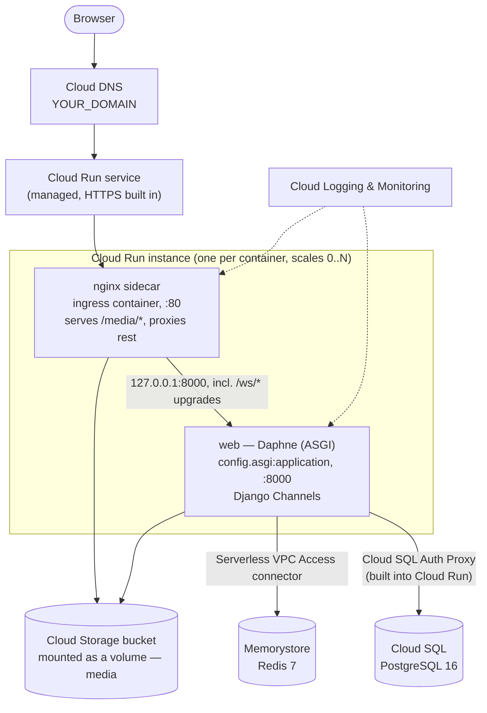

# Deploying Football Hub to GCP

A production-oriented deployment of Football Hub to Google Cloud
Platform, using managed services in place of the sibling containers
Docker Compose runs locally. Read [README.md](README.md) first for how
this guide relates to the existing local/Docker documentation, and
[../architecture/deployment-architecture.md](../architecture/deployment-architecture.md)
for *why* the app's Docker/Nginx/Daphne shape looks the way it does — this
guide reuses that shape rather than inventing a new one.

**Assumed starting point:** you can already run `docker compose -f
docker-compose.yml -f docker-compose.prod.yml build` successfully from a
clone of this repository (see [../deployment.md](../deployment.md)). This
guide deploys that same image.

## Contents

1. [Architecture](#1-architecture)
2. [GCP Project Setup](#2-gcp-project-setup)
3. [IAM](#3-iam)
4. [Artifact Registry](#4-artifact-registry)
5. [Database — Cloud SQL for PostgreSQL](#5-database--cloud-sql-for-postgresql)
6. [Redis — Memorystore](#6-redis--memorystore)
7. [Application Server](#7-application-server)
8. [Static and Media Files — Cloud Storage](#8-static-and-media-files--cloud-storage)
9. [Cloud Run Deployment](#9-cloud-run-deployment)
10. [Domain and HTTPS](#10-domain-and-https)
11. [Environment Variables and Secrets](#11-environment-variables-and-secrets)
12. [Database Migration Strategy](#12-database-migration-strategy)
13. [Logging and Monitoring](#13-logging-and-monitoring)
14. [Deployment Process (Complete Sequence)](#14-deployment-process-complete-sequence)
15. [Rollback](#15-rollback)
16. [WebSocket Verification](#16-websocket-verification)
17. [Production Security Checklist](#17-production-security-checklist)
18. [Troubleshooting](#18-troubleshooting)
19. [Cost Awareness](#19-cost-awareness)

---

## 1. Architecture



This mirrors `docker-compose.prod.yml` almost exactly: the same two
containers (`web` = Daphne, `nginx` = reverse proxy + media server), the
same division of responsibility, just with managed GCP services standing
in for the sibling `postgres`/`redis` containers and a mounted Cloud
Storage bucket standing in for the `media_data` named Docker volume.
Cloud Run runs both containers as a **multi-container (sidecar)
deployment** in the same service revision — `nginx` is the designated
ingress container (it receives external traffic), `web` is a sidecar
reachable only from `nginx` over `localhost`. See
[§7](#7-application-server) for why both containers are still needed, and
[§9](#9-cloud-run-deployment) for exactly how the sidecar wiring differs
from Compose.

**Services used and why:**

| Service | Replaces (local) | Why |
|---|---|---|
| Cloud Run | `web` + `nginx` containers | Runs the existing Docker image as a fully managed, scale-to-zero-capable service — no cluster, node pool, or VM to operate |
| Cloud SQL for PostgreSQL | `postgres` container | Managed backups, patching, and (optionally) high availability for the app's only database engine |
| Memorystore for Redis | `redis` container | Managed Redis for the Channels layer — required the moment more than one instance runs (see [§7](#7-application-server)) |
| Artifact Registry | — (local image only) | Private registry to push the built image to, so Cloud Run can pull it |
| Cloud Storage (volume mount) | `media_data` named volume | Durable, shared storage for `/app/media`, mounted directly into the container filesystem via Cloud Storage FUSE — no application code change required |
| Cloud DNS + Cloud Run domain mapping | — (not present locally) | DNS and Google-managed TLS certificates for a custom domain |
| Cloud Logging / Monitoring | `docker compose logs` | Centralized logs/metrics/alerts across instances, since Cloud Run instances have no persistent host to inspect directly |
| Secret Manager | `.env` file | Secret delivery without baking values into the image or committing them |

Placeholders used throughout: `YOUR_GCP_PROJECT_ID`, `YOUR_AWS_REGION`-equivalent
`YOUR_GCP_REGION`, `YOUR_DOMAIN`, `YOUR_BUCKET_NAME`. Replace every one of
these — none of them are usable as-is.

## 2. GCP Project Setup

**Do this in:** the Google Cloud Console (browser) and your local
terminal.

1. **Create a GCP project:**
   ```bash
   gcloud projects create YOUR_GCP_PROJECT_ID --name="Football Hub"
   ```
2. **Link a billing account** to it (required before any billable API can
   be enabled) — via Console: **Billing → Link a billing account**, or:
   ```bash
   gcloud billing projects link YOUR_GCP_PROJECT_ID --billing-account=YOUR_BILLING_ACCOUNT_ID
   ```
3. **Pick a region** close to your users (`YOUR_GCP_REGION`, e.g.
   `europe-west1`) — confirm Cloud Run, Cloud SQL, Memorystore, and
   Artifact Registry are all available there (true for every standard
   region as of this writing; Memorystore has a slightly shorter region
   list than the others — verify before committing to an unusual region).
4. **Install the Google Cloud CLI** (`gcloud`), then authenticate:
   ```bash
   gcloud --version
   gcloud auth login
   gcloud config set project YOUR_GCP_PROJECT_ID
   gcloud config set run/region YOUR_GCP_REGION
   ```
5. **Enable the required APIs** — identified from what this deployment
   actually uses, not enabled speculatively:
   ```bash
   gcloud services enable \
     run.googleapis.com \
     artifactregistry.googleapis.com \
     sqladmin.googleapis.com \
     redis.googleapis.com \
     vpcaccess.googleapis.com \
     secretmanager.googleapis.com \
     storage.googleapis.com \
     dns.googleapis.com \
     iam.googleapis.com \
     logging.googleapis.com \
     monitoring.googleapis.com
   ```
   (`vpcaccess.googleapis.com` — needed because Cloud Run reaches
   Memorystore over a Serverless VPC Access connector, see
   [§6](#6-redis--memorystore); Cloud SQL doesn't need it, since Cloud
   Run's built-in Cloud SQL integration bypasses the VPC connector
   entirely — see [§5](#5-database--cloud-sql-for-postgresql).)

## 3. IAM

**Do this in:** the GCP Console (IAM & Admin) or CLI.

1. **Never use your personal/root Google account's broad permissions for
   day-to-day deployment work.** Use a dedicated **service account** for
   anything automated (CI/CD) and least-privilege **predefined roles**
   (not `roles/owner`) for both your own user and that service account.
2. **Create a deployment service account:**
   ```bash
   gcloud iam service-accounts create football-hub-deployer \
     --display-name="Football Hub deployment"
   ```
   Grant it only what deploying this app actually requires:
   ```bash
   for role in roles/run.admin roles/artifactregistry.writer \
     roles/cloudsql.admin roles/redis.admin roles/vpcaccess.admin \
     roles/secretmanager.admin roles/storage.admin roles/dns.admin \
     roles/iam.serviceAccountUser roles/logging.admin; do
     gcloud projects add-iam-policy-binding YOUR_GCP_PROJECT_ID \
       --member="serviceAccount:football-hub-deployer@YOUR_GCP_PROJECT_ID.iam.gserviceaccount.com" \
       --role="$role"
   done
   ```
   Tighten to more specific custom roles once the initial setup is
   stable — the predefined roles above are a reasonable starting point,
   not the end state.
3. **Create a separate *runtime* service account** for the Cloud Run
   service itself — distinct from the deployer above. This is the
   identity the running container uses to reach Cloud SQL, Memorystore
   (via the VPC connector), Secret Manager, and Cloud Storage:
   ```bash
   gcloud iam service-accounts create football-hub-runtime \
     --display-name="Football Hub Cloud Run runtime"

   gcloud projects add-iam-policy-binding YOUR_GCP_PROJECT_ID \
     --member="serviceAccount:football-hub-runtime@YOUR_GCP_PROJECT_ID.iam.gserviceaccount.com" \
     --role="roles/cloudsql.client"

   gcloud projects add-iam-policy-binding YOUR_GCP_PROJECT_ID \
     --member="serviceAccount:football-hub-runtime@YOUR_GCP_PROJECT_ID.iam.gserviceaccount.com" \
     --role="roles/secretmanager.secretAccessor"

   gcloud projects add-iam-policy-binding YOUR_GCP_PROJECT_ID \
     --member="serviceAccount:football-hub-runtime@YOUR_GCP_PROJECT_ID.iam.gserviceaccount.com" \
     --role="roles/storage.objectAdmin"
   ```
   This is meaningfully narrower than the deployer account — the running
   app only ever needs to *use* these resources, never create/delete
   them.
4. **Do not place credentials directly in source code** — nowhere in
   this guide are static GCP credentials embedded in `config/settings.py`,
   the Dockerfile, or any committed file. The runtime service account's
   identity is attached to the Cloud Run service itself
   ([§9](#9-cloud-run-deployment)) and used implicitly by GCP client
   libraries/the Cloud SQL Auth Proxy — no key file to manage or leak.
5. **Secrets go in Secret Manager**, not IAM — see
   [§11](#11-environment-variables-and-secrets).

## 4. Artifact Registry

**Do this in:** your terminal, from the repository root (needs `docker`
and `gcloud` configured per [§2](#2-gcp-project-setup)).

1. **Create the repository:**
   ```bash
   gcloud artifacts repositories create football-hub \
     --repository-format=docker \
     --location=YOUR_GCP_REGION \
     --description="Football Hub container images"
   ```
2. **Authenticate Docker with Artifact Registry:**
   ```bash
   gcloud auth configure-docker YOUR_GCP_REGION-docker.pkg.dev
   ```
3. **Build the image** — the same `Dockerfile` used locally, no changes:
   ```bash
   docker build -t football-hub:latest .
   ```
4. **Tag it** — with a git SHA, not only `latest`, so you can roll back to
   a specific, addressable image ([§15](#15-rollback)):
   ```bash
   docker tag football-hub:latest \
     YOUR_GCP_REGION-docker.pkg.dev/YOUR_GCP_PROJECT_ID/football-hub/web:latest
   docker tag football-hub:latest \
     YOUR_GCP_REGION-docker.pkg.dev/YOUR_GCP_PROJECT_ID/football-hub/web:$(git rev-parse --short HEAD)
   ```
5. **Push:**
   ```bash
   docker push YOUR_GCP_REGION-docker.pkg.dev/YOUR_GCP_PROJECT_ID/football-hub/web:latest
   docker push YOUR_GCP_REGION-docker.pkg.dev/YOUR_GCP_PROJECT_ID/football-hub/web:$(git rev-parse --short HEAD)
   ```
6. **Deploying the image** happens as part of creating/updating the Cloud
   Run service — see [§9](#9-cloud-run-deployment). The `nginx` sidecar
   ([§7](#7-application-server)) needs its own small image built from
   `nginx:1.27-alpine` plus the adjusted config — build and push it the
   same way, under `.../football-hub/nginx:latest`.

## 5. Database — Cloud SQL for PostgreSQL

The app has exactly one supported database engine
(`django.db.backends.postgresql` — no SQLite fallback exists anywhere in
`config/settings.py`), so Cloud SQL is used here as the managed hosting
option for it, matching `postgres:16-alpine` locally.

**Do this in:** GCP Console (Cloud SQL) or CLI.

1. **Create the instance**, with a **private IP** (no public IP at all —
   see the networking note below):
   ```bash
   gcloud sql instances create football-hub-db \
     --database-version=POSTGRES_16 \
     --tier=db-f1-micro \
     --region=YOUR_GCP_REGION \
     --storage-type=SSD \
     --storage-size=10 \
     --storage-auto-increase \
     --backup-start-time=03:00 \
     --enable-point-in-time-recovery \
     --no-assign-ip \
     --network=default \
     --root-password='REPLACE_WITH_A_STRONG_GENERATED_PASSWORD'
   ```
   - `--no-assign-ip` — no public IP is ever created; the instance is
     reachable only over private networking. This is the GCP equivalent
     of RDS's `--no-publicly-accessible` in [aws.md](aws.md#4-database--amazon-rds-postgresql) —
     **never expose Postgres directly to the internet.**
   - `--enable-point-in-time-recovery` — enables the write-ahead-log-based
     recovery that automated backups alone don't give you; this is Cloud
     SQL's equivalent of RDS's automated backup retention window.
   - Encryption at rest is **on by default** for Cloud SQL — no flag
     needed.
2. **Create the database and app user:**
   ```bash
   gcloud sql databases create football_blog --instance=football-hub-db
   gcloud sql users create footballhub --instance=football-hub-db \
     --password='REPLACE_WITH_A_STRONG_GENERATED_PASSWORD'
   ```
3. **Connectivity from Cloud Run:** Cloud Run has a **built-in Cloud SQL
   integration** that's simpler and more robust than manually managing
   the Cloud SQL Auth Proxy or a VPC connector for this specific
   connection — it's attached per-service ([§9](#9-cloud-run-deployment))
   via `--add-cloudsql-instances`, and the app connects over a Unix socket
   at `/cloudsql/YOUR_GCP_PROJECT_ID:YOUR_GCP_REGION:football-hub-db`
   rather than a host:port pair. **This is the one place GCP's
   recommended connection method doesn't map onto `config/settings.py`
   as-is** — `DATABASES.default` unconditionally uses `HOST`/`PORT`
   (`config("DB_HOST")`/`config("DB_PORT")`), which is correct for a
   TCP connection but not for a Unix socket path. Two ways to reconcile
   this, in order of preference:
   - **Preferred, no code change:** don't use the Unix-socket
     integration; instead create a **Serverless VPC Access connector**
     (the same one used for Memorystore in [§6](#6-redis--memorystore))
     and connect to Cloud SQL over its **private IP** as a normal
     `DB_HOST`/`DB_PORT` TCP pair, exactly like RDS in [aws.md](aws.md).
     This keeps `config/settings.py` completely unmodified and is what
     this guide uses below.
   - **Alternative, requires an application change:** use the Unix-socket
     integration and change `config/settings.py` to set `HOST` to
     `/cloudsql/<connection-name>` when a `DB_SOCKET_PATH`-style variable
     is present. Slightly more resilient (no VPC connector dependency)
     but it's a real code change, not made here.
4. **Get the private IP:**
   ```bash
   gcloud sql instances describe football-hub-db --format='value(ipAddresses[0].ipAddress)'
   ```
5. **Map to Django's environment variables** exactly as
   `config/settings.py` reads them:

   | `.env` variable | Value |
   |---|---|
   | `DB_HOST` | the private IP from step 4 |
   | `DB_PORT` | `5432` |
   | `DB_NAME` | `football_blog` |
   | `DB_USER` | `footballhub` |
   | `DB_PASSWORD` | the password from step 2 — store in Secret Manager, see [§11](#11-environment-variables-and-secrets) |

6. **Run migrations** — see [§12](#12-database-migration-strategy). Cloud
   SQL starts with an empty schema, same as RDS.

## 6. Redis — Memorystore

**Is Redis required?** The same rule the app already documents applies in
the cloud: `CHANNEL_LAYERS` falls back to `channels.layers.InMemoryChannelLayer`
when `REDIS_URL` is unset, which only routes messages *within a single
process*. Cloud Run can and does run multiple container instances under
load (and Cloud Run's own request-level concurrency means even a single
instance handles many simultaneous connections, but instances themselves
still scale horizontally) — the moment more than one instance is serving
traffic, a chat message delivered to one instance's `ChatConsumer` would
never reach a `SupportInboxConsumer` connected to a different instance.
**Memorystore is a hard requirement** for any Cloud Run deployment that
allows more than one instance, which should be assumed for any real
production traffic (`--max-instances` set above 1 — see
[§9](#9-cloud-run-deployment)). If you deliberately pin `--max-instances=1`,
you could skip Memorystore — this guide does not recommend that for a
public production service, since it means the entire app has a single
point of failure with no ability to absorb a traffic spike.

**Do this in:** GCP Console (Memorystore) or CLI.

1. **Create a Serverless VPC Access connector** (Cloud Run instances
   aren't on a VPC by default; this connector is what lets them reach
   both Memorystore and, per [§5](#5-database--cloud-sql-for-postgresql),
   Cloud SQL's private IP):
   ```bash
   gcloud compute networks vpc-access connectors create football-hub-connector \
     --region=YOUR_GCP_REGION \
     --network=default \
     --range=10.8.0.0/28
   ```
2. **Create the Redis instance** (matching `redis:7-alpine` used locally):
   ```bash
   gcloud redis instances create football-hub-redis \
     --size=1 \
     --region=YOUR_GCP_REGION \
     --redis-version=redis_7_0 \
     --network=default \
     --connect-mode=private-service-access \
     --tier=basic
   ```
   `--tier=basic` (single node, no automatic failover) is sufficient for
   the channel layer's use case — transient pub/sub fan-out, not durable
   storage, since every chat message is also persisted to Postgres by the
   consumers (see [../architecture/realtime-chat-flow.md](../architecture/realtime-chat-flow.md)).
   Use `--tier=standard` for Redis-level HA if you want it.
3. **Never expose this publicly** — Memorystore has no public-IP option
   at all by design; `--connect-mode=private-service-access` keeps it
   reachable only from resources on the same VPC (i.e., through the
   connector from step 1).
4. **Get the endpoint and construct `REDIS_URL`:**
   ```bash
   gcloud redis instances describe football-hub-redis --region=YOUR_GCP_REGION \
     --format='value(host)'
   ```
   ```text
   REDIS_URL=redis://<memorystore-ip>:6379/0
   ```
   Consumed exactly the way `docker-compose.yml` already injects it
   locally (`REDIS_URL: redis://redis:6379/0`) — only the hostname
   changes. `config/settings.py` picks it up unmodified via
   `REDIS_URL = config('REDIS_URL', default='')`.
5. **Test connectivity** — from a Cloud Run instance directly (there's no
   local network path to a private Memorystore IP from your own machine):
   ```bash
   gcloud run services proxy football-hub --region=YOUR_GCP_REGION
   ```
   then, in a separate shell, use `gcloud run services describe` +
   Cloud Logging to confirm the `channels_redis` connection succeeds on
   startup, or temporarily override the service's command to run:
   ```bash
   python manage.py shell -c "
   from channels_redis.core import RedisChannelLayer
   import asyncio
   async def check():
       layer = RedisChannelLayer(hosts=['redis://<memorystore-ip>:6379/0'])
       await layer.send('test-channel', {'type': 'test'})
       print('Redis reachable')
   asyncio.run(check())
   "
   ```

If Memorystore is unreachable (VPC connector missing/misconfigured),
`channels_redis` raises connection errors from inside the consumers —
see [§18](#18-troubleshooting).

## 7. Application Server

**Determined from this repository, not invented:** `config/asgi.py`
defines a `ProtocolTypeRouter` routing `http` to the normal Django app and
`websocket` to `chat.routing.websocket_urlpatterns` — a pure-WSGI server
(Gunicorn with sync workers, `config/wsgi.py` alone) **cannot serve
`/ws/chat/...` at all**. `docker/entrypoint.sh`'s production path already
resolves this and is what this deployment must keep using unmodified:

```bash
daphne -b 0.0.0.0 -p "${PORT:-8000}" config.asgi:application
```

Gunicorn (`gunicorn==23.0.0` in `requirements.txt`) is **not invoked** in
this Docker setup and this guide does not introduce a Gunicorn-fronted
deployment for GCP either — doing so would silently break WebSocket
support. Daphne is the ASGI server, full stop, for this codebase as it
exists today.

**How Django Channels/WebSockets run on Cloud Run — explicit limitations:**

- Cloud Run **does support WebSockets** natively (bidirectional HTTP/1.1
  streaming) — no special configuration is needed for the protocol itself.
- Cloud Run enforces a **request timeout** on every connection, including
  WebSocket connections — the default is 300 seconds and it can be raised
  up to **60 minutes** (`--timeout` on the service, see
  [§9](#9-cloud-run-deployment)). A chat session open longer than this
  timeout **will be forcibly closed by Cloud Run**, regardless of activity.
  Set `--timeout=3600` (the maximum) for this service so ordinary support
  sessions aren't cut short, but understand this is a hard ceiling this
  app's architecture doesn't currently work around (no reconnect-and-resume
  logic exists — see the reconnect note in
  [§16](#16-websocket-verification)).
- **Session affinity is not required and not used** — Cloud Run can route
  a fresh request to any available instance, but an *established*
  WebSocket connection stays pinned to the instance that accepted it for
  its lifetime (this is inherent to how WebSockets work, not a Cloud Run
  setting). This is exactly why Memorystore matters
  ([§6](#6-redis--memorystore)): two users connected to *different*
  instances still see each other's messages, because `channels_redis`
  fans them out through Redis rather than relying on both connections
  living in the same process.
- **Scale-to-zero and cold starts** interact with chat: if `--min-instances=0`
  (see [§19](#19-cost-awareness)), the first WebSocket connection after a
  quiet period pays a cold-start penalty (container start + migrate/
  setup_roles/backfill_user_roles/collectstatic from
  `docker/entrypoint.sh` + Cloud SQL/Memorystore connection setup) before
  the `101 Switching Protocols` upgrade completes. Set `--min-instances=1`
  if consistently fast WebSocket handshakes matter more than idle cost.

**Why the `nginx` sidecar container still matters on Cloud Run**, not just
locally: nothing in this codebase serves `/media/...` once `DEBUG=False`
(`config/urls.py`'s `static()` route is behind an `if settings.DEBUG:`
guard). Locally, `docker-compose.prod.yml`'s `nginx` container closes that
gap by serving `/media/` directly from the shared `media_data` volume and
reverse-proxying everything else — including `/ws/` upgrades — to Daphne.
This guide keeps exactly that two-container shape as a Cloud Run
multi-container service ([§9](#9-cloud-run-deployment)), backed by a
mounted Cloud Storage bucket instead of a Docker volume (see
[§8](#8-static-and-media-files--cloud-storage)).

**One required change, called out explicitly rather than made silently:**
the bundled `docker/nginx/default.conf` proxies to `upstream django_app {
server web:8000; }` — `web` is the Docker Compose service DNS name, which
only resolves inside a Compose network. In a Cloud Run multi-container
service, sidecar containers share a single network namespace and reach
each other over `127.0.0.1`, the same as ECS Fargate's `awsvpc` mode. The
Cloud Run variant of the Nginx config needs one line changed:

```diff
 upstream django_app {
-    server web:8000;
+    server 127.0.0.1:8000;
 }
```

Save this as a separate file (e.g. `docker/nginx/cloudrun.conf`) rather
than editing the tracked `docker/nginx/default.conf` — the original file
must stay correct for local Docker Compose, which does resolve `web` via
its own embedded DNS. Bake it into the small `nginx` sidecar image built
in [§4](#4-artifact-registry).

## 8. Static and Media Files — Cloud Storage

**Static files** (`STATIC_ROOT` / `whitenoise.middleware.WhiteNoiseMiddleware`)
need **no Cloud Storage integration at all**. `docker/entrypoint.sh` runs
`python manage.py collectstatic --noinput` on every container start,
regenerating `STATIC_ROOT` from the repository's own `static/` source
tree — since that source is baked into the image, this works identically
and statelessly on every Cloud Run instance/cold start with zero extra
infrastructure. WhiteNoise then serves it directly from the `web`
container process, same as production Docker Compose today. A CDN in
front of static assets is a valid future optimization but is **not
required for correctness** — don't treat it as a blocker.

**Media files** (`Post.featured_image`, `CustomUser.avatar`,
`MEDIA_ROOT`/`MEDIA_URL`) are the real gap, and this repository has no
built-in object-storage integration to close it (see
[README.md's Known limitations](README.md#known-limitations-carried-into-both-guides)).

### Recommended — no application code changes: Cloud Storage volume mount

Cloud Run supports mounting a Cloud Storage bucket directly into a
container's filesystem (backed by Cloud Storage FUSE) — Django writes to
what looks like an ordinary local path, with no `django-storages`
dependency or `STORAGES` setting needed:

1. **Create the bucket**, in the same region as the Cloud Run service,
   with **uniform bucket-level access** and **no public access**:
   ```bash
   gcloud storage buckets create gs://YOUR_BUCKET_NAME \
     --location=YOUR_GCP_REGION \
     --uniform-bucket-level-access \
     --public-access-prevention
   ```
2. **Grant the runtime service account** ([§3](#3-iam)) read/write access
   — already covered by the `roles/storage.objectAdmin` binding granted
   there, scoped to this bucket if you want to tighten it further:
   ```bash
   gcloud storage buckets add-iam-policy-binding gs://YOUR_BUCKET_NAME \
     --member="serviceAccount:football-hub-runtime@YOUR_GCP_PROJECT_ID.iam.gserviceaccount.com" \
     --role="roles/storage.objectAdmin"
   ```
3. **Mount it into both containers** in the Cloud Run service definition
   ([§9](#9-cloud-run-deployment)) at `/app/media` — for `web`,
   read-write (Django writes uploads there); for `nginx`, read-only (it
   only serves them) — matching the read-write/read-only split
   `docker-compose.prod.yml` already uses for the Docker volume.

No `settings.py` change is needed: `MEDIA_ROOT = BASE_DIR / 'media'`
already resolves to `/app/media` inside the container, which is exactly
where the bucket gets mounted.

**A real caveat worth knowing, not hidden:** Cloud Storage FUSE is not a
fully POSIX-compliant filesystem — it doesn't support in-place random
writes or file locking the way a real disk or EFS does. This app's actual
write pattern (`FileField`/`ImageField`: write a new file once on upload,
read it many times afterward, occasionally overwrite/delete on a new
upload or account/post deletion) fits FUSE's supported operations fine.
It would **not** be a good fit for a workload that edits files in place —
this app doesn't do that.

### Alternative, more cloud-native: direct Cloud Storage integration via `django-storages`

Not implemented by this guide — a real application change, listed here so
the limitation isn't hidden:

- Add `django-storages[google]` to `requirements.txt`.
- Add a `STORAGES["default"]` (Django 5.1+) entry in `config/settings.py`
  pointing at `storages.backends.gcloud.GoogleCloudStorage`, reading
  `GS_BUCKET_NAME`, and relying on the **Cloud Run service's own runtime
  service account** for credentials (no key file needed, same principle
  as [§3](#3-iam)) rather than embedding a service-account JSON key
  anywhere.
- Keeps `nginx`'s media-serving role unnecessary entirely — reads go
  straight to Cloud Storage (optionally via signed URLs or a CDN), which
  would let you drop the sidecar and go back to a single-container Cloud
  Run service. That's a meaningfully simpler end state, but it's a code
  change with its own testing burden, not something to bolt on silently
  in infrastructure.

If you want this path, treat it as a follow-up PR to the application, not
something to bolt on only in infrastructure — reviewed and tested like any
other code change, per this repo's own CI security gate
([../security.md](../security.md)).

## 9. Cloud Run Deployment

**Do this in:** your terminal, after [§4](#4-artifact-registry)–[§8](#8-static-and-media-files--cloud-storage)
are complete (the service definition references their resource names).

Cloud Run's multi-container (sidecar) deployments are configured via a
YAML service manifest rather than a single long `gcloud run deploy`
command — this is the clearest way to express two containers sharing
volumes, so this guide uses that form.

1. **Create the service YAML** (`service.yaml`):
   ```yaml
   apiVersion: serving.knative.dev/v1
   kind: Service
   metadata:
     name: football-hub
     annotations:
       run.googleapis.com/ingress: all
   spec:
     template:
       metadata:
         annotations:
           autoscaling.knative.dev/minScale: "1"
           autoscaling.knative.dev/maxScale: "10"
           run.googleapis.com/vpc-access-connector: football-hub-connector
           run.googleapis.com/vpc-access-egress: private-ranges-only
       spec:
         serviceAccountName: football-hub-runtime@YOUR_GCP_PROJECT_ID.iam.gserviceaccount.com
         containerConcurrency: 80
         timeoutSeconds: 3600
         containers:
           - name: nginx
             image: YOUR_GCP_REGION-docker.pkg.dev/YOUR_GCP_PROJECT_ID/football-hub/nginx:latest
             ports:
               - containerPort: 80
             startupProbe:
               tcpSocket:
                 port: 80
               periodSeconds: 5
               failureThreshold: 12
             volumeMounts:
               - name: media
                 mountPath: /app/media
                 readOnly: true
           - name: web
             image: YOUR_GCP_REGION-docker.pkg.dev/YOUR_GCP_PROJECT_ID/football-hub/web:latest
             env:
               - name: DEBUG
                 value: "False"
               - name: ALLOWED_HOSTS
                 value: "YOUR_DOMAIN"
               - name: DB_HOST
                 value: "CLOUD_SQL_PRIVATE_IP"
               - name: DB_PORT
                 value: "5432"
               - name: DB_NAME
                 value: "football_blog"
               - name: REDIS_URL
                 value: "redis://MEMORYSTORE_IP:6379/0"
               - name: SECURE_SSL_REDIRECT
                 value: "True"
               - name: SESSION_COOKIE_SECURE
                 value: "True"
               - name: CSRF_COOKIE_SECURE
                 value: "True"
               - name: SECURE_HSTS_SECONDS
                 value: "31536000"
               - name: SECRET_KEY
                 valueFrom:
                   secretKeyRef: { name: football-hub-secret-key, key: latest }
               - name: DB_USER
                 valueFrom:
                   secretKeyRef: { name: football-hub-db-user, key: latest }
               - name: DB_PASSWORD
                 valueFrom:
                   secretKeyRef: { name: football-hub-db-password, key: latest }
             startupProbe:
               tcpSocket:
                 port: 8000
               periodSeconds: 5
               failureThreshold: 24
             volumeMounts:
               - name: media
                 mountPath: /app/media
         volumes:
           - name: media
             csi:
               driver: gcsfuse.run.googleapis.com
               volumeAttributes:
                 bucketName: YOUR_BUCKET_NAME
   ```
   - `nginx` is listed first and exposes `ports:` — this makes it the
     **ingress container** that receives external traffic; `web` has no
     `ports:` entry, making it a sidecar reachable only via `127.0.0.1`
     from `nginx`, matching the config change in
     [§7](#7-application-server).
   - `run.googleapis.com/vpc-access-connector` wires in the connector from
     [§6](#6-redis--memorystore) so `web` can reach both Memorystore and
     Cloud SQL's private IP.
   - `timeoutSeconds: 3600` is the WebSocket-timeout consideration from
     [§7](#7-application-server) — set to Cloud Run's maximum.
   - `startupProbe` on `web` uses a generous `failureThreshold` (24 × 5s =
     120s) to cover the entrypoint's migrate → setup_roles →
     backfill_user_roles → collectstatic sequence before Cloud Run
     considers the container unhealthy — matching the same reasoning as
     the ECS `startPeriod` in [aws.md](aws.md#9-container-deployment--ecs--fargate).
2. **Create the secrets** referenced above — see
   [§11](#11-environment-variables-and-secrets) for the full list and
   commands.
3. **Deploy:**
   ```bash
   gcloud run services replace service.yaml --region=YOUR_GCP_REGION
   ```
4. **Allow public (unauthenticated) HTTP access** to the service — this
   app does its own authentication (Django's own login system, not
   Cloud Run IAM), so the service itself must be publicly invokable:
   ```bash
   gcloud run services add-iam-policy-binding football-hub \
     --region=YOUR_GCP_REGION \
     --member="allUsers" \
     --role="roles/run.invoker"
   ```

**Scaling considerations:**

- `minScale: 1` avoids cold starts (see [§7](#7-application-server)'s
  WebSocket note) at the cost of paying for at least one instance
  continuously — see [§19](#19-cost-awareness) for the trade-off if
  you'd rather scale to zero for a dev/student deployment.
- `maxScale: 10` is a starting ceiling, not a tuned production value —
  raise it based on observed traffic via Cloud Monitoring
  ([§13](#13-logging-and-monitoring)).
- `containerConcurrency: 80` (Cloud Run's default) controls how many
  simultaneous requests/connections one instance handles before Cloud Run
  starts a new one. Each open WebSocket connection counts against this
  concurrency limit for as long as it's open — a support inbox with many
  simultaneous long-lived chat connections will drive instance count up
  even with otherwise-low HTTP request volume. This is expected, not a
  misconfiguration.

**Revision deployment:** every `gcloud run services replace` (or a plain
`gcloud run deploy`) creates a **new immutable revision** and, by default,
shifts 100% of traffic to it once it's healthy — this is Cloud Run's
built-in equivalent of ECS's rolling deployment, and is what
[§15](#15-rollback) relies on.

## 10. Domain and HTTPS

**Do this in:** GCP Console (Cloud Run, Cloud DNS) or CLI.

1. **Verify domain ownership** (required before Cloud Run will map a
   custom domain to your service) via [Google Search
   Console](https://search.google.com/search-console) or
   `gcloud domains verify YOUR_DOMAIN` — follow the interactive flow, it
   opens a browser verification step.
2. **Create the domain mapping:**
   ```bash
   gcloud run domain-mappings create \
     --service=football-hub \
     --domain=YOUR_DOMAIN \
     --region=YOUR_GCP_REGION
   ```
   This provisions a **Google-managed TLS certificate automatically** —
   no ACM-equivalent manual certificate request/validation step is
   needed; Cloud Run handles issuance and renewal for you.
3. **Get the DNS records Cloud Run wants:**
   ```bash
   gcloud run domain-mappings describe --domain=YOUR_DOMAIN --region=YOUR_GCP_REGION \
     --format='value(status.resourceRecords)'
   ```
4. **If Cloud DNS is your DNS host**, create the zone (if not already
   present) and add the records from step 3:
   ```bash
   gcloud dns managed-zones create football-hub-zone \
     --dns-name=YOUR_DOMAIN. --description="Football Hub DNS zone"

   gcloud dns record-sets create YOUR_DOMAIN. \
     --zone=football-hub-zone --type=A --ttl=300 \
     --rrdatas=RECORD_IP_FROM_STEP_3
   ```
   If your domain is registered elsewhere, either delegate it to Cloud
   DNS (update the registrar's nameservers to the zone's `NS` records) or
   add the same records directly at your existing DNS host — both work
   equally well.
5. **HTTP → HTTPS redirect and TLS termination are both handled
   automatically** by Cloud Run's domain mapping — unlike the AWS path
   ([aws.md §10](aws.md#10-domain-and-https)), there is no separate load
   balancer/listener/redirect-rule to configure. Plain `http://YOUR_DOMAIN`
   requests are redirected to HTTPS by Cloud Run itself.
6. **Set `ALLOWED_HOSTS=YOUR_DOMAIN`** ([§9](#9-cloud-run-deployment)'s
   service YAML) — required, not optional; Django rejects requests with a
   `Host` header not in this list (`DisallowedHost`, see
   [§18](#18-troubleshooting)). Also add the Cloud Run-assigned
   `*.run.app` URL if you still want that URL to keep working directly
   (useful for debugging without DNS in the loop).
7. **Turn on the HTTPS-only settings**, same as [aws.md](aws.md#10-domain-and-https):
   `SECURE_SSL_REDIRECT=True`, `SESSION_COOKIE_SECURE=True`,
   `CSRF_COOKIE_SECURE=True`, `SECURE_HSTS_SECONDS=31536000`.
8. **`SECURE_PROXY_SSL_HEADER` is not set in `config/settings.py`.**
   Cloud Run terminates TLS at its own edge and forwards the request to
   your container over plain HTTP internally, setting `X-Forwarded-Proto`
   on the way — exactly the same shape as the ALB in the AWS guide.
   Without telling Django to trust that header, `SECURE_SSL_REDIRECT=True`
   causes an infinite redirect loop (Django thinks every request is
   insecure). This is a **required application-code change** before
   step 7 above will work at all — add, in `config/settings.py`:
   ```python
   SECURE_PROXY_SSL_HEADER = ("HTTP_X_FORWARDED_PROTO", "https")
   ```
   This is safe to add unconditionally, and nginx's `default.conf`
   already passes `X-Forwarded-Proto` through untouched. This exact note
   already exists in [../docker.md](../docker.md#before-enabling-https-secure_ssl_redirecttrue)
   and identically in [aws.md](aws.md#10-domain-and-https) — this isn't a
   GCP-specific requirement, it's the same underlying gap surfacing at
   the same point (a proxy in front of the app) on both clouds.

## 11. Environment Variables and Secrets

Every variable below is read by `config/settings.py` via `python-decouple`
(`config("VAR_NAME")`) — this list is exhaustive, taken directly from
[../architecture/deployment-architecture.md](../architecture/deployment-architecture.md#environment-variables-from-envexample--the-authoritative-list-of-what-this-app-expects)
and `.env.example`, not invented for this guide.

### Secrets — store in Secret Manager, never as plain `env:` entries in the service YAML

| Variable | Purpose |
|---|---|
| `SECRET_KEY` | Django cryptographic signing key — required, no default |
| `DB_USER` | Cloud SQL username |
| `DB_PASSWORD` | Cloud SQL password |
| `TELEGRAM_BOT_TOKEN` | Optional — only if you enable Telegram announcements ([../../TELEGRAM.md](../../TELEGRAM.md)) |

Create them:

```bash
python -c 'import secrets; print(secrets.token_urlsafe(50))' | \
  gcloud secrets create football-hub-secret-key --data-file=-

echo -n 'footballhub' | gcloud secrets create football-hub-db-user --data-file=-

echo -n 'REPLACE_WITH_A_STRONG_GENERATED_PASSWORD' | \
  gcloud secrets create football-hub-db-password --data-file=-
```

Grant the runtime service account access (already covered by the
`roles/secretmanager.secretAccessor` binding in [§3](#3-iam), scoped
further per-secret if you prefer):

```bash
for secret in football-hub-secret-key football-hub-db-user football-hub-db-password; do
  gcloud secrets add-iam-policy-binding "$secret" \
    --member="serviceAccount:football-hub-runtime@YOUR_GCP_PROJECT_ID.iam.gserviceaccount.com" \
    --role="roles/secretmanager.secretAccessor"
done
```

Reference them via `secretKeyRef` in the service YAML's `env:` list (see
[§9](#9-cloud-run-deployment)) — Cloud Run resolves these at instance
startup and injects them as environment variables inside the container;
they're never written to the service YAML as plaintext or visible in the
Cloud Run console as plaintext.

### Normal configuration — plain `env:` entries in the service YAML (not secret, but still don't commit real values to Git)

| Variable | Value in this deployment |
|---|---|
| `DEBUG` | `False` |
| `ALLOWED_HOSTS` | `YOUR_DOMAIN` (plus the `*.run.app` URL if desired) |
| `DB_NAME` | `football_blog` |
| `DB_HOST` | the Cloud SQL private IP |
| `DB_PORT` | `5432` |
| `REDIS_URL` | `redis://<memorystore-ip>:6379/0` |
| `SECURE_SSL_REDIRECT`, `SESSION_COOKIE_SECURE`, `CSRF_COOKIE_SECURE` | `True` (only once the domain mapping/HTTPS is actually live — [§10](#10-domain-and-https)) |
| `SECURE_HSTS_SECONDS` | `31536000` (once confident HTTPS is fully correct) |
| `EMAIL_BACKEND`, `DEFAULT_FROM_EMAIL` | set to a real SMTP backend if you want password-reset emails to actually send — the default console backend just discards them in a container with no visible stdout |
| `LOGIN_MAX_FAILED_ATTEMPTS`, `LOGIN_LOCKOUT_MINUTES`, `LOGIN_CAPTCHA_AFTER_ATTEMPTS`, `SESSION_INACTIVITY_TIMEOUT`, `CSP_VIOLATION_REPORT_PATH` | optional — only set if you want a value other than the built-in defaults documented in [../deployment.md §4](../deployment.md#4-environment-configuration) |
| `TELEGRAM_CHANNEL_ID` | optional, non-secret half of the Telegram integration |

**Never commit real values for any of the above to Git** — this repo's CI
already runs Gitleaks against full git history specifically to catch this
(see [../security.md](../security.md)); don't be the first real finding it
flags.

## 12. Database Migration Strategy

`docker/entrypoint.sh` runs `python manage.py migrate --noinput`
automatically on **every** container start — in dev, in local production
Compose, and unmodified inside this same image on Cloud Run. This is safe
with exactly one instance applying migrations. It becomes a **real
consideration**, not a hypothetical one, once `minScale`/`maxScale`
([§9](#9-cloud-run-deployment)) allow more than one instance to cold-start
concurrently — every new instance start runs the full entrypoint sequence
independently, including `migrate`, and Cloud Run can start several
instances at once under a traffic burst or during a new-revision rollout.

In practice, Django's migration framework is reasonably safe under this:
already-applied migrations are skipped (checked against
`django_migrations`), and PostgreSQL's DDL is transactional, so a genuine
race (two instances racing to apply the *same new* migration for the
first time) mostly resolves as one instance's transaction blocking
briefly on the other's lock, not data corruption. But it is not risk-free
for more invasive migrations and this repo has no test coverage proving
safety under concurrent `migrate` invocations specifically.

**Recommended for this deployment:** run migrations as a **Cloud Run
Job** — a one-off, controlled execution of the same container image,
*before* deploying a new service revision, rather than relying solely on
concurrent entrypoints racing themselves:

```bash
gcloud run jobs create football-hub-migrate \
  --image=YOUR_GCP_REGION-docker.pkg.dev/YOUR_GCP_PROJECT_ID/football-hub/web:latest \
  --region=YOUR_GCP_REGION \
  --vpc-connector=football-hub-connector \
  --vpc-egress=private-ranges-only \
  --service-account=football-hub-runtime@YOUR_GCP_PROJECT_ID.iam.gserviceaccount.com \
  --set-env-vars="DB_HOST=CLOUD_SQL_PRIVATE_IP,DB_PORT=5432,DB_NAME=football_blog" \
  --set-secrets="SECRET_KEY=football-hub-secret-key:latest,DB_USER=football-hub-db-user:latest,DB_PASSWORD=football-hub-db-password:latest" \
  --command="python" \
  --args="manage.py,migrate,--noinput"

gcloud run jobs execute football-hub-migrate --region=YOUR_GCP_REGION --wait
```

Wait for the job to finish successfully before deploying the new revision
([§14](#14-deployment-process-complete-sequence)). The entrypoint's own
automatic `migrate` then becomes a harmless no-op on subsequent instance
starts (nothing new to apply), exactly the safety net it's meant to be,
not the primary mechanism. Re-run `gcloud run jobs execute
football-hub-migrate` (updating `--image` to the new revision's tag first)
before every deployment that includes new migrations.

`collectstatic` has no such race concern — it only writes to each
container's own `STATIC_ROOT` (not a shared resource), so the entrypoint
running it on every start is fine as-is; no separate job is needed.

## 13. Logging and Monitoring

- **Logs:** both containers (`web`, `nginx`) write to stdout/stderr, which
  Cloud Run automatically ships to **Cloud Logging** — no `awslogs`-style
  driver configuration needed, it's the default. This is the direct cloud
  equivalent of `docker compose logs -f web`. Note that
  `config/settings.py`'s `LOGGING` config also writes to
  `logs/errors.log`/`security.log`/`activity.log`/`csp_violations.log`
  *inside the container filesystem* — those are ephemeral on Cloud Run
  (lost when an instance is recycled) and not mounted anywhere durable in
  this guide; the `console` handler on every logger (see
  `config/settings.py: LOGGING`) is what actually reaches Cloud Logging,
  so nothing operationally important is lost as long as you rely on Cloud
  Logging rather than those in-container files.
- **View logs:**
  ```bash
  gcloud run services logs read football-hub --region=YOUR_GCP_REGION --limit=100
  ```
  or **Cloud Console → Cloud Run → football-hub → Logs** for a filterable
  view (filter by container name — `web` vs. `nginx` — using the
  structured log's `resource.labels.container_name` field).
- **Cloud Run service monitoring:**
  ```bash
  gcloud run services describe football-hub --region=YOUR_GCP_REGION \
    --format='value(status.conditions)'
  ```
  shows the current revision's readiness; **Cloud Console → Cloud Run →
  football-hub → Metrics** graphs request count, latency, container
  instance count, and CPU/memory without any extra setup.
- **Health checks:** the `startupProbe`s configured in
  [§9](#9-cloud-run-deployment) only confirm the process is listening
  (see [README.md's Known limitations](README.md#known-limitations-carried-into-both-guides) —
  no app-level readiness endpoint exists in this codebase). An instance
  that's up but can't reach Cloud SQL will still pass this probe; watch
  application logs, not just probe status, to catch that case.
- **Error investigation:** Cloud Logging's **Error Reporting** view
  automatically groups Python tracebacks written to stderr — since
  `config/settings.py`'s `django`/`security`/`blog`/`users`/`chat`/`csp`
  loggers all have a `console` handler, uncaught exceptions and the
  app's own security/activity log lines both show up there without extra
  configuration.
- **Alerts** — start with these three, via Cloud Monitoring:
  ```bash
  gcloud alpha monitoring policies create --notification-channels=YOUR_CHANNEL_ID \
    --display-name="Football Hub - high error rate" \
    --condition-display-name="5xx rate" \
    --condition-filter='resource.type="cloud_run_revision" AND resource.labels.service_name="football-hub" AND metric.type="run.googleapis.com/request_count" AND metric.labels.response_code_class="5xx"' \
    --condition-threshold-value=5 --condition-threshold-duration=300s

  gcloud alpha monitoring policies create --notification-channels=YOUR_CHANNEL_ID \
    --display-name="Football Hub - high instance count" \
    --condition-display-name="Instance count near max" \
    --condition-filter='resource.type="cloud_run_revision" AND resource.labels.service_name="football-hub" AND metric.type="run.googleapis.com/container/instance_count"' \
    --condition-threshold-value=8 --condition-threshold-duration=300s

  gcloud alpha monitoring policies create --notification-channels=YOUR_CHANNEL_ID \
    --display-name="Football Hub - Cloud SQL storage low" \
    --condition-display-name="Cloud SQL disk usage" \
    --condition-filter='resource.type="cloudsql_database" AND resource.labels.database_id="YOUR_GCP_PROJECT_ID:football-hub-db" AND metric.type="cloudsql.googleapis.com/database/disk/utilization"' \
    --condition-threshold-value=0.9 --condition-threshold-duration=300s
  ```
  (Create a notification channel first — Console → **Monitoring →
  Alerting → Notification channels** — and use its ID in place of
  `YOUR_CHANNEL_ID`.)

## 14. Deployment Process (Complete Sequence)

```text
1.  Create GCP project                                                    [§2]
2.  Configure billing                                                     [§2]
3.  Enable required APIs                                                  [§2]
4.  Configure IAM: deployment + runtime service accounts, least privilege [§3]
5.  Create Artifact Registry repository                                   [§4]
6.  Create Cloud SQL PostgreSQL instance (private IP only)                [§5]
7.  Create Serverless VPC Access connector + Memorystore Redis instance   [§6]
8.  Create Cloud Storage bucket for media                                 [§8]
9.  Build the Docker image from this repo's Dockerfile                    [§4]
10. Push the image (and nginx sidecar image) to Artifact Registry         [§4]
11. Configure Secret Manager entries                                      [§11]
12. Deploy the Cloud Run service (multi-container: nginx + web)           [§9]
13. Configure database/Redis connectivity (VPC connector, private IPs)    [§5, §6]
14. Add SECURE_PROXY_SSL_HEADER to config/settings.py, redeploy           [§10]
15. Run migrations as a Cloud Run Job (not just relying on entrypoint)    [§12]
16. Verify collectstatic ran (entrypoint handles this automatically)      [§8]
17. Configure the custom domain mapping                                   [§10]
18. Confirm HTTPS is live (Cloud Run provisions the certificate)          [§10]
19. Verify the application over HTTPS at YOUR_DOMAIN                      [§16]
20. Verify WebSockets (chat) end-to-end                                   [§16]
21. Verify logging/monitoring in Cloud Logging and Cloud Monitoring       [§13]
```

**A `DEBUG=False` deployment starts with zero data and zero admin users.**
Create your first superuser the same way `docker/entrypoint.sh`'s
automatic `setup_roles`/`backfill_user_roles` steps expect (see
[../docker.md#create-a-superuser](../docker.md#create-a-superuser) for why
`role` must be set explicitly afterward) — run it as a one-off Cloud Run
Job execution the same way as [§12](#12-database-migration-strategy),
overriding the command to `python manage.py createsuperuser
--noinput --username <u> --email <e>` (non-interactive, since a Job
execution has no attached terminal) followed by a scripted role
assignment, or use `gcloud run services proxy` plus `gcloud alpha run
services exec` if your `gcloud` version supports interactive exec into a
running Cloud Run instance.

## 15. Rollback

Cloud Run keeps every deployed revision by default — because every pushed
image is tagged with its git SHA ([§4](#4-artifact-registry)), rolling
back means shifting traffic to a previous, known-good **revision**, not
rebuilding anything:

```bash
# List revisions
gcloud run revisions list --service=football-hub --region=YOUR_GCP_REGION

# Roll back: send 100% of traffic to a specific previous revision
gcloud run services update-traffic football-hub --region=YOUR_GCP_REGION \
  --to-revisions=football-hub-00042-abc=100
```

This is faster than the AWS path — no new tasks need to start and pass
health checks, since the previous revision's instances are simply
reactivated. You can also **gradually** shift traffic instead of an
all-at-once rollback:

```bash
gcloud run services update-traffic football-hub --region=YOUR_GCP_REGION \
  --to-revisions=football-hub-00042-abc=50,football-hub-00043-def=50
```

**If the rollback is needed because of a bad migration** (schema change
incompatible with the previous code revision), a revision-traffic
rollback alone is not sufficient — Django migrations are not
automatically reversible. Assess whether the specific migration has a
safe `migrate <app> <previous_migration_name>` reverse path (run via the
same Cloud Run Job mechanism as [§12](#12-database-migration-strategy))
before running it against production data; if not, this is a "fix
forward" situation, not a clean rollback, and should be treated with the
same care as any other production data change — this scenario isn't
something Docker Compose's local setup has ever had to handle either,
since it's always run as a single instance to date.

## 16. WebSocket Verification

Verify the full stack end-to-end after any deployment, in this order:

1. **Plain HTTP works:** `curl -I https://YOUR_DOMAIN/` → `200 OK` (or a
   redirect chain ending in one). Confirms the domain mapping → nginx →
   Daphne → Django is wired correctly for ordinary requests.
2. **Login works:** log in through `/login/` in a browser. Confirms
   session cookies, CSRF, and the database connection are all correct —
   a failure here usually means Cloud SQL connectivity (VPC connector) or
   `SECRET_KEY`/session config, not WebSockets.
3. **Authenticated session persists:** reload the page, confirm you're
   still logged in — confirms `SESSION_COOKIE_SECURE`/`CSRF_COOKIE_SECURE`
   aren't rejecting the cookie over HTTPS (see [§18](#18-troubleshooting)
   if this fails right after enabling those).
4. **WebSocket connection:** open browser DevTools → Network → **WS**
   tab, then open the chat widget (any logged-in page — see
   [../wireframes/live-chat.md](../wireframes/live-chat.md)). You should
   see a connection to `wss://YOUR_DOMAIN/ws/chat/<session_id>/` with
   status **`101 Switching Protocols`**. This is the single most
   important check specific to this app — it confirms Cloud Run's
   ingress, the `nginx` sidecar's `/ws/` location block, and Daphne's
   `AllowedHostsOriginValidator` are all correctly passing the
   `Upgrade`/`Connection` headers through.
5. **Real-time chat delivery:** open the app in two separate browser
   sessions (or two browsers), log in as two different users (or use the
   staff support inbox — [../wireframes/support-inbox.md](../wireframes/support-inbox.md)),
   and start a chat. A message sent in one session should appear in the
   other **without a page reload**. If this works but step 4's raw
   connection didn't, something is buffering/re-encoding the WebSocket
   frames — check for `containerConcurrency` starving the instance (see
   [§9](#9-cloud-run-deployment)) or an intermediate proxy not covered by
   this guide.
6. **Redis/channel layer connectivity:** the fact that step 5 works across
   two *different* browser sessions, which Cloud Run can route to two
   *different* instances under `minScale`/`maxScale` > 1, is itself proof
   `channels_redis` is correctly fanning messages out via Memorystore —
   exactly the multi-instance scenario `InMemoryChannelLayer` cannot
   handle (see [§6](#6-redis--memorystore)). If it only works when both
   sessions happen to land on the same instance, Redis isn't actually
   wired up — recheck `REDIS_URL` and the VPC connector.
7. **Reconnect behavior — a known client-side limitation, not a
   deployment bug:** `static/js/chat_widget.js` does **not** implement
   automatic WebSocket reconnection — a dropped connection (instance
   recycling, hitting Cloud Run's request `--timeout` ceiling from
   [§7](#7-application-server), a network blip) requires the user to
   reload the page to reconnect. This is true locally too; it is not
   something this cloud deployment introduces or is expected to fix.
   Don't mistake "chat stops working until I refresh" for a broken
   deployment — confirm first whether a fresh page load restores it, and
   whether it correlates with the `--timeout` value if it happens on a
   predictable schedule.

## 17. Production Security Checklist

- [ ] `DEBUG=False` — set in the Cloud Run service YAML ([§11](#11-environment-variables-and-secrets))
- [ ] Strong, unique `SECRET_KEY` — generated, stored in Secret Manager ([§11](#11-environment-variables-and-secrets))
- [ ] `SESSION_COOKIE_SECURE=True`, `CSRF_COOKIE_SECURE=True` — only once the domain mapping/HTTPS is actually live ([§10](#10-domain-and-https))
- [ ] HTTPS enabled — automatic via Cloud Run's managed certificate once the domain mapping is created ([§10](#10-domain-and-https))
- [ ] `SECURE_HSTS_SECONDS` configured appropriately (start low, raise once confident) ([§10](#10-domain-and-https))
- [ ] `SECURE_PROXY_SSL_HEADER` added to `config/settings.py` — **required**, not optional, once behind Cloud Run's edge ([§10](#10-domain-and-https))
- [ ] `CSRF_TRUSTED_ORIGINS` reviewed — not set by default in this codebase; add it if you serve the site from more than one trusted domain/subdomain ([§18](#18-troubleshooting))
- [ ] `ALLOWED_HOSTS` set to `YOUR_DOMAIN` exactly, not left at the local default ([§10](#10-domain-and-https))
- [ ] Cloud SQL PostgreSQL has no public IP, private-networking only ([§5](#5-database--cloud-sql-for-postgresql))
- [ ] Memorystore Redis not publicly accessible (no public-IP option exists, by design) ([§6](#6-redis--memorystore))
- [ ] Secrets (`SECRET_KEY`, `DB_PASSWORD`, `DB_USER`) in Secret Manager, never in the service YAML's plain `env:` list ([§11](#11-environment-variables-and-secrets))
- [ ] Cloud SQL automated backups + point-in-time recovery enabled ([§5](#5-database--cloud-sql-for-postgresql))
- [ ] Container images scanned — enable Artifact Registry vulnerability scanning, and this repo's own Trivy image scan in CI stays green ([§4](#4-artifact-registry), [../security.md](../security.md))
- [ ] IAM follows least privilege — separate deployment vs. runtime service accounts, no `roles/owner` in day-to-day use ([§3](#3-iam))
- [ ] Cloud Storage bucket has uniform bucket-level access and public access prevention enabled, not publicly writable ([§8](#8-static-and-media-files--cloud-storage))
- [ ] Production logs enabled and flowing to Cloud Logging (default, verify it's actually visible) ([§13](#13-logging-and-monitoring))
- [ ] Monitoring/alerts configured (error rate, instance count, Cloud SQL storage) ([§13](#13-logging-and-monitoring))
- [ ] WebSockets tested end-to-end after deployment, including the `--timeout` ceiling understood ([§16](#16-websocket-verification))
- [ ] Static files verified (CSS/JS/admin assets load correctly) ([§8](#8-static-and-media-files--cloud-storage))
- [ ] Media uploads verified (avatar/post-image upload round-trips through the mounted bucket and is servable via nginx) ([§8](#8-static-and-media-files--cloud-storage))
- [ ] `python manage.py check --deploy` passes — run it against the production-shaped environment before going live; this repo's CI already runs this check on every push (`django-security-checks` job, see [../security.md §11](../security.md#11-existing--pre-existing-findings-as-of-2026-08-16)), and it currently reports the pre-existing, tracked `django-ckeditor` EOL warning plus the two HSTS-subdomain warnings — nothing new should appear from this deployment itself

## 18. Troubleshooting

### Django

| Symptom | Likely cause | Fix |
|---|---|---|
| `DisallowedHost` in logs | `ALLOWED_HOSTS` doesn't include the `Host` header the request arrived with | Set `ALLOWED_HOSTS=YOUR_DOMAIN` exactly ([§10](#10-domain-and-https) step 6); add the `*.run.app` URL too if you still test against it directly |
| CSRF failures (`403 CSRF verification failed`) on forms (login, comments, post submission) | Either (a) `SECURE_PROXY_SSL_HEADER` missing — Django/CSRF sees the request as insecure while the browser sent it over HTTPS, or (b) you're serving the app from more than one hostname/subdomain and `CSRF_TRUSTED_ORIGINS` (not set anywhere in this codebase) is needed | Add `SECURE_PROXY_SSL_HEADER` first ([§10](#10-domain-and-https)) — this alone fixes the common case. If you genuinely serve multiple trusted origins (custom domain + `*.run.app`), add `CSRF_TRUSTED_ORIGINS = ["https://YOUR_DOMAIN"]` to `config/settings.py` — an application change, test it locally first |
| Static files (CSS/JS/admin) missing/404 | `collectstatic` didn't run, or `DEBUG` accidentally left `True` | Check `gcloud run services logs read` for the entrypoint's `collecting static files...` line; confirm `DEBUG=False` is actually set (§11) — WhiteNoise only serves `STATIC_ROOT`, populated only by `collectstatic` |
| Media files (avatars/post images) missing/404 | The Cloud Storage volume isn't mounted into the `nginx` sidecar, or mounted at the wrong path | Confirm both `volumeMounts` in the service YAML ([§9](#9-cloud-run-deployment)) target `/app/media`; check the `nginx` container's logs for file-not-found at that path |
| `django.db.utils.OperationalError` on startup | Cloud SQL unreachable — usually the VPC connector missing or misconfigured | See "Cloud SQL connection failure" below |
| Migration errors | Concurrent `migrate` from multiple cold-starting instances racing, or a genuinely broken migration | Use the Cloud Run Job migration step ([§12](#12-database-migration-strategy)) instead of relying on concurrent entrypoints; check the job execution's logs for the traceback |

### Docker / Cloud Run

| Symptom | Likely cause | Fix |
|---|---|---|
| Cloud Run container fails to start | A required env var is missing (`SECRET_KEY`, any `DB_*`) — the app refuses to start without them by design (`decouple.UndefinedValueError`) | `gcloud run services logs read football-hub --region=YOUR_GCP_REGION` for the exact missing variable; confirm the `secretKeyRef` names in the service YAML match real Secret Manager secret names and the runtime service account can read them |
| Container port errors | Cloud Run's `ports:` on the `nginx` container doesn't match what nginx actually listens on, or `web` incorrectly declares a `ports:` entry (making Cloud Run treat it as ingress instead of a sidecar) | `nginx` must be the only container with `ports:` in the service YAML ([§9](#9-cloud-run-deployment)) — it listens on `80`, matching the bundled `docker/nginx/default.conf`'s `listen 80;` |
| Cloud SQL connection failure | VPC connector not attached to the service, or its egress setting is wrong, or `DB_HOST`/`DB_PASSWORD` don't match what was set at instance creation | Confirm `run.googleapis.com/vpc-access-connector` and `vpc-access-egress: private-ranges-only` are set in the service YAML ([§9](#9-cloud-run-deployment)); verify the Secret Manager values match; test via a one-off Job running `python manage.py dbshell` |
| Secret Manager permission errors | The runtime service account lacks `roles/secretmanager.secretAccessor` on the specific secret | Re-run the `add-iam-policy-binding` commands in [§11](#11-environment-variables-and-secrets) — a project-level `secretmanager.admin` binding on the *deployment* account does not grant the *runtime* account read access |
| Memorystore connectivity failure | Same VPC connector issue as Cloud SQL, or `REDIS_URL` has the wrong IP | Confirm the connector is attached and its `--network` matches the one Memorystore was created with (`--network=default` throughout this guide); verify the IP via `gcloud redis instances describe` ([§6](#6-redis--memorystore)) |
| Artifact Registry authentication failure | `gcloud auth configure-docker` token expired or wasn't run for this region's registry host | Re-run `gcloud auth configure-docker YOUR_GCP_REGION-docker.pkg.dev` ([§4](#4-artifact-registry)) |
| Custom domain problems | Domain ownership not verified, or DNS records from `domain-mappings describe` not yet propagated | Re-check `gcloud domains verify`; `dig YOUR_DOMAIN` to confirm the records match what Cloud Run requested — propagation and certificate provisioning together can take up to ~24 hours on a first mapping |
| WebSocket connectivity failure | Either the `nginx`/`web` sidecar wiring is wrong (`server 127.0.0.1:8000;` not applied, per [§7](#7-application-server)), or the request exceeded `--timeout` | Check `nginx` container logs for connection-refused to `127.0.0.1:8000`; if connections open fine but drop after a fixed duration, that's `timeoutSeconds` in the service YAML, not a networking bug — raise it up to the 3600s maximum |

## 19. Cost Awareness

Actual cost depends on region, instance/container sizing, traffic volume,
storage size, database size/tier, number of running instances,
`minScale`/`maxScale`, Redis tier, logging volume, and any CDN usage — no
specific number is promised here, and GCP's own [Pricing
Calculator](https://cloud.google.com/products/calculator) against the
exact resources in [§14](#14-deployment-process-complete-sequence) is the
authoritative way to estimate it for your account/region.

**What drives cost in this specific architecture, roughly by size:**

| Component | Cost driver |
|---|---|
| Cloud Run | Billed per vCPU/memory-second **while actively handling requests**, plus a per-instance minimum if `minScale` > 0 — the one component in this architecture that can genuinely bill near-zero when idle, unlike ECS |
| Cloud SQL | Instance hours (scales with tier) + storage (GB-month) + backup storage |
| Memorystore | Instance hours (scales with tier), continuous even at low chat traffic — no scale-to-zero option |
| Serverless VPC Access connector | A small continuous per-hour charge for the connector instances themselves, independent of traffic through it |
| Cloud Storage | Pay-per-GB stored + operations count + network egress, generally low for this app's media volume |
| Data transfer | Outbound to the internet from Cloud Run and Cloud SQL |

### Development/testing vs. production configuration

| Aspect | Dev/student-budget | Production |
|---|---|---|
| Cloud Run `minScale` | `0` — true scale-to-zero, accept cold-start latency including on WebSocket connects ([§7](#7-application-server)) | `1`+ for consistently fast responses and WebSocket handshakes |
| Cloud Run `maxScale` | Low (e.g. `2`–`3`), enough to avoid a runaway bill from an unexpected traffic spike | Sized from observed Cloud Monitoring metrics |
| Cloud SQL tier | `db-f1-micro`, no read replica | Right-sized for actual load; consider a read replica if reporting/analytics load grows |
| Memorystore tier | `basic` (single node) | `standard` for automatic failover, if chat availability during a Redis failure matters |
| VPC connector | Smallest instance range/count the connector supports | Sized for actual connection volume between Cloud Run and Cloud SQL/Memorystore |
| Backups | Default retention | Point-in-time recovery enabled, tested restore process |

**Ways to reduce cost for a student/development deployment without
compromising the production architecture's shape** (same services, just
smaller/fewer, or genuinely idle when unused):

- Set `minScale: 0` — this is Cloud Run's single biggest advantage over
  the AWS path for a low-traffic/dev project: **you are not billed for
  compute time when nobody is using the app**, unlike ECS Fargate tasks
  or an EC2-based deployment, which bill continuously while running.
- Use `db-f1-micro`/`basic`-tier Memorystore (smallest supported classes)
  — same managed-service behavior, lower cost.
- **Stop Cloud SQL when not in use for an extended period**
  (`gcloud sql instances patch football-hub-db --activation-policy=NEVER`,
  then `ALWAYS` to resume) — unlike Cloud Run, Cloud SQL bills
  continuously while running; this is the equivalent lever to RDS's
  `stop-db-instance` in [aws.md](aws.md#19-cost-awareness).
- Memorystore has no stop/start — deleting and recreating it for each
  study session is the only way to avoid its hourly charge entirely, at
  the cost of losing any in-flight (non-persisted) state, which is
  acceptable for this app's channel-layer use case (same trade-off as the
  AWS guide).
- Keep the VPC connector at its minimum instance count/range — it's a
  small but continuous charge regardless of Cloud Run's own scale-to-zero
  behavior.

Never reduce security posture (private-IP-only Cloud SQL, no public
Memorystore, secrets in Secret Manager, HTTPS) to save cost — every item
above reduces *capacity/idle cost*, not the architecture's security
properties.
